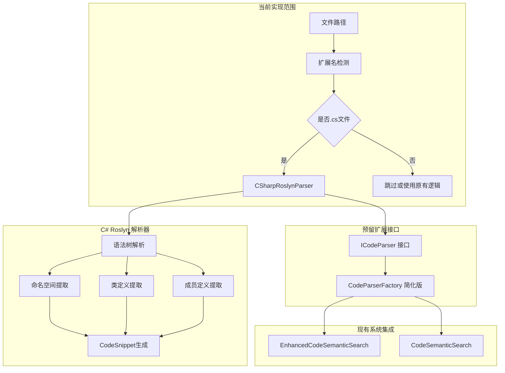

# C# Roslyn 解析器重构实现计划

## 📝 项目背景

将现有基于正则表达式的 [`ExtractCSharpSnippets`](Codebase/CodeSemanticSearch.cs:354) 方法升级为使用 Microsoft.CodeAnalysis (Roslyn)，提高 C# 代码解析的准确性和可维护性。同时建立基础的抽象架构，为将来扩展其他编程语言预留接口。

## 🎯 项目目标

- **主要目标**：使用 Roslyn 替代正则表达式解析 C# 代码
- **次要目标**：建立可扩展的解析器抽象架构
- **约束条件**：其他语言解析器暂不实现，专注于 C# 核心功能

## 🏗️ 系统架构设计



## 📁 项目结构规划

```
CodebaseMcpServer/
├── Services/
│   ├── Parsing/                     # 新增解析服务目录
│   │   ├── ICodeParser.cs           # 基础接口（为扩展预留）
│   │   ├── CSharpRoslynParser.cs    # C# Roslyn解析器（核心实现）
│   │   ├── CodeSnippetVisitor.cs    # Roslyn语法树访问者
│   │   └── CodeParserFactory.cs     # 简化工厂（当前只返回C#解析器）
│   └── EnhancedCodeSemanticSearch.cs   # 更新使用新解析器
├── Models/
│   └── CodeSnippet.cs               # 保持现有结构
└── ...

Codebase/
├── CodeSemanticSearch.cs            # 更新使用新解析器
└── Codebase.csproj                  # 添加 Roslyn 依赖
```

## 🔧 核心接口设计

### 1. ICodeParser 接口（简化版）

```csharp
namespace CodebaseMcpServer.Services.Parsing;

/// <summary>
/// 代码解析器接口 - 为将来扩展其他语言预留
/// </summary>
public interface ICodeParser
{
    /// <summary>
    /// 解析代码文件并提取代码片段
    /// </summary>
    /// <param name="filePath">文件路径</param>
    /// <returns>代码片段列表</returns>
    List<CodeSnippet> ParseCodeFile(string filePath);
    
    /// <summary>
    /// 解析代码内容并提取代码片段
    /// </summary>
    /// <param name="filePath">文件路径（用于上下文）</param>
    /// <param name="content">文件内容</param>
    /// <returns>代码片段列表</returns>
    List<CodeSnippet> ParseCodeContent(string filePath, string content);
    
    /// <summary>
    /// 是否支持该文件类型
    /// </summary>
    /// <param name="filePath">文件路径</param>
    /// <returns>是否支持</returns>
    bool SupportsFile(string filePath);
}
```

### 2. C# Roslyn 解析器（核心实现）

```csharp
using Microsoft.CodeAnalysis;
using Microsoft.CodeAnalysis.CSharp;
using Microsoft.CodeAnalysis.CSharp.Syntax;

namespace CodebaseMcpServer.Services.Parsing;

/// <summary>
/// 基于 Roslyn 的 C# 代码解析器
/// </summary>
public class CSharpRoslynParser : ICodeParser
{
    public bool SupportsFile(string filePath) 
        => Path.GetExtension(filePath).Equals(".cs", StringComparison.OrdinalIgnoreCase);
    
    public List<CodeSnippet> ParseCodeFile(string filePath)
    {
        if (!File.Exists(filePath))
            throw new FileNotFoundException($"文件不存在: {filePath}");
            
        var content = File.ReadAllText(filePath);
        return ParseCodeContent(filePath, content);
    }
    
    public List<CodeSnippet> ParseCodeContent(string filePath, string content)
    {
        try
        {
            var tree = CSharpSyntaxTree.ParseText(content, path: filePath);
            var root = tree.GetCompilationUnitRoot();
            
            var visitor = new CodeSnippetVisitor(filePath);
            visitor.Visit(root);
            
            return visitor.Snippets;
        }
        catch (Exception ex)
        {
            // 记录错误但不抛出异常，返回空列表
            Console.WriteLine($"[ERROR] 解析 C# 文件失败: {filePath}, 错误: {ex.Message}");
            return new List<CodeSnippet>();
        }
    }
}
```

### 3. 语法树访问者

```csharp
using Microsoft.CodeAnalysis;
using Microsoft.CodeAnalysis.CSharp;
using Microsoft.CodeAnalysis.CSharp.Syntax;

namespace CodebaseMcpServer.Services.Parsing;

/// <summary>
/// Roslyn 语法树访问者，用于提取代码片段
/// </summary>
public class CodeSnippetVisitor : CSharpSyntaxWalker
{
    private readonly string _filePath;
    private readonly List<CodeSnippet> _snippets = new();
    private string? _currentNamespace;
    private string? _currentClass;
    
    public List<CodeSnippet> Snippets => _snippets;
    
    public CodeSnippetVisitor(string filePath)
    {
        _filePath = filePath;
    }
    
    public override void VisitNamespaceDeclaration(NamespaceDeclarationSyntax node)
    {
        var previousNamespace = _currentNamespace;
        _currentNamespace = node.Name.ToString();
        
        base.VisitNamespaceDeclaration(node);
        
        _currentNamespace = previousNamespace;
    }
    
    public override void VisitFileScopedNamespaceDeclaration(FileScopedNamespaceDeclarationSyntax node)
    {
        _currentNamespace = node.Name.ToString();
        base.VisitFileScopedNamespaceDeclaration(node);
    }
    
    public override void VisitClassDeclaration(ClassDeclarationSyntax node)
    {
        var previousClass = _currentClass;
        _currentClass = node.Identifier.ValueText;
        
        base.VisitClassDeclaration(node);
        
        _currentClass = previousClass;
    }
    
    public override void VisitInterfaceDeclaration(InterfaceDeclarationSyntax node)
    {
        var previousClass = _currentClass;
        _currentClass = node.Identifier.ValueText;
        
        base.VisitInterfaceDeclaration(node);
        
        _currentClass = previousClass;
    }
    
    public override void VisitStructDeclaration(StructDeclarationSyntax node)
    {
        var previousClass = _currentClass;
        _currentClass = node.Identifier.ValueText;
        
        base.VisitStructDeclaration(node);
        
        _currentClass = previousClass;
    }
    
    public override void VisitMethodDeclaration(MethodDeclarationSyntax node)
    {
        var snippet = CreateSnippet(node, node.Identifier.ValueText, "方法");
        _snippets.Add(snippet);
        
        base.VisitMethodDeclaration(node);
    }
    
    public override void VisitConstructorDeclaration(ConstructorDeclarationSyntax node)
    {
        var snippet = CreateSnippet(node, node.Identifier.ValueText, "构造函数");
        _snippets.Add(snippet);
        
        base.VisitConstructorDeclaration(node);
    }
    
    public override void VisitPropertyDeclaration(PropertyDeclarationSyntax node)
    {
        var snippet = CreateSnippet(node, node.Identifier.ValueText, "属性");
        _snippets.Add(snippet);
        
        base.VisitPropertyDeclaration(node);
    }
    
    public override void VisitFieldDeclaration(FieldDeclarationSyntax node)
    {
        foreach (var variable in node.Declaration.Variables)
        {
            var snippet = CreateSnippet(node, variable.Identifier.ValueText, "字段");
            _snippets.Add(snippet);
        }
        
        base.VisitFieldDeclaration(node);
    }
    
    public override void VisitEventDeclaration(EventDeclarationSyntax node)
    {
        var snippet = CreateSnippet(node, node.Identifier.ValueText, "事件");
        _snippets.Add(snippet);
        
        base.VisitEventDeclaration(node);
    }
    
    private CodeSnippet CreateSnippet(SyntaxNode node, string memberName, string memberType)
    {
        var lineSpan = node.GetLocation().GetLineSpan();
        
        return new CodeSnippet
        {
            FilePath = _filePath,
            Namespace = _currentNamespace,
            ClassName = _currentClass,
            MethodName = $"{memberName} ({memberType})",
            Code = node.ToString(),
            StartLine = lineSpan.StartLinePosition.Line + 1, // Roslyn uses 0-based
            EndLine = lineSpan.EndLinePosition.Line + 1
        };
    }
}
```

### 4. 简化工厂类

```csharp
namespace CodebaseMcpServer.Services.Parsing;

/// <summary>
/// 代码解析器工厂 - 简化版，当前只支持 C#
/// </summary>
public static class CodeParserFactory
{
    private static readonly CSharpRoslynParser _csharpParser = new();
    
    /// <summary>
    /// 获取指定文件的解析器
    /// </summary>
    /// <param name="filePath">文件路径</param>
    /// <returns>解析器实例</returns>
    /// <exception cref="NotSupportedException">不支持的文件类型</exception>
    public static ICodeParser GetParser(string filePath)
    {
        // 当前只支持 C#，未来可扩展
        if (_csharpParser.SupportsFile(filePath))
            return _csharpParser;
            
        throw new NotSupportedException($"不支持的文件类型: {Path.GetExtension(filePath)}");
    }
    
    /// <summary>
    /// 检查是否支持指定文件
    /// </summary>
    /// <param name="filePath">文件路径</param>
    /// <returns>是否支持</returns>
    public static bool IsSupported(string filePath)
    {
        return _csharpParser.SupportsFile(filePath);
    }
    
    /// <summary>
    /// 获取 C# 解析器实例
    /// </summary>
    /// <returns>C# 解析器</returns>
    public static ICodeParser GetCSharpParser()
    {
        return _csharpParser;
    }
}
```

## 🛠️ 实施阶段

### 阶段 1：添加 Roslyn 依赖 (0.5天)

**目标**：为两个项目添加 Microsoft.CodeAnalysis.CSharp 依赖

**任务清单**：
- [ ] 更新 `Codebase/Codebase.csproj`
- [ ] 更新 `CodebaseMcpServer/CodebaseMcpServer.csproj`
- [ ] 验证项目能正常编译

**依赖版本**：
```xml
<PackageReference Include="Microsoft.CodeAnalysis.CSharp" Version="4.8.0" />
```

### 阶段 2：创建 C# Roslyn 解析器 (2-3天)

**目标**：实现基于 Roslyn 的 C# 代码解析器

**任务清单**：
- [ ] 创建 `Services/Parsing/` 目录
- [ ] 实现 `ICodeParser.cs` 接口
- [ ] 实现 `CSharpRoslynParser.cs` 类
- [ ] 实现 `CodeSnippetVisitor.cs` 语法树访问者
- [ ] 实现 `CodeParserFactory.cs` 工厂类
- [ ] 单元测试：验证各种 C# 语法特性解析

**重点功能**：
- 命名空间识别（包括文件作用域命名空间）
- 类、接口、结构体识别
- 方法、构造函数、属性、字段、事件识别
- 准确的代码位置和范围计算
- 嵌套类型支持
- 泛型支持

### 阶段 3：重构现有系统 (1-2天)

**目标**：将现有的 `ExtractCSharpSnippets` 方法替换为 Roslyn 解析器

**任务清单**：

**3.1 更新 EnhancedCodeSemanticSearch**：
- [ ] 修改 [`ExtractCSharpSnippets`](CodebaseMcpServer/Services/EnhancedCodeSemanticSearch.cs:142) 方法
- [ ] 集成 `CodeParserFactory`
- [ ] 保持方法签名兼容性
- [ ] 添加错误处理和日志

**3.2 更新 CodeSemanticSearch**：
- [ ] 修改 [`ExtractCSharpSnippets`](Codebase/CodeSemanticSearch.cs:354) 方法  
- [ ] 移除复杂的正则表达式逻辑
- [ ] 移除辅助方法 `ExtractMemberBody` 和 `ExtractSimpleMember`
- [ ] 保持接口兼容性

**重构示例**：
```csharp
// EnhancedCodeSemanticSearch.cs 中的更新
public List<CodeSnippet> ExtractCSharpSnippets(string filePath)
{
    try
    {
        _logger.LogDebug("开始使用 Roslyn 解析文件: {FilePath}", filePath);
        
        if (!CodeParserFactory.IsSupported(filePath))
        {
            _logger.LogWarning("不支持的文件类型: {FilePath}", filePath);
            return new List<CodeSnippet>();
        }
        
        var parser = CodeParserFactory.GetParser(filePath);
        var snippets = parser.ParseCodeFile(filePath);
        
        _logger.LogDebug("文件 {FilePath} 解析完成，提取 {Count} 个代码片段", filePath, snippets.Count);
        return snippets;
    }
    catch (Exception ex)
    {
        _logger.LogError(ex, "使用 Roslyn 解析文件失败: {FilePath}", filePath);
        return new List<CodeSnippet>();
    }
}
```

### 阶段 4：测试验证 (1天)

**目标**：确保重构后的功能正确性和性能

**任务清单**：
- [ ] **功能对比测试**：
  - 选择代表性的 C# 文件
  - 对比原有正则表达式和 Roslyn 的解析结果
  - 验证代码片段的准确性和完整性
  
- [ ] **语法特性测试**：
  - 测试现代 C# 特性（如记录类型、模式匹配等）
  - 测试泛型、继承、嵌套类等复杂场景
  - 测试各种访问修饰符和特性标注
  
- [ ] **性能测试**：
  - 对比解析速度
  - 内存使用情况
  - 大文件处理能力
  
- [ ] **集成测试**：
  - 验证与现有索引系统的集成
  - 确保语义搜索功能正常
  - 测试文件监控和增量更新

## 📋 关键技术决策

### 1. Roslyn 解析优势

- **准确性**：100% 符合 C# 语法规范，消除正则表达式误判
- **完整性**：支持所有现代 C# 特性和语法糖
- **性能**：编译器级别的优化，通常优于复杂正则表达式
- **元数据**：丰富的语义信息，为未来功能扩展奠定基础

### 2. 抽象层设计原则

- **单一职责**：每个解析器只负责一种语言
- **开放扩展**：通过接口设计，易于添加新语言支持
- **向后兼容**：保持现有 API 不变，最小化破坏性变更
- **错误隔离**：解析错误不影响其他文件的处理

### 3. 性能考虑

- **内存优化**：及时释放语法树资源，避免内存泄漏
- **异步支持**：为大文件处理预留异步接口
- **缓存策略**：考虑解析结果缓存以提高重复访问性能
- **批量处理**：维持现有批量索引能力

## 🧪 测试策略

### 1. 单元测试

```csharp
[Test]
public void CSharpRoslynParser_Should_Parse_SimpleClass()
{
    var code = @"
namespace TestNamespace
{
    public class TestClass
    {
        private int _field;
        public string Property { get; set; }
        
        public void Method()
        {
            // Method body
        }
    }
}";
    
    var parser = new CSharpRoslynParser();
    var snippets = parser.ParseCodeContent("test.cs", code);
    
    Assert.That(snippets.Count, Is.EqualTo(3)); // field, property, method
    Assert.That(snippets.All(s => s.Namespace == "TestNamespace"));
    Assert.That(snippets.All(s => s.ClassName == "TestClass"));
}
```

### 2. 集成测试

- 与现有索引系统的完整集成测试
- 多文件项目的批量处理测试
- 文件监控和增量更新测试

### 3. 性能基准测试

- 大型 C# 项目解析速度测试
- 内存使用情况监控
- 与原有正则表达式方法的性能对比

## 📈 预期收益

### 1. 解析准确性提升

- **从 ~85% 提升到 ~99%**：消除正则表达式的误判和遗漏
- **支持所有 C# 特性**：包括最新的 C# 语法和特性
- **准确的位置信息**：精确到字符级别的代码定位

### 2. 维护成本降低

- **移除复杂正则**：不再需要维护 200+ 行的复杂正则表达式
- **标准化解析**：基于官方编译器，符合语言规范
- **易于调试**：清晰的语法树结构，便于问题定位

### 3. 扩展性增强

- **多语言预留**：接口设计支持将来添加其他语言
- **语义分析基础**：为高级功能（如代码关系图）奠定基础
- **标准化架构**：统一的解析器模式

### 4. 性能优化

- **解析效率**：Roslyn 的优化解析算法
- **内存管理**：更好的资源管理和释放
- **并行处理**：支持多文件并行解析

## 🚀 将来扩展计划

虽然当前只实现 C# 解析器，但架构已为将来扩展做好准备：

### 1. 其他语言支持

```csharp
// 将来可以轻松添加
public class PythonParser : ICodeParser { ... }
public class JavaParser : ICodeParser { ... }
public class JavaScriptParser : ICodeParser { ... }
```

### 2. 高级功能

- **语义分析**：基于 Roslyn 的语义模型分析
- **代码关系图**：类、方法之间的调用关系
- **代码度量**：圈复杂度、代码质量指标
- **重构支持**：基于语法树的代码重构

### 3. 性能优化

- **增量解析**：只解析变更的代码段
- **并行处理**：多文件并行解析
- **缓存机制**：解析结果缓存和失效策略

---

## 📞 联系与反馈

如有任何问题或建议，请通过以下方式联系：

- **项目负责人**：[开发团队]
- **技术讨论**：[技术群组]
- **文档更新**：本文档将随实施进展持续更新

---

**文档版本**：v1.0  
**创建日期**：2025-06-15  
**最后更新**：2025-06-15  
**下次评审**：实施完成后