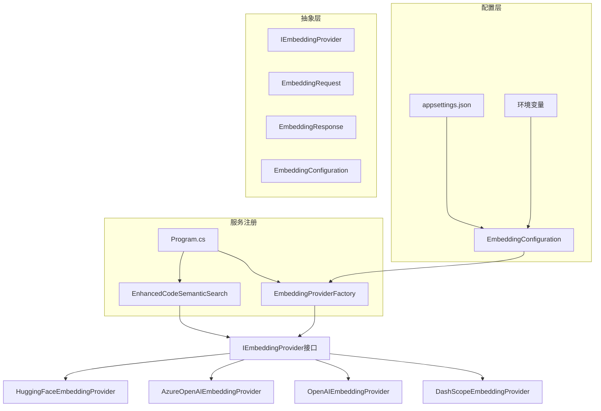

# 嵌入向量多厂商支持升级计划

## 📋 项目概述

本文档描述了对代码索引和MCP服务的嵌入向量获取逻辑进行抽象化改进的详细计划，旨在支持多个不同厂家的嵌入向量接口实现。

## 🎯 当前现状分析

### 现有实现问题
1. **硬编码依赖**：嵌入向量获取逻辑硬编码在 `EnhancedCodeSemanticSearch.cs` 的 `GetEmbeddings` 方法中
2. **单一提供商**：仅支持阿里云 DashScope 的 text-embedding-v4 模型
3. **紧耦合设计**：HTTP 请求逻辑、API 格式、错误处理都与具体厂商绑定
4. **配置限制**：API Key、端点URL、模型参数等都是硬编码的
5. **扩展困难**：添加新提供商需要修改核心业务逻辑代码

### 当前代码结构
```
CodebaseMcpServer/Services/EnhancedCodeSemanticSearch.cs
├── GetEmbeddings() - 硬编码DashScope API调用
├── EstimateTokenCount() - Token估算逻辑
├── TruncateText() - 文本截断逻辑
└── 其他业务逻辑...
```

## 🏗️ 目标架构设计

### 核心设计原则
- **单一职责**：每个提供商实现专注于自己的API调用
- **开闭原则**：对扩展开放，对修改关闭
- **依赖倒置**：依赖抽象而不是具体实现
- **配置驱动**：通过配置文件控制提供商选择

### 架构图


## 📁 新项目结构设计

```
CodebaseMcpServer/
├── Services/
│   ├── Embedding/                          # 新增嵌入向量服务目录
│   │   ├── IEmbeddingProvider.cs           # 嵌入向量提供商接口
│   │   ├── EmbeddingProviderFactory.cs     # 提供商工厂
│   │   ├── Providers/                      # 具体提供商实现
│   │   │   ├── DashScopeEmbeddingProvider.cs
│   │   │   ├── OpenAIEmbeddingProvider.cs
│   │   │   ├── AzureOpenAIEmbeddingProvider.cs
│   │   │   └── HuggingFaceEmbeddingProvider.cs
│   │   └── Models/                         # 嵌入向量相关模型
│   │       ├── EmbeddingRequest.cs
│   │       ├── EmbeddingResponse.cs
│   │       ├── EmbeddingConfiguration.cs
│   │       └── EmbeddingProviderSettings.cs
│   └── EnhancedCodeSemanticSearch.cs       # 修改以使用抽象接口
├── Models/
│   └── EmbeddingProviderType.cs           # 提供商类型枚举
└── appsettings.json                       # 更新配置结构
```

## 🔧 核心接口设计

### IEmbeddingProvider 接口
```csharp
public interface IEmbeddingProvider
{
    /// <summary>
    /// 获取文本的嵌入向量
    /// </summary>
    Task<List<List<float>>> GetEmbeddingsAsync(List<string> texts);
    
    /// <summary>
    /// 获取最大批处理大小
    /// </summary>
    int GetMaxBatchSize();
    
    /// <summary>
    /// 获取最大Token长度
    /// </summary>
    int GetMaxTokenLength();
    
    /// <summary>
    /// 获取嵌入向量维度
    /// </summary>
    int GetEmbeddingDimension();
    
    /// <summary>
    /// 验证配置是否有效
    /// </summary>
    bool ValidateConfiguration();
    
    /// <summary>
    /// 提供商名称
    /// </summary>
    string ProviderName { get; }
}
```

### EmbeddingProviderType 枚举
```csharp
public enum EmbeddingProviderType
{
    DashScope,      // 阿里云DashScope
    OpenAI,         // OpenAI官方API
    AzureOpenAI,    // Azure OpenAI服务
    HuggingFace,    // Hugging Face推理API
    // 可扩展支持更多厂商...
}
```

## ⚙️ 配置结构设计

### appsettings.json 新结构
```json
{
  "EmbeddingProviders": {
    "DefaultProvider": "DashScope",
    "Providers": {
      "DashScope": {
        "ApiKey": "sk-a239bd73d5b947ed955d03d437ca1e70",
        "BaseUrl": "https://dashscope.aliyuncs.com/compatible-mode/v1",
        "Model": "text-embedding-v4",
        "MaxBatchSize": 10,
        "MaxTokenLength": 8192,
        "EmbeddingDimension": 1024,
        "Timeout": 30000
      },
      "OpenAI": {
        "ApiKey": "",
        "BaseUrl": "https://api.openai.com/v1",
        "Model": "text-embedding-3-small",
        "MaxBatchSize": 2048,
        "MaxTokenLength": 8191,
        "EmbeddingDimension": 1536,
        "Timeout": 30000
      },
      "AzureOpenAI": {
        "ApiKey": "",
        "BaseUrl": "https://your-resource.openai.azure.com",
        "Model": "text-embedding-3-small",
        "ApiVersion": "2024-02-01",
        "MaxBatchSize": 2048,
        "MaxTokenLength": 8191,
        "EmbeddingDimension": 1536,
        "Timeout": 30000
      },
      "HuggingFace": {
        "ApiKey": "",
        "BaseUrl": "https://api-inference.huggingface.co",
        "Model": "sentence-transformers/all-MiniLM-L6-v2",
        "MaxBatchSize": 100,
        "MaxTokenLength": 512,
        "EmbeddingDimension": 384,
        "Timeout": 30000
      }
    }
  },
  // 保持现有其他配置...
}
```

## 🔄 实施阶段计划

### 第一阶段：创建抽象层 (1-2天)
**目标**：建立基础架构和接口

**任务清单**：
- [x] 创建 `IEmbeddingProvider` 接口
- [x] 创建嵌入向量相关的模型类
  - `EmbeddingRequest.cs`
  - `EmbeddingResponse.cs` 
  - `EmbeddingConfiguration.cs`
  - `EmbeddingProviderSettings.cs`
- [x] 创建 `EmbeddingProviderType` 枚举
- [x] 创建 `EmbeddingProviderFactory` 工厂类
- [x] 设计和实现配置结构

**预期产出**：
- 完整的抽象层接口
- 配置模型和工厂类
- 单元测试基础框架

### 第二阶段：重构现有实现 (1-2天)
**目标**：将现有DashScope实现重构为新架构

**任务清单**：
- [x] 创建 `DashScopeEmbeddingProvider` 类
- [x] 从 `EnhancedCodeSemanticSearch` 中提取嵌入向量逻辑
- [x] 修改 `EnhancedCodeSemanticSearch` 使用 `IEmbeddingProvider` 接口
- [x] 更新依赖注入配置
- [x] 更新 `appsettings.json` 配置文件
- [x] 确保向后兼容性

**预期产出**：
- 重构后的代码保持功能不变
- 所有现有测试通过
- 配置文件更新完成

### 第三阶段：添加新提供商支持 (2-3天)
**目标**：实现多个主流嵌入向量提供商

**任务清单**：
- [x] 实现 `OpenAIEmbeddingProvider`
  - 支持 text-embedding-3-small 和 text-embedding-3-large
  - 处理OpenAI特有的API格式和限制
- [x] 实现 `AzureOpenAIEmbeddingProvider`
  - 支持Azure OpenAI服务的API格式
  - 处理API版本和资源URL配置
- [x] 实现 `HuggingFaceEmbeddingProvider`
  - 支持Hugging Face推理API
  - 处理不同的模型和响应格式
- [x] 添加提供商动态切换功能
- [x] 实现配置验证和错误处理

**预期产出**：
- 4个完整的提供商实现
- 动态提供商切换功能
- 完整的配置验证

### 第四阶段：测试和优化 (1-2天)
**目标**：确保系统稳定性和性能

**任务清单**：
- [x] 单元测试各个提供商实现
- [x] 集成测试提供商切换功能
- [x] 性能测试和对比分析
- [x] 错误处理和重试机制测试
- [x] 配置验证测试
- [x] 文档更新和使用说明

**预期产出**：
- 完整的测试覆盖
- 性能基准报告
- 用户使用文档

## 💡 核心改进价值

### 技术优势
- **🔧 可扩展性**：轻松添加新的嵌入向量提供商，无需修改核心业务逻辑
- **⚙️ 可配置性**：运行时通过配置文件切换不同提供商
- **🔗 解耦合**：业务逻辑与具体API实现完全分离
- **📏 一致性**：统一的接口标准化所有提供商的使用方式
- **🛡️ 稳定性**：独立的错误处理和重试机制

### 业务价值
- **💰 成本优化**：可根据成本和性能选择最合适的提供商
- **⚡ 性能优化**：支持A/B测试找到最优嵌入向量方案
- **🔒 风险分散**：避免单点依赖，提高系统可用性
- **🌍 灵活部署**：不同环境可以使用不同的提供商
- **📊 监控对比**：可以对比不同提供商的效果和性能

## 🤔 技术考虑和挑战

### 向量维度兼容性
- **问题**：不同提供商的向量维度可能不同（如DashScope 1024维 vs OpenAI 1536维）
- **解决方案**：
  - 在索引创建时记录向量维度
  - 不同维度的向量使用不同的Qdrant集合
  - 提供维度转换选项（如PCA降维）

### API限制差异处理
- **批处理大小**：各厂商支持的批处理大小不同
- **Token限制**：最大Token长度限制不同
- **请求频率**：API调用频率限制不同
- **解决方案**：接口中提供限制查询方法，动态调整批处理策略

### 错误处理和重试
- **统一错误码**：将不同厂商的错误码统一映射
- **重试策略**：指数退避重试机制
- **熔断机制**：提供商不可用时的降级策略

### 配置管理
- **敏感信息**：API Key等敏感信息的安全存储
- **环境变量**：支持通过环境变量覆盖配置
- **配置验证**：启动时验证所有配置的完整性

## 📊 性能基准预期

### 不同提供商对比维度
- **响应时间**：API调用的平均响应时间
- **吞吐量**：每秒可处理的文本数量
- **准确性**：语义搜索的准确率对比
- **成本效益**：每1000次调用的成本对比
- **稳定性**：服务可用性和错误率

### 监控指标
- 每个提供商的调用次数和成功率
- 平均响应时间和P99延迟
- 错误类型和频率统计
- 成本使用情况追踪

## 🚀 后续扩展计划

### 短期扩展（1-3个月）
- 添加更多提供商支持（Google Vertex AI、Claude等）
- 实现向量缓存机制减少API调用
- 添加A/B测试框架对比提供商效果

### 中期扩展（3-6个月）
- 支持本地部署的开源模型
- 实现多提供商负载均衡
- 添加提供商性能监控和告警

### 长期扩展（6个月以上）
- 自动提供商选择和切换
- 向量质量评估和优化
- 支持多模态嵌入向量（文本+代码）

## 📝 文档和培训计划

### 开发文档
- API接口文档和示例
- 新提供商接入指南
- 配置参考文档
- 故障排除指南

### 用户文档
- 提供商选择建议
- 配置最佳实践
- 性能调优指南
- 成本优化建议

---

**创建时间**：2025-06-14 19:51:52  
**文档版本**：v1.0  
**负责人**：AI Assistant  
**预计完成时间**：7-10个工作日