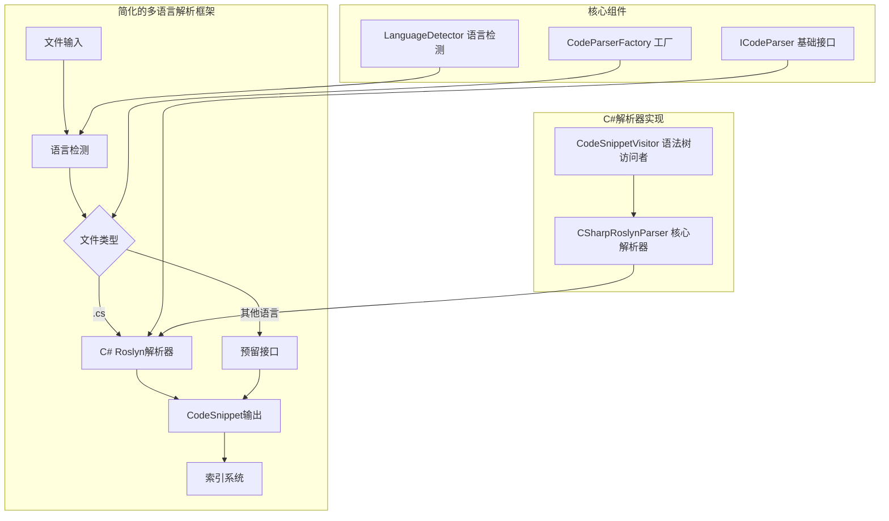

# 多语言代码解析框架设计文档

## 📝 项目概述

设计支持扩展其他语言的代码解析框架，当前专注于C#解析器的简化实现，主要目标是满足代码索引构建需求。

## 🎯 设计目标

### 核心原则
- **简单实用**：满足索引构建的基本需求
- **可扩展**：为将来支持其他语言预留接口
- **高效稳定**：确保解析性能和系统稳定性
- **易于维护**：代码结构清晰，逻辑简单

### 功能目标
- ✅ 准确解析C#代码结构（类、方法、属性等）
- ✅ 提取代码片段用于语义索引
- ✅ 支持现代C#语法特性
- ✅ 为其他语言扩展预留标准接口

## 🏗️ 架构设计



## 📁 项目结构

```
CodebaseMcpServer/
├── Services/
│   ├── Parsing/                     # 解析服务目录
│   │   ├── ICodeParser.cs           # 基础接口
│   │   ├── ILanguageDetector.cs     # 语言检测接口
│   │   ├── LanguageDetector.cs      # 语言检测实现
│   │   ├── CodeParserFactory.cs     # 解析器工厂
│   │   ├── CSharpRoslynParser.cs    # C#解析器
│   │   └── CodeSnippetVisitor.cs    # 语法树访问者
│   └── EnhancedCodeSemanticSearch.cs   # 更新使用新解析器
├── Models/
│   ├── CodeSnippet.cs               # 代码片段模型
│   ├── LanguageInfo.cs              # 语言信息模型
│   └── ParseResult.cs               # 解析结果模型
└── ...
```

## 🔧 核心接口设计

### 1. 基础解析器接口

```csharp
namespace CodebaseMcpServer.Services.Parsing;

/// <summary>
/// 代码解析器基础接口
/// </summary>
public interface ICodeParser
{
    /// <summary>
    /// 解析器支持的语言标识
    /// </summary>
    string Language { get; }
    
    /// <summary>
    /// 解析器显示名称
    /// </summary>
    string DisplayName { get; }
    
    /// <summary>
    /// 支持的文件扩展名
    /// </summary>
    IEnumerable<string> SupportedExtensions { get; }
    
    /// <summary>
    /// 检查是否支持指定文件
    /// </summary>
    bool SupportsFile(string filePath);
    
    /// <summary>
    /// 解析代码文件
    /// </summary>
    List<CodeSnippet> ParseCodeFile(string filePath);
    
    /// <summary>
    /// 解析代码内容
    /// </summary>
    List<CodeSnippet> ParseCodeContent(string filePath, string content);
}
```

### 2. 语言检测接口

```csharp
/// <summary>
/// 语言检测器接口
/// </summary>
public interface ILanguageDetector
{
    /// <summary>
    /// 根据文件路径检测语言
    /// </summary>
    string DetectLanguage(string filePath);
    
    /// <summary>
    /// 获取语言信息
    /// </summary>
    LanguageInfo? GetLanguageInfo(string language);
    
    /// <summary>
    /// 获取所有支持的语言
    /// </summary>
    IEnumerable<LanguageInfo> GetSupportedLanguages();
}
```

### 3. 语言信息模型

```csharp
/// <summary>
/// 语言信息
/// </summary>
public record LanguageInfo(
    string Id,           // 语言标识，如 "csharp"
    string DisplayName,  // 显示名称，如 "C#"
    string[] Extensions, // 文件扩展名，如 [".cs"]
    string MimeType      // MIME类型，如 "text/x-csharp"
);
```

## 🛠️ 简化实施方案

### 阶段一：基础架构搭建 (1天)

**目标**：建立基础的多语言解析框架

**核心任务**：

**1.1 创建基础接口和模型**
```csharp
// Models/LanguageInfo.cs
namespace CodebaseMcpServer.Models;

public record LanguageInfo(
    string Id,
    string DisplayName,
    string[] Extensions,
    string MimeType = "text/plain")
{
    public static LanguageInfo CSharp => new(
        "csharp", 
        "C#", 
        new[] { ".cs" }, 
        "text/x-csharp");
    
    public static LanguageInfo Python => new(
        "python", 
        "Python", 
        new[] { ".py" }, 
        "text/x-python");
    
    public static LanguageInfo JavaScript => new(
        "javascript", 
        "JavaScript", 
        new[] { ".js" }, 
        "text/javascript");
    
    public static LanguageInfo TypeScript => new(
        "typescript", 
        "TypeScript", 
        new[] { ".ts" }, 
        "text/typescript");
}

// Models/ParseResult.cs
namespace CodebaseMcpServer.Models;

public class ParseResult
{
    public bool Success { get; set; } = true;
    public string Language { get; set; } = string.Empty;
    public string FilePath { get; set; } = string.Empty;
    public List<CodeSnippet> Snippets { get; set; } = new();
    public string? ErrorMessage { get; set; }
    public Exception? Exception { get; set; }
    public DateTime ParsedAt { get; set; } = DateTime.UtcNow;
}
```

**1.2 实现语言检测器**
```csharp
// Services/Parsing/LanguageDetector.cs
namespace CodebaseMcpServer.Services.Parsing;

public class LanguageDetector : ILanguageDetector
{
    private static readonly Dictionary<string, LanguageInfo> ExtensionMap = new()
    {
        { ".cs", LanguageInfo.CSharp },
        { ".py", LanguageInfo.Python },
        { ".js", LanguageInfo.JavaScript },
        { ".ts", LanguageInfo.TypeScript }
    };
    
    public string DetectLanguage(string filePath)
    {
        var extension = Path.GetExtension(filePath).ToLowerInvariant();
        return ExtensionMap.TryGetValue(extension, out var info) 
            ? info.Id 
            : "unknown";
    }
    
    public LanguageInfo? GetLanguageInfo(string language)
    {
        return ExtensionMap.Values.FirstOrDefault(l => l.Id == language);
    }
    
    public IEnumerable<LanguageInfo> GetSupportedLanguages()
    {
        return ExtensionMap.Values.Distinct();
    }
}
```

### 阶段二：简化C#解析器 (1-2天)

**目标**：实现满足索引需求的C#解析器

**核心实现**：

**2.1 简化的C#解析器**
```csharp
// Services/Parsing/CSharpRoslynParser.cs
using Microsoft.CodeAnalysis;
using Microsoft.CodeAnalysis.CSharp;

namespace CodebaseMcpServer.Services.Parsing;

/// <summary>
/// 简化的C# Roslyn解析器 - 满足索引构建需求
/// </summary>
public class CSharpRoslynParser : ICodeParser
{
    public string Language => "csharp";
    public string DisplayName => "C# (Roslyn)";
    public IEnumerable<string> SupportedExtensions => new[] { ".cs" };
    
    public bool SupportsFile(string filePath) 
        => Path.GetExtension(filePath).Equals(".cs", StringComparison.OrdinalIgnoreCase);
    
    public List<CodeSnippet> ParseCodeFile(string filePath)
    {
        if (!File.Exists(filePath))
        {
            Console.WriteLine($"[WARNING] 文件不存在: {filePath}");
            return new List<CodeSnippet>();
        }
        
        try
        {
            var content = File.ReadAllText(filePath);
            return ParseCodeContent(filePath, content);
        }
        catch (Exception ex)
        {
            Console.WriteLine($"[ERROR] 解析文件失败: {filePath}, 错误: {ex.Message}");
            return new List<CodeSnippet>();
        }
    }
    
    public List<CodeSnippet> ParseCodeContent(string filePath, string content)
    {
        if (string.IsNullOrWhiteSpace(content))
            return new List<CodeSnippet>();
        
        try
        {
            // 创建语法树
            var tree = CSharpSyntaxTree.ParseText(content, path: filePath);
            var root = tree.GetCompilationUnitRoot();
            
            // 检查是否有严重语法错误
            var errors = root.GetDiagnostics()
                .Where(d => d.Severity == DiagnosticSeverity.Error)
                .ToList();
            
            if (errors.Count > 10) // 如果错误过多，跳过解析
            {
                Console.WriteLine($"[WARNING] 文件 {filePath} 语法错误过多，跳过解析");
                return new List<CodeSnippet>();
            }
            
            // 使用访问者模式提取代码片段
            var visitor = new SimpleCodeSnippetVisitor(filePath);
            visitor.Visit(root);
            
            return visitor.Snippets;
        }
        catch (Exception ex)
        {
            Console.WriteLine($"[ERROR] Roslyn解析失败: {filePath}, 错误: {ex.Message}");
            return new List<CodeSnippet>();
        }
    }
}
```

**2.2 简化的语法树访问者**
```csharp
// Services/Parsing/SimpleCodeSnippetVisitor.cs
using Microsoft.CodeAnalysis;
using Microsoft.CodeAnalysis.CSharp;
using Microsoft.CodeAnalysis.CSharp.Syntax;

namespace CodebaseMcpServer.Services.Parsing;

/// <summary>
/// 简化的代码片段访问者 - 专注于核心成员提取
/// </summary>
public class SimpleCodeSnippetVisitor : CSharpSyntaxWalker
{
    private readonly string _filePath;
    private readonly List<CodeSnippet> _snippets = new();
    private string? _currentNamespace;
    private string? _currentClass;
    
    public List<CodeSnippet> Snippets => _snippets;
    
    public SimpleCodeSnippetVisitor(string filePath)
    {
        _filePath = filePath;
    }
    
    #region 命名空间处理
    
    public override void VisitNamespaceDeclaration(NamespaceDeclarationSyntax node)
    {
        var previousNamespace = _currentNamespace;
        _currentNamespace = node.Name.ToString();
        
        base.VisitNamespaceDeclaration(node);
        
        _currentNamespace = previousNamespace;
    }
    
    public override void VisitFileScopedNamespaceDeclaration(FileScopedNamespaceDeclarationSyntax node)
    {
        _currentNamespace = node.Name.ToString();
        base.VisitFileScopedNamespaceDeclaration(node);
    }
    
    #endregion
    
    #region 类型声明处理
    
    public override void VisitClassDeclaration(ClassDeclarationSyntax node)
    {
        ProcessTypeDeclaration(node, node.Identifier.ValueText, "类");
    }
    
    public override void VisitInterfaceDeclaration(InterfaceDeclarationSyntax node)
    {
        ProcessTypeDeclaration(node, node.Identifier.ValueText, "接口");
    }
    
    public override void VisitStructDeclaration(StructDeclarationSyntax node)
    {
        ProcessTypeDeclaration(node, node.Identifier.ValueText, "结构体");
    }
    
    public override void VisitRecordDeclaration(RecordDeclarationSyntax node)
    {
        ProcessTypeDeclaration(node, node.Identifier.ValueText, "记录");
    }
    
    public override void VisitEnumDeclaration(EnumDeclarationSyntax node)
    {
        ProcessTypeDeclaration(node, node.Identifier.ValueText, "枚举");
    }
    
    private void ProcessTypeDeclaration(SyntaxNode node, string typeName, string typeKind)
    {
        var previousClass = _currentClass;
        _currentClass = typeName;
        
        var snippet = CreateCodeSnippet(node, typeName, typeKind);
        _snippets.Add(snippet);
        
        base.Visit(node);
        
        _currentClass = previousClass;
    }
    
    #endregion
    
    #region 成员声明处理
    
    public override void VisitMethodDeclaration(MethodDeclarationSyntax node)
    {
        var methodName = node.Identifier.ValueText;
        var snippet = CreateCodeSnippet(node, methodName, "方法");
        _snippets.Add(snippet);
        
        // 不继续访问方法体内容，避免过深的嵌套
    }
    
    public override void VisitConstructorDeclaration(ConstructorDeclarationSyntax node)
    {
        var constructorName = node.Identifier.ValueText;
        var snippet = CreateCodeSnippet(node, constructorName, "构造函数");
        _snippets.Add(snippet);
    }
    
    public override void VisitPropertyDeclaration(PropertyDeclarationSyntax node)
    {
        var propertyName = node.Identifier.ValueText;
        var snippet = CreateCodeSnippet(node, propertyName, "属性");
        _snippets.Add(snippet);
    }
    
    public override void VisitFieldDeclaration(FieldDeclarationSyntax node)
    {
        // 处理字段声明（可能包含多个变量）
        foreach (var variable in node.Declaration.Variables)
        {
            var fieldName = variable.Identifier.ValueText;
            var snippet = CreateCodeSnippet(node, fieldName, "字段");
            _snippets.Add(snippet);
        }
    }
    
    public override void VisitEventDeclaration(EventDeclarationSyntax node)
    {
        var eventName = node.Identifier.ValueText;
        var snippet = CreateCodeSnippet(node, eventName, "事件");
        _snippets.Add(snippet);
    }
    
    #endregion
    
    #region 代码片段创建
    
    private CodeSnippet CreateCodeSnippet(SyntaxNode node, string memberName, string memberType)
    {
        try
        {
            var location = node.GetLocation();
            var lineSpan = location.GetLineSpan();
            
            // 限制代码长度，避免过大的代码片段
            var code = node.ToString();
            if (code.Length > 2000)
            {
                code = code[..1950] + "\n// ... 代码过长已截取 ...";
            }
            
            return new CodeSnippet
            {
                FilePath = _filePath,
                Namespace = _currentNamespace,
                ClassName = _currentClass,
                MethodName = $"{memberName} ({memberType})",
                Code = code,
                StartLine = lineSpan.StartLinePosition.Line + 1,
                EndLine = lineSpan.EndLinePosition.Line + 1
            };
        }
        catch (Exception ex)
        {
            Console.WriteLine($"[WARNING] 创建代码片段失败: {memberName}, 错误: {ex.Message}");
            
            // 返回基础的代码片段
            return new CodeSnippet
            {
                FilePath = _filePath,
                Namespace = _currentNamespace,
                ClassName = _currentClass,
                MethodName = $"{memberName} ({memberType})",
                Code = $"// 无法提取代码: {ex.Message}",
                StartLine = 1,
                EndLine = 1
            };
        }
    }
    
    #endregion
}
```

### 阶段三：解析器工厂实现 (0.5天)

**目标**：统一的解析器管理和创建

```csharp
// Services/Parsing/CodeParserFactory.cs
namespace CodebaseMcpServer.Services.Parsing;

/// <summary>
/// 代码解析器工厂
/// </summary>
public class CodeParserFactory
{
    private static readonly ILanguageDetector LanguageDetector = new LanguageDetector();
    private static readonly Dictionary<string, Func<ICodeParser>> ParserFactories = new()
    {
        { "csharp", () => new CSharpRoslynParser() }
        // 将来可以添加其他语言解析器
        // { "python", () => new PythonParser() },
        // { "javascript", () => new JavaScriptParser() }
    };
    
    /// <summary>
    /// 获取指定文件的解析器
    /// </summary>
    public static ICodeParser? GetParser(string filePath)
    {
        var language = LanguageDetector.DetectLanguage(filePath);
        return GetParserByLanguage(language);
    }
    
    /// <summary>
    /// 根据语言获取解析器
    /// </summary>
    public static ICodeParser? GetParserByLanguage(string language)
    {
        return ParserFactories.TryGetValue(language, out var factory) 
            ? factory() 
            : null;
    }
    
    /// <summary>
    /// 检查是否支持指定文件
    /// </summary>
    public static bool IsSupported(string filePath)
    {
        var language = LanguageDetector.DetectLanguage(filePath);
        return ParserFactories.ContainsKey(language);
    }
    
    /// <summary>
    /// 获取所有支持的语言
    /// </summary>
    public static IEnumerable<LanguageInfo> GetSupportedLanguages()
    {
        return LanguageDetector.GetSupportedLanguages()
            .Where(lang => ParserFactories.ContainsKey(lang.Id));
    }
    
    /// <summary>
    /// 注册新的解析器（用于将来扩展）
    /// </summary>
    public static void RegisterParser(string language, Func<ICodeParser> factory)
    {
        ParserFactories[language] = factory;
    }
}
```

### 阶段四：集成现有系统 (0.5天)

**目标**：将新解析器集成到现有索引系统

```csharp
// 更新 EnhancedCodeSemanticSearch.cs 中的解析方法
public List<CodeSnippet> ExtractCodeSnippets(string filePath)
{
    try
    {
        _logger.LogDebug("开始解析文件: {FilePath}", filePath);
        
        // 使用新的解析器工厂
        var parser = CodeParserFactory.GetParser(filePath);
        if (parser == null)
        {
            _logger.LogWarning("不支持的文件类型: {FilePath}", filePath);
            return new List<CodeSnippet>();
        }
        
        var snippets = parser.ParseCodeFile(filePath);
        
        _logger.LogDebug("文件 {FilePath} 解析完成，提取 {Count} 个代码片段", 
            filePath, snippets.Count);
        
        return snippets;
    }
    catch (Exception ex)
    {
        _logger.LogError(ex, "解析文件失败: {FilePath}", filePath);
        return new List<CodeSnippet>();
    }
}
```

## 📊 预期效果

### 解析能力
- ✅ **C#支持完整**：类、接口、方法、属性、字段、事件等
- ✅ **现代语法**：支持C# 12新特性（记录类型、文件作用域命名空间等）
- ✅ **容错处理**：语法错误时能够部分解析
- ✅ **性能适中**：满足索引构建的性能要求

### 扩展能力
- 🔄 **接口预留**：为其他语言扩展预留标准接口
- 🔄 **工厂模式**：支持动态注册新的解析器
- 🔄 **语言检测**：自动识别文件类型

### 维护性
- ✅ **代码简洁**：核心逻辑清晰，易于理解
- ✅ **模块化**：各组件职责明确，低耦合
- ✅ **可测试**：每个组件都可以独立测试

## 🚀 将来扩展示例

当需要支持其他语言时，只需实现对应的解析器：

```csharp
// 将来的Python解析器示例
public class PythonParser : ICodeParser
{
    public string Language => "python";
    public string DisplayName => "Python";
    public IEnumerable<string> SupportedExtensions => new[] { ".py" };
    
    public bool SupportsFile(string filePath) 
        => Path.GetExtension(filePath).Equals(".py", StringComparison.OrdinalIgnoreCase);
    
    public List<CodeSnippet> ParseCodeFile(string filePath)
    {
        // TODO: 实现Python解析逻辑
        // 可以使用正则表达式或其他解析库
        return new List<CodeSnippet>();
    }
    
    public List<CodeSnippet> ParseCodeContent(string filePath, string content)
    {
        // TODO: 实现Python内容解析
        return new List<CodeSnippet>();
    }
}

// 注册新解析器
CodeParserFactory.RegisterParser("python", () => new PythonParser());
```

## 📋 实施时间安排

| 阶段 | 任务 | 预估时间 | 输出 |
|------|------|----------|------|
| 阶段一 | 基础架构搭建 | 1天 | 接口、模型、语言检测器 |
| 阶段二 | C#解析器实现 | 1-2天 | 完整的C#解析功能 |
| 阶段三 | 解析器工厂 | 0.5天 | 统一的解析器管理 |
| 阶段四 | 系统集成 | 0.5天 | 与现有索引系统集成 |
| **总计** | **完整框架** | **3-4天** | **可用的多语言解析框架** |

---

**文档版本**：v1.0  
**创建日期**：2025-06-15  
**适用场景**：代码索引构建、语义搜索  
**复杂度**：简化实现，专注核心功能