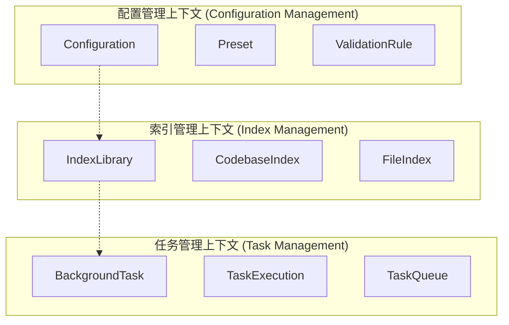
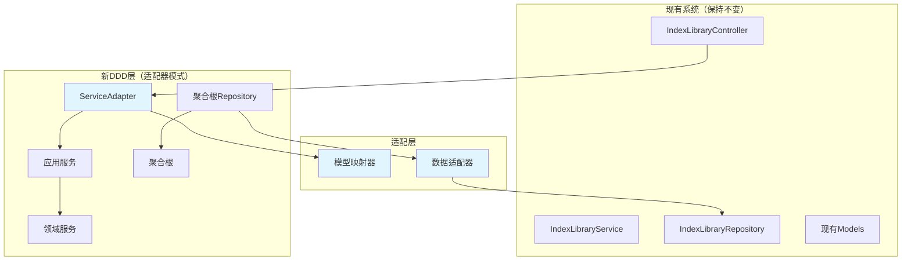

# CodebaseMcpServer DDD重构计划

## 项目现状分析

### 1. 当前架构状态

#### 架构混合问题
- **传统分层架构为主**：采用 Controllers -> Services -> Repositories 的经典三层架构
- **DDD元素不完整**：存在 Domain 文件夹但大部分为空，缺乏真正的领域模型
- **垂直切片尝试**：Features 目录显示了垂直切片架构的尝试，但覆盖不全面
- **职责边界模糊**：业务逻辑、应用逻辑、基础设施逻辑混合在 Services 层

#### 领域模型问题
- **贫血模型**：IndexLibrary 和 BackgroundTask 缺乏业务逻辑，主要是数据容器
- **领域逻辑分散**：业务规则散布在 IndexLibraryService 中
- **缺乏聚合根概念**：没有明确的聚合边界和不变性保护
- **值对象缺失**：如 CodebasePath、CollectionName 等应该是值对象

#### 数据访问层
- **Repository 模式基础良好**：IIndexLibraryRepository 实现了基础接口
- **混合存储设计合理**：SQLite + JSON 的设计适合项目需求
- **缺乏聚合根Repository**：当前Repository是数据访问而非聚合根Repository

### 2. 技术债务识别

#### 高优先级问题
1. **领域模型贫血**：实体缺乏业务逻辑和不变性保护
2. **服务层过重**：IndexLibraryService 承担了过多职责
3. **缺乏领域事件**：无法实现松耦合的业务流程
4. **边界上下文不清晰**：索引管理、任务管理、配置管理混合

#### 中优先级问题
1. **应用服务缺失**：没有明确的应用层协调逻辑
2. **领域服务不明确**：业务逻辑和技术逻辑混合
3. **工厂模式使用不当**：缺乏聚合根工厂

## DDD重构计划

### 重构原则和约束

#### 核心约束：零功能变更
**重要说明：本重构计划严格遵循零功能变更原则，所有重构都是结构性的，不会改变任何现有功能的行为。**

#### 重构策略
1. **独立项目重构**：在 `CodebaseMcpServer_v2` 项目中进行重构，原项目 `CodebaseMcpServer` 保持完全不变
2. **保持API兼容性**：所有现有的REST API接口保持完全不变
3. **保持数据库兼容性**：数据库结构和数据格式保持不变
4. **保持配置兼容性**：所有配置文件和环境变量保持不变
5. **保持行为一致性**：所有业务逻辑的输入输出行为完全一致
6. **渐进式重构**：通过适配器模式和门面模式实现新旧架构的平滑过渡

#### 验证机制
- **回归测试**：每个重构步骤都必须通过完整的回归测试
- **API测试**：确保所有API响应格式和状态码保持一致
- **性能测试**：确保重构不会影响系统性能
- **集成测试**：验证与外部系统的集成保持正常

### 阶段零：项目复制和环境准备（1周）

#### 0.1 项目复制策略

**目标**：创建 `CodebaseMcpServer_v2` 项目，在其中进行DDD重构，确保原项目 `CodebaseMcpServer` 完全不受影响。

**实施步骤**：

```bash
# 1. 复制整个项目目录
cp -r CodebaseMcpServer CodebaseMcpServer_v2

# 2. 更新项目文件
# 修改 .csproj 文件中的项目名称和程序集名称
# 修改 namespace 声明（可选，建议保持一致以减少差异）
```

**项目结构对比**：
```
d:\VSProject\CoodeBaseApp\
├── CodebaseMcpServer\          # 原项目（保持不变）
│   ├── Controllers\
│   ├── Services\
│   ├── Models\
│   ├── Infrastructure\
│   └── ...
└── CodebaseMcpServer_v2\       # 重构项目
    ├── Controllers\            # 保持原有接口
    ├── Services\              # 逐步重构为适配器
    ├── Models\                # 保持兼容
    ├── Domain\                # 新增DDD领域层
    │   ├── IndexManagement\
    │   ├── TaskManagement\
    │   └── SemanticSearch\
    ├── Application\           # 新增应用层
    │   ├── IndexManagement\
    │   └── SemanticSearch\
    ├── Infrastructure\        # 重构基础设施层
    └── Features\              # 完善垂直切片
```

#### 0.2 配置文件调整

**端口配置**：
```json
// CodebaseMcpServer_v2/appsettings.json
{
  "Kestrel": {
    "Endpoints": {
      "Http": {
        "Url": "http://localhost:5001"  // 不同于原项目的5000端口
      }
    }
  },
  // 其他配置保持与原项目一致
  "Qdrant": {
    "Endpoint": "http://localhost:6333",
    "ApiKey": ""
  },
  "OpenAI": {
    "ApiKey": "",
    "Endpoint": "https://api.openai.com/v1"
  }
}
```

**数据库配置**：
```json
// 使用不同的数据库文件避免冲突
{
  "ConnectionStrings": {
    "DefaultConnection": "Data Source=codebase_mcp_v2.db"
  }
}
```

#### 0.3 CI/CD 配置

**独立构建管道**：
```yaml
# .github/workflows/codebase-mcp-server-v2.yml
name: CodebaseMcpServer_v2 CI/CD

on:
  push:
    paths:
      - 'CodebaseMcpServer_v2/**'
  pull_request:
    paths:
      - 'CodebaseMcpServer_v2/**'

jobs:
  build-and-test:
    runs-on: ubuntu-latest
    defaults:
      run:
        working-directory: ./CodebaseMcpServer_v2
    
    steps:
    - uses: actions/checkout@v3
    - name: Setup .NET
      uses: actions/setup-dotnet@v3
      with:
        dotnet-version: '8.0.x'
    
    - name: Restore dependencies
      run: dotnet restore
    
    - name: Build
      run: dotnet build --no-restore
    
    - name: Test
      run: dotnet test --no-build --verbosity normal
    
    - name: Compatibility Test
      run: |
        # 启动v2服务
        dotnet run --project CodebaseMcpServer_v2 &
        sleep 10
        
        # 运行API兼容性测试
        dotnet test Tests/CompatibilityTests --logger trx
```

#### 0.4 开发环境隔离

**Docker配置**：
```dockerfile
# CodebaseMcpServer_v2/Dockerfile
FROM mcr.microsoft.com/dotnet/aspnet:8.0 AS base
WORKDIR /app
EXPOSE 5001  # 不同端口

FROM mcr.microsoft.com/dotnet/sdk:8.0 AS build
WORKDIR /src
COPY ["CodebaseMcpServer_v2/CodebaseMcpServer_v2.csproj", "CodebaseMcpServer_v2/"]
RUN dotnet restore "CodebaseMcpServer_v2/CodebaseMcpServer_v2.csproj"
COPY . .
WORKDIR "/src/CodebaseMcpServer_v2"
RUN dotnet build "CodebaseMcpServer_v2.csproj" -c Release -o /app/build

FROM build AS publish
RUN dotnet publish "CodebaseMcpServer_v2.csproj" -c Release -o /app/publish

FROM base AS final
WORKDIR /app
COPY --from=publish /app/publish .
ENTRYPOINT ["dotnet", "CodebaseMcpServer_v2.dll"]
```

**docker-compose 配置**：
```yaml
# docker-compose.v2.yml
version: '3.8'
services:
  codebase-mcp-server-v2:
    build:
      context: .
      dockerfile: CodebaseMcpServer_v2/Dockerfile
    ports:
      - "5001:5001"
    environment:
      - ASPNETCORE_ENVIRONMENT=Development
      - ConnectionStrings__DefaultConnection=Data Source=/app/data/codebase_mcp_v2.db
    volumes:
      - ./data_v2:/app/data
    depends_on:
      - qdrant
  
  qdrant:
    image: qdrant/qdrant:latest
    ports:
      - "6333:6333"
    volumes:
      - ./qdrant_storage_v2:/qdrant/storage
```

#### 0.5 兼容性测试框架

**API兼容性测试**：
```csharp
// Tests/CompatibilityTests/ApiCompatibilityTests.cs
public class ApiCompatibilityTests
{
    private readonly HttpClient _originalClient;
    private readonly HttpClient _v2Client;
    
    public ApiCompatibilityTests()
    {
        _originalClient = new HttpClient { BaseAddress = new Uri("http://localhost:5000") };
        _v2Client = new HttpClient { BaseAddress = new Uri("http://localhost:5001") };
    }
    
    [Test]
    public async Task GetAllLibraries_ShouldReturnIdenticalResponse()
    {
        // Arrange
        var endpoint = "/api/index-libraries";
        
        // Act
        var originalResponse = await _originalClient.GetStringAsync(endpoint);
        var v2Response = await _v2Client.GetStringAsync(endpoint);
        
        // Assert
        var originalData = JsonSerializer.Deserialize<List<IndexLibrary>>(originalResponse);
        var v2Data = JsonSerializer.Deserialize<List<IndexLibrary>>(v2Response);
        
        originalData.Should().BeEquivalentTo(v2Data);
    }
    
    [Test]
    public async Task CreateLibrary_ShouldReturnIdenticalResponse()
    {
        // Arrange
        var request = new CreateLibraryRequest
        {
            Name = "Test Library",
            CodebasePath = @"C:\TestProject"
        };
        
        // Act
        var originalResponse = await _originalClient.PostAsJsonAsync("/api/index-libraries", request);
        var v2Response = await _v2Client.PostAsJsonAsync("/api/index-libraries", request);
        
        // Assert
        originalResponse.StatusCode.Should().Be(v2Response.StatusCode);
        
        var originalContent = await originalResponse.Content.ReadAsStringAsync();
        var v2Content = await v2Response.Content.ReadAsStringAsync();
        
        // 比较响应结构（忽略ID等动态字段）
        CompareResponseStructure(originalContent, v2Content);
    }
}
```

#### 0.6 阶段零完成状态

**完成状态**：已完成

**说明**：
- `CodebaseMcpServer_v2` 项目的基础目录结构已创建。
- 领域层（Domain）和基础设施层（Infrastructure）的关键接口和值对象、实体、聚合根、领域事件等文件已根据计划创建并成功编译。
- 编译验证已通过，项目已具备进入下一阶段的条件。

### 阶段一：领域模型重构（2-3周）

> **编译保证**：每个子阶段完成后都必须确保项目能够成功编译和运行，通过自动化测试验证功能完整性。

#### 1.1 识别边界上下文（第1天）

**实施步骤**：

**步骤1.1.1**：创建领域层基础结构（30分钟）
```bash
# 在 CodebaseMcpServer_v2 项目中创建目录结构
mkdir Domain\Shared
mkdir Domain\IndexManagement
mkdir Domain\TaskManagement
mkdir Domain\SemanticSearch
mkdir Domain\ConfigurationManagement
```

**步骤1.1.2**：创建共享领域基础类（2小时）
```csharp
// Domain/Shared/Entity.cs
namespace CodebaseMcpServer.Domain.Shared
{
    public abstract class Entity<TId>
    {
        public TId Id { get; protected set; }
        
        protected Entity(TId id)
        {
            Id = id;
        }
        
        protected Entity() { } // For EF Core
        
        public override bool Equals(object obj)
        {
            if (obj is not Entity<TId> other)
                return false;
                
            if (ReferenceEquals(this, other))
                return true;
                
            return Id.Equals(other.Id);
        }
        
        public override int GetHashCode()
        {
            return Id.GetHashCode();
        }
    }
}

// Domain/Shared/AggregateRoot.cs
using System.Collections.Generic;

namespace CodebaseMcpServer.Domain.Shared
{
    public abstract class AggregateRoot<TId> : Entity<TId>
    {
        private readonly List<IDomainEvent> _domainEvents = new();
        
        protected AggregateRoot(TId id) : base(id) { }
        protected AggregateRoot() { }
        
        public IReadOnlyList<IDomainEvent> DomainEvents => _domainEvents.AsReadOnly();
        
        protected void AddDomainEvent(IDomainEvent domainEvent)
        {
            _domainEvents.Add(domainEvent);
        }
        
        public void ClearDomainEvents()
        {
            _domainEvents.Clear();
        }
    }
}

// Domain/Shared/IDomainEvent.cs
using System;

namespace CodebaseMcpServer.Domain.Shared
{
    public interface IDomainEvent
    {
        DateTime OccurredOn { get; }
    }
}

// Domain/Shared/ValueObject.cs
using System;
using System.Collections.Generic;
using System.Linq;

namespace CodebaseMcpServer.Domain.Shared
{
    public abstract class ValueObject
    {
        protected static bool EqualOperator(ValueObject left, ValueObject right)
        {
            if (ReferenceEquals(left, null) ^ ReferenceEquals(right, null))
                return false;
            return ReferenceEquals(left, null) || left.Equals(right);
        }
        
        protected static bool NotEqualOperator(ValueObject left, ValueObject right)
        {
            return !(EqualOperator(left, right));
        }
        
        protected abstract IEnumerable<object> GetEqualityComponents();
        
        public override bool Equals(object obj)
        {
            if (obj == null || obj.GetType() != GetType())
                return false;
            
            var other = (ValueObject)obj;
            return GetEqualityComponents().SequenceEqual(other.GetEqualityComponents());
        }
        
        public override int GetHashCode()
        {
            return GetEqualityComponents()
                .Select(x => x?.GetHashCode() ?? 0)
                .Aggregate((x, y) => x ^ y);
        }
    }
}
```

**步骤1.1.3**：创建边界上下文标记接口（30分钟）
```csharp
// Domain/IndexManagement/IIndexManagementContext.cs
namespace CodebaseMcpServer.Domain.IndexManagement
{
    /// <summary>
    /// 索引管理边界上下文标记接口
    /// </summary>
    public interface IIndexManagementContext { }
}

// Domain/TaskManagement/ITaskManagementContext.cs
namespace CodebaseMcpServer.Domain.TaskManagement
{
    /// <summary>
    /// 任务管理边界上下文标记接口
    /// </summary>
    public interface ITaskManagementContext { }
}

// Domain/SemanticSearch/ISemanticSearchContext.cs
namespace CodebaseMcpServer.Domain.SemanticSearch
{
    /// <summary>
    /// 语义搜索边界上下文标记接口
    /// </summary>
    public interface ISemanticSearchContext { }
}

// Domain/ConfigurationManagement/IConfigurationManagementContext.cs
namespace CodebaseMcpServer.Domain.ConfigurationManagement
{
    /// <summary>
    /// 配置管理边界上下文标记接口
    /// </summary>
    public interface IConfigurationManagementContext { }
}
```

**编译验证**：
```bash
# 验证编译
dotnet build CodebaseMcpServer_v2
# 预期结果：Build succeeded. 0 Warning(s). 0 Error(s).

# 运行基础测试
dotnet test CodebaseMcpServer_v2.Tests --filter "Category=Domain" --verbosity normal
```

**边界上下文架构图**：


#### 1.2 重新设计聚合根（第2-3天）

**实施步骤**：

**步骤1.2.1**：创建值对象（4小时）
```csharp
// Domain/IndexManagement/ValueObjects/IndexLibraryId.cs
using CodebaseMcpServer.Domain.Shared;
using System;

namespace CodebaseMcpServer.Domain.IndexManagement.ValueObjects
{
    public record IndexLibraryId(int Value)
    {
        public IndexLibraryId
        {
            if (Value <= 0)
                throw new ArgumentException("Library ID must be positive", nameof(Value));
        }
        
        public static implicit operator int(IndexLibraryId id) => id.Value;
        public static implicit operator IndexLibraryId(int value) => new(value);
    }
}

// Domain/IndexManagement/ValueObjects/CodebasePath.cs
using System;
using System.IO;
using System.Collections.Generic;
using CodebaseMcpServer.Domain.Shared;

namespace CodebaseMcpServer.Domain.IndexManagement.ValueObjects
{
    public class CodebasePath : ValueObject
    {
        public string Value { get; }
        
        public CodebasePath(string value)
        {
            if (string.IsNullOrWhiteSpace(value))
                throw new ArgumentException("Codebase path cannot be empty", nameof(value));
            if (!Directory.Exists(value))
                throw new ArgumentException($"Directory does not exist: {value}", nameof(value));
                
            Value = Path.GetFullPath(value).TrimEnd(Path.DirectorySeparatorChar);
        }
        
        public string NormalizedPath => Value;
        
        protected override IEnumerable<object> GetEqualityComponents()
        {
            yield return Value;
        }
        
        public static implicit operator string(CodebasePath path) => path.Value;
        public static implicit operator CodebasePath(string value) => new(value);
    }
}

// Domain/IndexManagement/ValueObjects/CollectionName.cs
using System;
using System.Collections.Generic;
using CodebaseMcpServer.Domain.Shared;

namespace CodebaseMcpServer.Domain.IndexManagement.ValueObjects
{
    public class CollectionName : ValueObject
    {
        public string Value { get; }
        
        public CollectionName(string value)
        {
            if (string.IsNullOrWhiteSpace(value))
                throw new ArgumentException("Collection name cannot be empty", nameof(value));
            if (value.Length > 100)
                throw new ArgumentException("Collection name too long", nameof(value));
                
            Value = value.Trim();
        }
        
        protected override IEnumerable<object> GetEqualityComponents()
        {
            yield return Value;
        }
        
        public static implicit operator string(CollectionName name) => name.Value;
        public static implicit operator CollectionName(string value) => new(value);
    }
}

// Domain/IndexManagement/ValueObjects/FilePath.cs
using System;
using System.Collections.Generic;
using System.IO;
using CodebaseMcpServer.Domain.Shared;

namespace CodebaseMcpServer.Domain.IndexManagement.ValueObjects
{
    public class FilePath : ValueObject
    {
        public string RelativePath { get; }
        
        public FilePath(string relativePath)
        {
            if (string.IsNullOrWhiteSpace(relativePath))
                throw new ArgumentException("File path cannot be empty", nameof(relativePath));
            if (Path.IsPathRooted(relativePath))
                throw new ArgumentException("File path must be relative", nameof(relativePath));
                
            RelativePath = relativePath.Replace('\\', '/');
        }
        
        protected override IEnumerable<object> GetEqualityComponents()
        {
            yield return RelativePath;
        }
        
        public static implicit operator string(FilePath path) => path.RelativePath;
        public static implicit operator FilePath(string value) => new(value);
    }
}
```

**步骤1.2.2**：创建枚举和状态对象（1小时）
```csharp
// Domain/IndexManagement/Enums/IndexStatus.cs
namespace CodebaseMcpServer.Domain.IndexManagement.Enums
{
    public enum IndexStatus
    {
        Pending = 0,
        Indexing = 1,
        Completed = 2,
        Failed = 3,
        Cancelled = 4
    }
}

// Domain/IndexManagement/ValueObjects/IndexStatistics.cs
using System;
using System.Collections.Generic;
using CodebaseMcpServer.Domain.Shared;

namespace CodebaseMcpServer.Domain.IndexManagement.ValueObjects
{
    public class IndexStatistics : ValueObject
    {
        public int TotalFiles { get; }
        public int IndexedFiles { get; }
        public long TotalSize { get; }
        public DateTime LastUpdated { get; }
        
        public IndexStatistics(int totalFiles, int indexedFiles, long totalSize, DateTime lastUpdated)
        {
            if (totalFiles < 0) throw new ArgumentException("Total files cannot be negative");
            if (indexedFiles < 0) throw new ArgumentException("Indexed files cannot be negative");
            if (indexedFiles > totalFiles) throw new ArgumentException("Indexed files cannot exceed total files");
            if (totalSize < 0) throw new ArgumentException("Total size cannot be negative");
            
            TotalFiles = totalFiles;
            IndexedFiles = indexedFiles;
            TotalSize = totalSize;
            LastUpdated = lastUpdated;
        }
        
        public static IndexStatistics Empty => new(0, 0, 0, DateTime.UtcNow);
        
        public IndexStatistics UpdateFromResult(IndexResult result)
        {
            return new IndexStatistics(
                result.TotalFiles,
                result.SuccessfulFiles,
                result.TotalSize,
                DateTime.UtcNow
            );
        }
        
        protected override IEnumerable<object> GetEqualityComponents()
        {
            yield return TotalFiles;
            yield return IndexedFiles;
            yield return TotalSize;
            yield return LastUpdated;
        }
    }
}
```

**步骤1.2.3**：创建IndexLibrary聚合根（3小时）
```csharp
// Domain/IndexManagement/Aggregates/IndexLibrary.cs
using System;
using System.Collections.Generic;
using System.Linq;
using CodebaseMcpServer.Domain.Shared;
using CodebaseMcpServer.Domain.IndexManagement.ValueObjects;
using CodebaseMcpServer.Domain.IndexManagement.Enums;
using CodebaseMcpServer.Domain.IndexManagement.Events;
using CodebaseMcpServer.Domain.IndexManagement.Entities;

namespace CodebaseMcpServer.Domain.IndexManagement.Aggregates
{
    public class IndexLibrary : AggregateRoot<IndexLibraryId>
    {
        private readonly List<FileIndex> _fileIndexes = new();
        
        public CodebasePath CodebasePath { get; private set; }
        public CollectionName CollectionName { get; private set; }
        public IndexStatus Status { get; private set; }
        public WatchConfiguration WatchConfig { get; private set; }
        public IndexStatistics Statistics { get; private set; }
        public DateTime CreatedAt { get; private set; }
        public DateTime? LastIndexedAt { get; private set; }
        
        // EF Core constructor
        private IndexLibrary() { }
        
        public IndexLibrary(
            IndexLibraryId id,
            CodebasePath codebasePath,
            CollectionName collectionName)
        {
            Id = id ?? throw new ArgumentNullException(nameof(id));
            CodebasePath = codebasePath ?? throw new ArgumentNullException(nameof(codebasePath));
            CollectionName = collectionName ?? throw new ArgumentNullException(nameof(collectionName));
            Status = IndexStatus.Pending;
            Statistics = IndexStatistics.Empty;
            CreatedAt = DateTime.UtcNow;
            
            AddDomainEvent(new IndexLibraryCreated(Id, CodebasePath, CollectionName));
        }
        
        // 业务方法
        public void StartIndexing()
        {
            if (!CanStartIndexing())
                throw new InvalidOperationException($"Cannot start indexing in current state: {Status}");
                
            Status = IndexStatus.Indexing;
            AddDomainEvent(new IndexingStarted(Id, DateTime.UtcNow));
        }
        
        public void CompleteIndexing(IndexResult result)
        {
            if (Status != IndexStatus.Indexing)
                throw new InvalidOperationException($"Not currently indexing. Current status: {Status}");
                
            Status = IndexStatus.Completed;
            Statistics = Statistics.UpdateFromResult(result);
            LastIndexedAt = DateTime.UtcNow;
            AddDomainEvent(new IndexingCompleted(Id, result));
        }
        
        public void FailIndexing(string errorMessage)
        {
            if (Status != IndexStatus.Indexing)
                throw new InvalidOperationException($"Not currently indexing. Current status: {Status}");
                
            Status = IndexStatus.Failed;
            AddDomainEvent(new IndexingFailed(Id, errorMessage));
        }
        
        public void UpdateFileIndex(FilePath filePath, IndexContent content)
        {
            var existingIndex = _fileIndexes.FirstOrDefault(f => f.FilePath.Equals(filePath));
            if (existingIndex != null)
            {
                existingIndex.UpdateContent(content);
            }
            else
            {
                _fileIndexes.Add(new FileIndex(filePath, content));
            }
            
            AddDomainEvent(new FileIndexUpdated(Id, filePath));
        }
        
        public void EnableWatching(WatchConfiguration config)
        {
            WatchConfig = config ?? throw new ArgumentNullException(nameof(config));
            AddDomainEvent(new WatchingEnabled(Id, config));
        }
        
        public void DisableWatching()
        {
            if (WatchConfig == null)
                return;
                
            WatchConfig = null;
            AddDomainEvent(new WatchingDisabled(Id));
        }
        
        public bool CanStartIndexing()
        {
            return Status == IndexStatus.Pending || Status == IndexStatus.Failed;
        }
        
        public IReadOnlyList<FileIndex> GetFileIndexes() => _fileIndexes.AsReadOnly();
    }
}
```

**编译验证**：
```bash
# 验证编译
dotnet build CodebaseMcpServer_v2
# 预期结果：Build succeeded. 0 Warning(s). 0 Error(s).

# 运行领域模型测试
dotnet test CodebaseMcpServer_v2.Tests --filter "Category=Domain&TestCategory=AggregateRoot" --verbosity normal
```

**值对象设计**
```csharp
// Domain/IndexManagement/ValueObjects/
public record CodebasePath(string Value)
{
    public CodebasePath
    {
        if (string.IsNullOrWhiteSpace(Value))
            throw new ArgumentException("Codebase path cannot be empty");
        if (!Directory.Exists(Value))
            throw new ArgumentException($"Directory does not exist: {Value}");
    }
    
    public string NormalizedPath => Path.GetFullPath(Value).TrimEnd(Path.DirectorySeparatorChar);
}

public record CollectionName(string Value)
{
    public CollectionName
    {
        if (string.IsNullOrWhiteSpace(Value))
            throw new ArgumentException("Collection name cannot be empty");
        if (Value.Length > 100)
            throw new ArgumentException("Collection name too long");
    }
}

public record IndexLibraryId(int Value)
{
    public IndexLibraryId
    {
        if (Value <= 0)
            throw new ArgumentException("Library ID must be positive");
    }
}

public record FilePath(string RelativePath)
{
    public FilePath
    {
        if (string.IsNullOrWhiteSpace(RelativePath))
            throw new ArgumentException("File path cannot be empty");
        if (Path.IsPathRooted(RelativePath))
            throw new ArgumentException("File path must be relative");
    }
}
```

#### 1.3 领域事件设计（第4天）

**实施步骤**：

**步骤1.3.1**：创建领域事件基础设施（2小时）
```csharp
// Domain/Shared/IDomainEvent.cs
using System;

namespace CodebaseMcpServer.Domain.Shared
{
    public interface IDomainEvent
    {
        DateTime OccurredOn { get; }
        Guid EventId { get; }
    }
}

// Domain/Shared/DomainEventBase.cs
using System;

namespace CodebaseMcpServer.Domain.Shared
{
    public abstract record DomainEventBase : IDomainEvent
    {
        public DateTime OccurredOn { get; } = DateTime.UtcNow;
        public Guid EventId { get; } = Guid.NewGuid();
    }
}
```

**步骤1.3.2**：创建索引管理领域事件（2小时）
```csharp
// Domain/IndexManagement/Events/IndexLibraryCreated.cs
using System;
using CodebaseMcpServer.Domain.Shared;
using CodebaseMcpServer.Domain.IndexManagement.ValueObjects;

namespace CodebaseMcpServer.Domain.IndexManagement.Events
{
    public record IndexLibraryCreated(
        IndexLibraryId LibraryId,
        CodebasePath CodebasePath,
        CollectionName CollectionName
    ) : DomainEventBase;
}

// Domain/IndexManagement/Events/IndexingStarted.cs
using System;
using CodebaseMcpServer.Domain.Shared;
using CodebaseMcpServer.Domain.IndexManagement.ValueObjects;

namespace CodebaseMcpServer.Domain.IndexManagement.Events
{
    public record IndexingStarted(
        IndexLibraryId LibraryId,
        DateTime StartedAt
    ) : DomainEventBase;
}

// Domain/IndexManagement/Events/IndexingCompleted.cs
using CodebaseMcpServer.Domain.Shared;
using CodebaseMcpServer.Domain.IndexManagement.ValueObjects;

namespace CodebaseMcpServer.Domain.IndexManagement.Events
{
    public record IndexingCompleted(
        IndexLibraryId LibraryId,
        IndexResult Result
    ) : DomainEventBase;
}

// Domain/IndexManagement/Events/IndexingFailed.cs
using CodebaseMcpServer.Domain.Shared;
using CodebaseMcpServer.Domain.IndexManagement.ValueObjects;

namespace CodebaseMcpServer.Domain.IndexManagement.Events
{
    public record IndexingFailed(
        IndexLibraryId LibraryId,
        string ErrorMessage
    ) : DomainEventBase;
}

// Domain/IndexManagement/Events/FileIndexUpdated.cs
using CodebaseMcpServer.Domain.Shared;
using CodebaseMcpServer.Domain.IndexManagement.ValueObjects;

namespace CodebaseMcpServer.Domain.IndexManagement.Events
{
    public record FileIndexUpdated(
        IndexLibraryId LibraryId,
        FilePath FilePath
    ) : DomainEventBase;
}

// Domain/IndexManagement/Events/WatchingEnabled.cs
using CodebaseMcpServer.Domain.Shared;
using CodebaseMcpServer.Domain.IndexManagement.ValueObjects;

namespace CodebaseMcpServer.Domain.IndexManagement.Events
{
    public record WatchingEnabled(
        IndexLibraryId LibraryId,
        WatchConfiguration Config
    ) : DomainEventBase;
}

// Domain/IndexManagement/Events/WatchingDisabled.cs
using CodebaseMcpServer.Domain.Shared;
using CodebaseMcpServer.Domain.IndexManagement.ValueObjects;

namespace CodebaseMcpServer.Domain.IndexManagement.Events
{
    public record WatchingDisabled(
        IndexLibraryId LibraryId
    ) : DomainEventBase;
}
```

**步骤1.3.3**：创建缺失的实体和值对象（2小时）
```csharp
// Domain/IndexManagement/ValueObjects/IndexResult.cs
using System;
using System.Collections.Generic;
using CodebaseMcpServer.Domain.Shared;

namespace CodebaseMcpServer.Domain.IndexManagement.ValueObjects
{
    public class IndexResult : ValueObject
    {
        public int TotalFiles { get; }
        public int SuccessfulFiles { get; }
        public int FailedFiles { get; }
        public long TotalSize { get; }
        public TimeSpan Duration { get; }
        public IReadOnlyList<string> Errors { get; }
        
        public IndexResult(
            int totalFiles,
            int successfulFiles,
            int failedFiles,
            long totalSize,
            TimeSpan duration,
            IReadOnlyList<string> errors = null)
        {
            if (totalFiles < 0) throw new ArgumentException("Total files cannot be negative");
            if (successfulFiles < 0) throw new ArgumentException("Successful files cannot be negative");
            if (failedFiles < 0) throw new ArgumentException("Failed files cannot be negative");
            if (successfulFiles + failedFiles > totalFiles) 
                throw new ArgumentException("Successful + Failed files cannot exceed total files");
            if (totalSize < 0) throw new ArgumentException("Total size cannot be negative");
            
            TotalFiles = totalFiles;
            SuccessfulFiles = successfulFiles;
            FailedFiles = failedFiles;
            TotalSize = totalSize;
            Duration = duration;
            Errors = errors ?? new List<string>();
        }
        
        public bool IsSuccessful => FailedFiles == 0;
        public double SuccessRate => TotalFiles == 0 ? 1.0 : (double)SuccessfulFiles / TotalFiles;
        
        protected override IEnumerable<object> GetEqualityComponents()
        {
            yield return TotalFiles;
            yield return SuccessfulFiles;
            yield return FailedFiles;
            yield return TotalSize;
            yield return Duration;
            foreach (var error in Errors)
                yield return error;
        }
    }
}

// Domain/IndexManagement/ValueObjects/WatchConfiguration.cs
using System;
using System.Collections.Generic;
using System.Linq;
using CodebaseMcpServer.Domain.Shared;

namespace CodebaseMcpServer.Domain.IndexManagement.ValueObjects
{
    public class WatchConfiguration : ValueObject
    {
        public bool IsEnabled { get; }
        public IReadOnlyList<string> IncludePatterns { get; }
        public IReadOnlyList<string> ExcludePatterns { get; }
        public TimeSpan DebounceInterval { get; }
        
        public WatchConfiguration(
            bool isEnabled,
            IEnumerable<string> includePatterns = null,
            IEnumerable<string> excludePatterns = null,
            TimeSpan? debounceInterval = null)
        {
            IsEnabled = isEnabled;
            IncludePatterns = includePatterns?.ToList() ?? new List<string> { "*.*" };
            ExcludePatterns = excludePatterns?.ToList() ?? new List<string>();
            DebounceInterval = debounceInterval ?? TimeSpan.FromSeconds(1);
            
            if (DebounceInterval < TimeSpan.Zero)
                throw new ArgumentException("Debounce interval cannot be negative");
        }
        
        public static WatchConfiguration Disabled => new(false);
        
        protected override IEnumerable<object> GetEqualityComponents()
        {
            yield return IsEnabled;
            foreach (var pattern in IncludePatterns)
                yield return pattern;
            foreach (var pattern in ExcludePatterns)
                yield return pattern;
            yield return DebounceInterval;
        }
    }
}

// Domain/IndexManagement/ValueObjects/IndexContent.cs
using System;
using System.Collections.Generic;
using CodebaseMcpServer.Domain.Shared;

namespace CodebaseMcpServer.Domain.IndexManagement.ValueObjects
{
    public class IndexContent : ValueObject
    {
        public string Content { get; }
        public string Language { get; }
        public long Size { get; }
        public DateTime LastModified { get; }
        public string Hash { get; }
        
        public IndexContent(
            string content,
            string language,
            long size,
            DateTime lastModified,
            string hash)
        {
            if (string.IsNullOrEmpty(content))
                throw new ArgumentException("Content cannot be null or empty");
            if (size < 0)
                throw new ArgumentException("Size cannot be negative");
            if (string.IsNullOrWhiteSpace(hash))
                throw new ArgumentException("Hash cannot be null or empty");
                
            Content = content;
            Language = language ?? "unknown";
            Size = size;
            LastModified = lastModified;
            Hash = hash;
        }
        
        protected override IEnumerable<object> GetEqualityComponents()
        {
            yield return Content;
            yield return Language;
            yield return Size;
            yield return LastModified;
            yield return Hash;
        }
    }
}

// Domain/IndexManagement/Entities/FileIndex.cs
using System;
using CodebaseMcpServer.Domain.Shared;
using CodebaseMcpServer.Domain.IndexManagement.ValueObjects;

namespace CodebaseMcpServer.Domain.IndexManagement.Entities
{
    public class FileIndex : Entity<int>
    {
        public FilePath FilePath { get; private set; }
        public IndexContent Content { get; private set; }
        public DateTime CreatedAt { get; private set; }
        public DateTime UpdatedAt { get; private set; }
        
        // EF Core constructor
        private FileIndex() { }
        
        public FileIndex(FilePath filePath, IndexContent content)
        {
            FilePath = filePath ?? throw new ArgumentNullException(nameof(filePath));
            Content = content ?? throw new ArgumentNullException(nameof(content));
            CreatedAt = DateTime.UtcNow;
            UpdatedAt = DateTime.UtcNow;
        }
        
        public void UpdateContent(IndexContent newContent)
        {
            Content = newContent ?? throw new ArgumentNullException(nameof(newContent));
            UpdatedAt = DateTime.UtcNow;
        }
    }
}
```

**编译验证**：
```bash
# 验证编译
dotnet build CodebaseMcpServer_v2
# 预期结果：Build succeeded. 0 Warning(s). 0 Error(s).

# 运行领域事件测试
dotnet test CodebaseMcpServer_v2.Tests --filter "Category=Domain&TestCategory=DomainEvents" --verbosity normal

# 验证聚合根事件发布
dotnet test CodebaseMcpServer_v2.Tests --filter "TestCategory=AggregateEvents" --verbosity normal
```

### 阶段二：应用层重构（2周）

> **编译保证**：每个子阶段完成后都必须确保项目能够成功编译和运行，通过自动化测试验证功能完整性。

#### 2.1 应用服务设计（第5-6天）

**实施步骤**：

**步骤2.1.1**：创建应用层基础结构（1小时）
```bash
# 创建应用层目录结构
mkdir Application\Shared
mkdir Application\IndexManagement\Commands
mkdir Application\IndexManagement\Queries
mkdir Application\IndexManagement\Services
mkdir Application\IndexManagement\DTOs
mkdir Application\IndexManagement\Handlers
```

**步骤2.1.2**：创建CQRS基础设施（2小时）
```csharp
// Application/Shared/ICommand.cs
namespace CodebaseMcpServer.Application.Shared
{
    public interface ICommand
    {
    }
    
    public interface ICommand<TResult> : ICommand
    {
    }
}

// Application/Shared/IQuery.cs
namespace CodebaseMcpServer.Application.Shared
{
    public interface IQuery<TResult>
    {
    }
}

// Application/Shared/ICommandHandler.cs
using System.Threading;
using System.Threading.Tasks;

namespace CodebaseMcpServer.Application.Shared
{
    public interface ICommandHandler<in TCommand>
        where TCommand : ICommand
    {
        Task HandleAsync(TCommand command, CancellationToken cancellationToken = default);
    }
    
    public interface ICommandHandler<in TCommand, TResult>
        where TCommand : ICommand<TResult>
    {
        Task<TResult> HandleAsync(TCommand command, CancellationToken cancellationToken = default);
    }
}

// Application/Shared/IQueryHandler.cs
using System.Threading;
using System.Threading.Tasks;

namespace CodebaseMcpServer.Application.Shared
{
    public interface IQueryHandler<in TQuery, TResult>
        where TQuery : IQuery<TResult>
    {
        Task<TResult> HandleAsync(TQuery query, CancellationToken cancellationToken = default);
    }
}

// Application/Shared/Result.cs
using System;
using System.Collections.Generic;

namespace CodebaseMcpServer.Application.Shared
{
    public class Result
    {
        public bool IsSuccess { get; }
        public bool IsFailure => !IsSuccess;
        public string Error { get; }
        public IReadOnlyList<string> Errors { get; }
        
        protected Result(bool isSuccess, string error, IReadOnlyList<string> errors = null)
        {
            IsSuccess = isSuccess;
            Error = error;
            Errors = errors ?? new List<string>();
        }
        
        public static Result Success() => new(true, null);
        public static Result Failure(string error) => new(false, error);
        public static Result Failure(IReadOnlyList<string> errors) => new(false, null, errors);
        
        public static Result<T> Success<T>(T value) => new(value, true, null);
        public static Result<T> Failure<T>(string error) => new(default, false, error);
        public static Result<T> Failure<T>(IReadOnlyList<string> errors) => new(default, false, null, errors);
    }
    
    public class Result<T> : Result
    {
        public T Value { get; }
        
        internal Result(T value, bool isSuccess, string error, IReadOnlyList<string> errors = null)
            : base(isSuccess, error, errors)
        {
            Value = value;
        }
    }
}
```

**步骤2.1.3**：创建索引管理命令和查询（3小时）
```csharp
// Application/IndexManagement/Commands/CreateIndexLibraryCommand.cs
using CodebaseMcpServer.Application.Shared;

namespace CodebaseMcpServer.Application.IndexManagement.Commands
{
    public record CreateIndexLibraryCommand(
        string CodebasePath,
        string CollectionName
    ) : ICommand<Result<int>>;
}

// Application/IndexManagement/Commands/StartIndexingCommand.cs
using CodebaseMcpServer.Application.Shared;

namespace CodebaseMcpServer.Application.IndexManagement.Commands
{
    public record StartIndexingCommand(
        int LibraryId
    ) : ICommand<Result>;
}

// Application/IndexManagement/Commands/UpdateWatchConfigurationCommand.cs
using System;
using System.Collections.Generic;
using CodebaseMcpServer.Application.Shared;

namespace CodebaseMcpServer.Application.IndexManagement.Commands
{
    public record UpdateWatchConfigurationCommand(
        int LibraryId,
        bool IsEnabled,
        IEnumerable<string> IncludePatterns = null,
        IEnumerable<string> ExcludePatterns = null,
        TimeSpan? DebounceInterval = null
    ) : ICommand<Result>;
}

// Application/IndexManagement/Queries/GetIndexLibraryQuery.cs
using CodebaseMcpServer.Application.Shared;
using CodebaseMcpServer.Application.IndexManagement.DTOs;

namespace CodebaseMcpServer.Application.IndexManagement.Queries
{
    public record GetIndexLibraryQuery(
        int LibraryId
    ) : IQuery<IndexLibraryDto>;
}

// Application/IndexManagement/Queries/GetAllIndexLibrariesQuery.cs
using System.Collections.Generic;
using CodebaseMcpServer.Application.Shared;
using CodebaseMcpServer.Application.IndexManagement.DTOs;

namespace CodebaseMcpServer.Application.IndexManagement.Queries
{
    public record GetAllIndexLibrariesQuery() : IQuery<IReadOnlyList<IndexLibraryDto>>;
}
```

**步骤2.1.4**：创建DTOs（1小时）
```csharp
// Application/IndexManagement/DTOs/IndexLibraryDto.cs
using System;

namespace CodebaseMcpServer.Application.IndexManagement.DTOs
{
    public record IndexLibraryDto(
        int Id,
        string CodebasePath,
        string CollectionName,
        string Status,
        int TotalFiles,
        int IndexedFiles,
        long TotalSize,
        DateTime CreatedAt,
        DateTime? LastIndexedAt,
        bool IsWatchingEnabled
    );
}

// Application/IndexManagement/DTOs/IndexStatisticsDto.cs
using System;

namespace CodebaseMcpServer.Application.IndexManagement.DTOs
{
    public record IndexStatisticsDto(
        int TotalFiles,
        int IndexedFiles,
        long TotalSize,
        DateTime LastUpdated,
        double CompletionPercentage
    );
}
```

**步骤2.1.5**：创建应用服务（4小时）
```csharp
// Application/IndexManagement/Services/IndexLibraryApplicationService.cs
using System;
using System.Threading;
using System.Threading.Tasks;
using CodebaseMcpServer.Application.Shared;
using CodebaseMcpServer.Application.IndexManagement.Commands;
using CodebaseMcpServer.Application.IndexManagement.Queries;
using CodebaseMcpServer.Application.IndexManagement.DTOs;
using CodebaseMcpServer.Domain.IndexManagement.Aggregates;
using CodebaseMcpServer.Domain.IndexManagement.ValueObjects;
using CodebaseMcpServer.Domain.IndexManagement.Repositories;
using CodebaseMcpServer.Domain.IndexManagement.Services;
using Microsoft.Extensions.Logging;

namespace CodebaseMcpServer.Application.IndexManagement.Services
{
    public class IndexLibraryApplicationService :
        ICommandHandler<CreateIndexLibraryCommand, Result<int>>,
        ICommandHandler<StartIndexingCommand, Result>,
        ICommandHandler<UpdateWatchConfigurationCommand, Result>,
        IQueryHandler<GetIndexLibraryQuery, IndexLibraryDto>,
        IQueryHandler<GetAllIndexLibrariesQuery, IReadOnlyList<IndexLibraryDto>>
    {
        private readonly IIndexLibraryRepository _repository;
        private readonly IProjectTypeDetectionService _projectDetectionService;
        private readonly IIndexingService _indexingService;
        private readonly IDomainEventDispatcher _eventDispatcher;
        private readonly ILogger<IndexLibraryApplicationService> _logger;
        
        public IndexLibraryApplicationService(
            IIndexLibraryRepository repository,
            IProjectTypeDetectionService projectDetectionService,
            IIndexingService indexingService,
            IDomainEventDispatcher eventDispatcher,
            ILogger<IndexLibraryApplicationService> logger)
        {
            _repository = repository ?? throw new ArgumentNullException(nameof(repository));
            _projectDetectionService = projectDetectionService ?? throw new ArgumentNullException(nameof(projectDetectionService));
            _indexingService = indexingService ?? throw new ArgumentNullException(nameof(indexingService));
            _eventDispatcher = eventDispatcher ?? throw new ArgumentNullException(nameof(eventDispatcher));
            _logger = logger ?? throw new ArgumentNullException(nameof(logger));
        }
        
        public async Task<Result<int>> HandleAsync(CreateIndexLibraryCommand command, CancellationToken cancellationToken = default)
        {
            try
            {
                _logger.LogInformation("Creating index library for path: {CodebasePath}", command.CodebasePath);
                
                // 验证路径不存在重复
                var codebasePath = new CodebasePath(command.CodebasePath);
                var existingLibrary = await _repository.GetByCodebasePathAsync(codebasePath, cancellationToken);
                if (existingLibrary != null)
                {
                    return Result.Failure<int>("Codebase path already exists");
                }
                
                // 检测项目类型
                var projectType = await _projectDetectionService.DetectProjectTypeAsync(codebasePath, cancellationToken);
                
                // 创建聚合根
                var nextId = await _repository.GetNextIdAsync(cancellationToken);
                var library = new IndexLibrary(
                    new IndexLibraryId(nextId),
                    codebasePath,
                    new CollectionName(command.CollectionName)
                );
                
                // 保存到仓储
                await _repository.AddAsync(library, cancellationToken);
                await _repository.SaveChangesAsync(cancellationToken);
                
                // 分发领域事件
                await _eventDispatcher.DispatchAsync(library.DomainEvents, cancellationToken);
                library.ClearDomainEvents();
                
                _logger.LogInformation("Index library created successfully with ID: {LibraryId}", library.Id.Value);
                return Result.Success(library.Id.Value);
            }
            catch (Exception ex)
            {
                _logger.LogError(ex, "Failed to create index library for path: {CodebasePath}", command.CodebasePath);
                return Result.Failure<int>(ex.Message);
            }
        }
        
        public async Task<Result> HandleAsync(StartIndexingCommand command, CancellationToken cancellationToken = default)
        {
            try
            {
                _logger.LogInformation("Starting indexing for library: {LibraryId}", command.LibraryId);
                
                var library = await _repository.GetByIdAsync(new IndexLibraryId(command.LibraryId), cancellationToken);
                if (library == null)
                {
                    return Result.Failure("Index library not found");
                }
                
                // 启动索引
                library.StartIndexing();
                
                // 保存更改
                await _repository.UpdateAsync(library, cancellationToken);
                await _repository.SaveChangesAsync(cancellationToken);
                
                // 分发领域事件
                await _eventDispatcher.DispatchAsync(library.DomainEvents, cancellationToken);
                library.ClearDomainEvents();
                
                // 异步执行索引任务
                _ = Task.Run(async () => await ExecuteIndexingAsync(library), cancellationToken);
                
                _logger.LogInformation("Indexing started successfully for library: {LibraryId}", command.LibraryId);
                return Result.Success();
            }
            catch (Exception ex)
            {
                _logger.LogError(ex, "Failed to start indexing for library: {LibraryId}", command.LibraryId);
                return Result.Failure(ex.Message);
            }
        }
        
        private async Task ExecuteIndexingAsync(IndexLibrary library)
        {
            try
            {
                var result = await _indexingService.IndexCodebaseAsync(library.CodebasePath);
                
                // 重新加载聚合根以避免并发问题
                var updatedLibrary = await _repository.GetByIdAsync(library.Id);
                if (updatedLibrary != null)
                {
                    updatedLibrary.CompleteIndexing(result);
                    await _repository.UpdateAsync(updatedLibrary);
                    await _repository.SaveChangesAsync();
                    
                    await _eventDispatcher.DispatchAsync(updatedLibrary.DomainEvents);
                    updatedLibrary.ClearDomainEvents();
                }
            }
            catch (Exception ex)
            {
                _logger.LogError(ex, "Indexing failed for library: {LibraryId}", library.Id.Value);
                
                var updatedLibrary = await _repository.GetByIdAsync(library.Id);
                if (updatedLibrary != null)
                {
                    updatedLibrary.FailIndexing(ex.Message);
                    await _repository.UpdateAsync(updatedLibrary);
                    await _repository.SaveChangesAsync();
                    
                    await _eventDispatcher.DispatchAsync(updatedLibrary.DomainEvents);
                    updatedLibrary.ClearDomainEvents();
                }
            }
        }
        
        // 其他方法实现...
    }
}
```

**编译验证**：
```bash
# 验证编译
dotnet build CodebaseMcpServer_v2
# 预期结果：Build succeeded. 0 Warning(s). 0 Error(s).

# 运行应用服务测试
dotnet test CodebaseMcpServer_v2.Tests --filter "Category=Application&TestCategory=ApplicationService" --verbosity normal
```

#### 2.2 命令处理器设计（第7天）

**实施步骤**：

**步骤2.2.1**：创建命令处理器基础设施（1小时）
```csharp
// Application/Shared/IDomainEventDispatcher.cs
using System.Collections.Generic;
using System.Threading;
using System.Threading.Tasks;
using CodebaseMcpServer.Domain.Shared;

namespace CodebaseMcpServer.Application.Shared
{
    public interface IDomainEventDispatcher
    {
        Task DispatchAsync(IEnumerable<IDomainEvent> domainEvents, CancellationToken cancellationToken = default);
        Task DispatchAsync(IDomainEvent domainEvent, CancellationToken cancellationToken = default);
    }
}

// Application/Shared/IDomainEventHandler.cs
using System.Threading;
using System.Threading.Tasks;
using CodebaseMcpServer.Domain.Shared;

namespace CodebaseMcpServer.Application.Shared
{
    public interface IDomainEventHandler<in TDomainEvent>
        where TDomainEvent : IDomainEvent
    {
        Task HandleAsync(TDomainEvent domainEvent, CancellationToken cancellationToken = default);
    }
}
```

**步骤2.2.2**：创建索引管理命令处理器（3小时）
```csharp
// Application/IndexManagement/Handlers/CreateIndexLibraryCommandHandler.cs
using System;
using System.Threading;
using System.Threading.Tasks;
using CodebaseMcpServer.Application.Shared;
using CodebaseMcpServer.Application.IndexManagement.Commands;
using CodebaseMcpServer.Application.IndexManagement.Services;
using Microsoft.Extensions.Logging;

namespace CodebaseMcpServer.Application.IndexManagement.Handlers
{
    public class CreateIndexLibraryCommandHandler : ICommandHandler<CreateIndexLibraryCommand, Result<int>>
    {
        private readonly IndexLibraryApplicationService _applicationService;
        private readonly ILogger<CreateIndexLibraryCommandHandler> _logger;
        
        public CreateIndexLibraryCommandHandler(
            IndexLibraryApplicationService applicationService,
            ILogger<CreateIndexLibraryCommandHandler> logger)
        {
            _applicationService = applicationService ?? throw new ArgumentNullException(nameof(applicationService));
            _logger = logger ?? throw new ArgumentNullException(nameof(logger));
        }
        
        public async Task<Result<int>> HandleAsync(CreateIndexLibraryCommand command, CancellationToken cancellationToken = default)
        {
            _logger.LogDebug("Handling CreateIndexLibraryCommand for path: {CodebasePath}", command.CodebasePath);
            
            var result = await _applicationService.HandleAsync(command, cancellationToken);
            
            if (result.IsSuccess)
            {
                _logger.LogInformation("Successfully created index library with ID: {LibraryId}", result.Value);
            }
            else
            {
                _logger.LogWarning("Failed to create index library: {Error}", result.Error);
            }
            
            return result;
        }
    }
}

// Application/IndexManagement/Handlers/StartIndexingCommandHandler.cs
using System;
using System.Threading;
using System.Threading.Tasks;
using CodebaseMcpServer.Application.Shared;
using CodebaseMcpServer.Application.IndexManagement.Commands;
using CodebaseMcpServer.Application.IndexManagement.Services;
using Microsoft.Extensions.Logging;

namespace CodebaseMcpServer.Application.IndexManagement.Handlers
{
    public class StartIndexingCommandHandler : ICommandHandler<StartIndexingCommand, Result>
    {
        private readonly IndexLibraryApplicationService _applicationService;
        private readonly ILogger<StartIndexingCommandHandler> _logger;
        
        public StartIndexingCommandHandler(
            IndexLibraryApplicationService applicationService,
            ILogger<StartIndexingCommandHandler> logger)
        {
            _applicationService = applicationService ?? throw new ArgumentNullException(nameof(applicationService));
            _logger = logger ?? throw new ArgumentNullException(nameof(logger));
        }
        
        public async Task<Result> HandleAsync(StartIndexingCommand command, CancellationToken cancellationToken = default)
        {
            _logger.LogDebug("Handling StartIndexingCommand for library: {LibraryId}", command.LibraryId);
            
            var result = await _applicationService.HandleAsync(command, cancellationToken);
            
            if (result.IsSuccess)
            {
                _logger.LogInformation("Successfully started indexing for library: {LibraryId}", command.LibraryId);
            }
            else
            {
                _logger.LogWarning("Failed to start indexing for library {LibraryId}: {Error}", command.LibraryId, result.Error);
            }
            
            return result;
        }
    }
}
```

**编译验证**：
```bash
# 验证编译
dotnet build CodebaseMcpServer_v2
# 预期结果：Build succeeded. 0 Warning(s). 0 Error(s).

# 运行命令处理器测试
dotnet test CodebaseMcpServer_v2.Tests --filter "Category=Application&TestCategory=CommandHandler" --verbosity normal
```

#### 2.3 查询处理器设计（第8天）

**实施步骤**：

**步骤2.3.1**：创建查询处理器（4小时）
```csharp
// Application/IndexManagement/Handlers/GetIndexLibraryQueryHandler.cs
using System;
using System.Threading;
using System.Threading.Tasks;
using CodebaseMcpServer.Application.Shared;
using CodebaseMcpServer.Application.IndexManagement.Queries;
using CodebaseMcpServer.Application.IndexManagement.DTOs;
using CodebaseMcpServer.Domain.IndexManagement.Repositories;
using CodebaseMcpServer.Domain.IndexManagement.ValueObjects;
using Microsoft.Extensions.Logging;

namespace CodebaseMcpServer.Application.IndexManagement.Handlers
{
    public class GetIndexLibraryQueryHandler : IQueryHandler<GetIndexLibraryQuery, IndexLibraryDto>
    {
        private readonly IIndexLibraryRepository _repository;
        private readonly ILogger<GetIndexLibraryQueryHandler> _logger;
        
        public GetIndexLibraryQueryHandler(
            IIndexLibraryRepository repository,
            ILogger<GetIndexLibraryQueryHandler> logger)
        {
            _repository = repository ?? throw new ArgumentNullException(nameof(repository));
            _logger = logger ?? throw new ArgumentNullException(nameof(logger));
        }
        
        public async Task<IndexLibraryDto> HandleAsync(GetIndexLibraryQuery query, CancellationToken cancellationToken = default)
        {
            _logger.LogDebug("Handling GetIndexLibraryQuery for library: {LibraryId}", query.LibraryId);
            
            var library = await _repository.GetByIdAsync(new IndexLibraryId(query.LibraryId), cancellationToken);
            if (library == null)
            {
                _logger.LogWarning("Index library not found: {LibraryId}", query.LibraryId);
                return null;
            }
            
            var dto = new IndexLibraryDto(
                library.Id.Value,
                library.CodebasePath.Value,
                library.CollectionName.Value,
                library.Status.ToString(),
                library.Statistics.TotalFiles,
                library.Statistics.IndexedFiles,
                library.Statistics.TotalSize,
                library.CreatedAt,
                library.LastIndexedAt,
                library.WatchConfiguration.IsEnabled
            );
            
            _logger.LogDebug("Successfully retrieved index library: {LibraryId}", query.LibraryId);
            return dto;
        }
    }
}

// Application/IndexManagement/Handlers/GetAllIndexLibrariesQueryHandler.cs
using System;
using System.Collections.Generic;
using System.Linq;
using System.Threading;
using System.Threading.Tasks;
using CodebaseMcpServer.Application.Shared;
using CodebaseMcpServer.Application.IndexManagement.Queries;
using CodebaseMcpServer.Application.IndexManagement.DTOs;
using CodebaseMcpServer.Domain.IndexManagement.Repositories;
using Microsoft.Extensions.Logging;

namespace CodebaseMcpServer.Application.IndexManagement.Handlers
{
    public class GetAllIndexLibrariesQueryHandler : IQueryHandler<GetAllIndexLibrariesQuery, IReadOnlyList<IndexLibraryDto>>
    {
        private readonly IIndexLibraryRepository _repository;
        private readonly ILogger<GetAllIndexLibrariesQueryHandler> _logger;
        
        public GetAllIndexLibrariesQueryHandler(
            IIndexLibraryRepository repository,
            ILogger<GetAllIndexLibrariesQueryHandler> logger)
        {
            _repository = repository ?? throw new ArgumentNullException(nameof(repository));
            _logger = logger ?? throw new ArgumentNullException(nameof(logger));
        }
        
        public async Task<IReadOnlyList<IndexLibraryDto>> HandleAsync(GetAllIndexLibrariesQuery query, CancellationToken cancellationToken = default)
        {
            _logger.LogDebug("Handling GetAllIndexLibrariesQuery");
            
            var libraries = await _repository.GetAllAsync(cancellationToken);
            
            var dtos = libraries.Select(library => new IndexLibraryDto(
                library.Id.Value,
                library.CodebasePath.Value,
                library.CollectionName.Value,
                library.Status.ToString(),
                library.Statistics.TotalFiles,
                library.Statistics.IndexedFiles,
                library.Statistics.TotalSize,
                library.CreatedAt,
                library.LastIndexedAt,
                library.WatchConfiguration.IsEnabled
            )).ToList();
            
            _logger.LogDebug("Successfully retrieved {Count} index libraries", dtos.Count);
            return dtos;
        }
    }
}
```

**编译验证**：
```bash
# 验证编译
dotnet build CodebaseMcpServer_v2
# 预期结果：Build succeeded. 0 Warning(s). 0 Error(s).

# 运行查询处理器测试
dotnet test CodebaseMcpServer_v2.Tests --filter "Category=Application&TestCategory=QueryHandler" --verbosity normal
```

#### 2.4 事件处理器设计（第9天）

**实施步骤**：

**步骤2.4.1**：创建通知服务接口（1小时）
```csharp
// Application/Shared/INotificationService.cs
using System;
using System.Threading;
using System.Threading.Tasks;

namespace CodebaseMcpServer.Application.Shared
{
    public interface INotificationService
    {
        Task NotifyIndexingStartedAsync(int libraryId, string codebasePath, CancellationToken cancellationToken = default);
        Task NotifyIndexingCompletedAsync(int libraryId, int totalFiles, int processedFiles, DateTime completedAt, CancellationToken cancellationToken = default);
        Task NotifyIndexingFailedAsync(int libraryId, string errorMessage, DateTime failedAt, CancellationToken cancellationToken = default);
        Task NotifyFileIndexUpdatedAsync(int libraryId, string filePath, DateTime updatedAt, CancellationToken cancellationToken = default);
        Task NotifyWatchingStatusChangedAsync(int libraryId, bool isEnabled, CancellationToken cancellationToken = default);
    }
}
```

**步骤2.4.2**：创建领域事件处理器（4小时）
```csharp
// Application/IndexManagement/Handlers/IndexingStartedEventHandler.cs
using System;
using System.Threading;
using System.Threading.Tasks;
using CodebaseMcpServer.Application.Shared;
using CodebaseMcpServer.Domain.IndexManagement.Events;
using Microsoft.Extensions.Logging;

namespace CodebaseMcpServer.Application.IndexManagement.Handlers
{
    public class IndexingStartedEventHandler : IDomainEventHandler<IndexingStarted>
    {
        private readonly INotificationService _notificationService;
        private readonly ILogger<IndexingStartedEventHandler> _logger;
        
        public IndexingStartedEventHandler(
            INotificationService notificationService,
            ILogger<IndexingStartedEventHandler> logger)
        {
            _notificationService = notificationService ?? throw new ArgumentNullException(nameof(notificationService));
            _logger = logger ?? throw new ArgumentNullException(nameof(logger));
        }
        
        public async Task HandleAsync(IndexingStarted domainEvent, CancellationToken cancellationToken = default)
        {
            _logger.LogInformation("Handling IndexingStarted event for library {LibraryId}", domainEvent.LibraryId.Value);
            
            try
            {
                await _notificationService.NotifyIndexingStartedAsync(
                    domainEvent.LibraryId.Value,
                    domainEvent.CodebasePath.Value,
                    cancellationToken
                );
                
                _logger.LogDebug("Successfully notified indexing started for library {LibraryId}", domainEvent.LibraryId.Value);
            }
            catch (Exception ex)
            {
                _logger.LogError(ex, "Failed to notify indexing started for library {LibraryId}", domainEvent.LibraryId.Value);
                // 不重新抛出异常，避免影响主流程
            }
        }
    }
}

// Application/IndexManagement/Handlers/IndexingCompletedEventHandler.cs
using System;
using System.Threading;
using System.Threading.Tasks;
using CodebaseMcpServer.Application.Shared;
using CodebaseMcpServer.Domain.IndexManagement.Events;
using Microsoft.Extensions.Logging;

namespace CodebaseMcpServer.Application.IndexManagement.Handlers
{
    public class IndexingCompletedEventHandler : IDomainEventHandler<IndexingCompleted>
    {
        private readonly INotificationService _notificationService;
        private readonly ILogger<IndexingCompletedEventHandler> _logger;
        
        public IndexingCompletedEventHandler(
            INotificationService notificationService,
            ILogger<IndexingCompletedEventHandler> logger)
        {
            _notificationService = notificationService ?? throw new ArgumentNullException(nameof(notificationService));
            _logger = logger ?? throw new ArgumentNullException(nameof(logger));
        }
        
        public async Task HandleAsync(IndexingCompleted domainEvent, CancellationToken cancellationToken = default)
        {
            _logger.LogInformation("Handling IndexingCompleted event for library {LibraryId}", domainEvent.LibraryId.Value);
            
            try
            {
                await _notificationService.NotifyIndexingCompletedAsync(
                    domainEvent.LibraryId.Value,
                    domainEvent.Result.TotalFiles,
                    domainEvent.Result.ProcessedFiles,
                    domainEvent.OccurredOn,
                    cancellationToken
                );
                
                _logger.LogDebug("Successfully notified indexing completed for library {LibraryId}", domainEvent.LibraryId.Value);
            }
            catch (Exception ex)
            {
                _logger.LogError(ex, "Failed to notify indexing completed for library {LibraryId}", domainEvent.LibraryId.Value);
            }
        }
    }
}

// Application/IndexManagement/Handlers/IndexingFailedEventHandler.cs
using System;
using System.Threading;
using System.Threading.Tasks;
using CodebaseMcpServer.Application.Shared;
using CodebaseMcpServer.Domain.IndexManagement.Events;
using Microsoft.Extensions.Logging;

namespace CodebaseMcpServer.Application.IndexManagement.Handlers
{
    public class IndexingFailedEventHandler : IDomainEventHandler<IndexingFailed>
    {
        private readonly INotificationService _notificationService;
        private readonly ILogger<IndexingFailedEventHandler> _logger;
        
        public IndexingFailedEventHandler(
            INotificationService notificationService,
            ILogger<IndexingFailedEventHandler> logger)
        {
            _notificationService = notificationService ?? throw new ArgumentNullException(nameof(notificationService));
            _logger = logger ?? throw new ArgumentNullException(nameof(logger));
        }
        
        public async Task HandleAsync(IndexingFailed domainEvent, CancellationToken cancellationToken = default)
        {
            _logger.LogWarning("Handling IndexingFailed event for library {LibraryId}: {ErrorMessage}", 
                domainEvent.LibraryId.Value, domainEvent.ErrorMessage);
            
            try
            {
                await _notificationService.NotifyIndexingFailedAsync(
                    domainEvent.LibraryId.Value,
                    domainEvent.ErrorMessage,
                    domainEvent.OccurredOn,
                    cancellationToken
                );
                
                _logger.LogDebug("Successfully notified indexing failed for library {LibraryId}", domainEvent.LibraryId.Value);
            }
            catch (Exception ex)
            {
                _logger.LogError(ex, "Failed to notify indexing failed for library {LibraryId}", domainEvent.LibraryId.Value);
            }
        }
    }
}
```

**编译验证**：
```bash
# 验证编译
dotnet build CodebaseMcpServer_v2
# 预期结果：Build succeeded. 0 Warning(s). 0 Error(s).

# 运行事件处理器测试
dotnet test CodebaseMcpServer_v2.Tests --filter "Category=Application&TestCategory=EventHandler" --verbosity normal
```
        
        // 检测项目类型
        var projectType = await _projectDetectionService.DetectProjectTypeAsync(new CodebasePath(command.CodebasePath));
        
        // 创建聚合根
        var library = IndexLibrary.Create(
            new CodebasePath(command.CodebasePath),
            command.Name,
            projectType);
        
        // 保存聚合根
        await _repository.SaveAsync(library);
        
        // 分发领域事件
        foreach (var domainEvent in library.DomainEvents)
        {
            await _eventDispatcher.DispatchAsync(domainEvent);
        }
        
        library.ClearDomainEvents();
        
        return CreateIndexLibraryResult.Success(library.Id);
    }
    
    public async Task<StartIndexingResult> StartIndexingAsync(StartIndexingCommand command)
    {
        var library = await _repository.GetByIdAsync(command.LibraryId);
        if (library == null)
        {
            return StartIndexingResult.Failed("Library not found");
        }
        
        library.StartIndexing();
        
        await _repository.SaveAsync(library);
        
        foreach (var domainEvent in library.DomainEvents)
        {
            await _eventDispatcher.DispatchAsync(domainEvent);
        }
        
        library.ClearDomainEvents();
        
        return StartIndexingResult.Success();
    }
    
    public async Task<UpdateWatchConfigResult> UpdateWatchConfigAsync(UpdateWatchConfigCommand command)
    {
        var library = await _repository.GetByIdAsync(command.LibraryId);
        if (library == null)
        {
            return UpdateWatchConfigResult.Failed("Library not found");
        }
        
        var watchConfig = new WatchConfiguration(
            command.FilePatterns,
            command.ExcludePatterns,
            command.IsEnabled);
            
        library.EnableWatching(watchConfig);
        
        await _repository.SaveAsync(library);
        
        foreach (var domainEvent in library.DomainEvents)
        {
            await _eventDispatcher.DispatchAsync(domainEvent);
        }
        
        library.ClearDomainEvents();
        
        return UpdateWatchConfigResult.Success();
    }
}
```

#### 2.2 命令查询分离（CQRS）
```csharp
// Application/IndexManagement/Commands/
public record CreateIndexLibraryCommand(
    string Name,
    string CodebasePath,
    List<string>? PresetIds = null);
    
public record StartIndexingCommand(
    IndexLibraryId LibraryId,
    TaskPriority Priority = TaskPriority.Normal);
    
public record UpdateWatchConfigCommand(
    IndexLibraryId LibraryId,
    string[] FilePatterns,
    string[] ExcludePatterns,
    bool IsEnabled);

// Application/IndexManagement/Queries/
public record GetIndexLibraryQuery(IndexLibraryId LibraryId);
public record SearchIndexLibrariesQuery(
    string? ProjectType = null,
    string? Team = null,
    IndexStatus? Status = null);
public record GetLibraryStatisticsQuery(IndexLibraryId LibraryId);

// Application/IndexManagement/QueryHandlers/
public class IndexLibraryQueryHandler
{
    private readonly IIndexLibraryReadRepository _readRepository;
    
    public async Task<IndexLibraryDto?> HandleAsync(GetIndexLibraryQuery query)
    {
        return await _readRepository.GetByIdAsync(query.LibraryId);
    }
    
    public async Task<List<IndexLibraryDto>> HandleAsync(SearchIndexLibrariesQuery query)
    {
        return await _readRepository.SearchAsync(
            query.ProjectType,
            query.Team,
            query.Status);
    }
}
```

#### 2.3 领域服务识别
```csharp
// Domain/IndexManagement/Services/
public interface IIndexingService
{
    Task<IndexResult> IndexCodebaseAsync(CodebasePath path, IndexConfiguration config);
    Task<bool> ValidateIndexIntegrityAsync(CollectionName collectionName);
}

public interface IProjectTypeDetectionService
{
    Task<ProjectType> DetectProjectTypeAsync(CodebasePath path);
    WatchConfiguration GetRecommendedConfiguration(ProjectType projectType);
}

public interface ICollectionNameGenerator
{
    CollectionName GenerateFor(CodebasePath path);
    bool IsUnique(CollectionName name);
}

// Domain/SemanticSearch/Services/ - 新增语义搜索领域服务
public interface ISemanticSearchService
{
    Task<SearchResult> SearchAsync(SearchQuery query, CollectionName collection);
    Task<bool> IsCollectionReadyAsync(CollectionName collection);
}

public interface IEmbeddingService
{
    Task<EmbeddingVector> GenerateEmbeddingAsync(CodeSnippet snippet);
    Task<List<EmbeddingVector>> GenerateEmbeddingsAsync(IEnumerable<CodeSnippet> snippets);
    int GetMaxTokens();
    EmbeddingProvider Provider { get; }
}

// Domain/TaskManagement/Services/
public interface ITaskSchedulingService
{
    Task<TaskId> ScheduleIndexingTaskAsync(IndexLibraryId libraryId, TaskPriority priority);
    Task<bool> CanScheduleTaskAsync(IndexLibraryId libraryId);
}
```

### 阶段三：基础设施层重构（第10-16天）

**编译保证**：每个子阶段完成后，项目必须能够成功编译和运行，并通过自动化测试验证功能完整性。

#### 3.1 嵌入向量服务重构（第10-11天）

**问题分析：**
当前的 `EnhancedCodeSemanticSearch` 服务混合了多种职责：
- 向量数据库操作（Qdrant）
- 嵌入提供商管理（OpenAI、Azure OpenAI等）
- 代码解析和分片
- 业务逻辑协调

**实施步骤**：

**步骤3.1.1**：创建基础设施层目录结构（30分钟）
```bash
# 创建基础设施层目录
mkdir -p Infrastructure/Shared
mkdir -p Infrastructure/SemanticSearch
mkdir -p Infrastructure/IndexManagement
mkdir -p Infrastructure/TaskManagement
mkdir -p Infrastructure/Persistence
mkdir -p Infrastructure/ExternalServices
```

**步骤3.1.2**：创建语义搜索值对象和实体（3小时）
**DDD重构方案：**

```csharp
// Domain/SemanticSearch/ValueObjects/
public record EmbeddingVector(float[] Values)
{
    public EmbeddingVector
    {
        if (Values == null || Values.Length == 0)
            throw new ArgumentException("Embedding vector cannot be empty");
    }
    
    public double CosineSimilarity(EmbeddingVector other)
    {
        if (Values.Length != other.Values.Length)
            throw new ArgumentException("Vector dimensions must match");
            
        var dotProduct = Values.Zip(other.Values, (a, b) => a * b).Sum();
        var magnitudeA = Math.Sqrt(Values.Sum(x => x * x));
        var magnitudeB = Math.Sqrt(other.Values.Sum(x => x * x));
        
        return dotProduct / (magnitudeA * magnitudeB);
    }
}

public record CodeSnippet(
    FilePath FilePath,
    string Content,
    CodeLanguage Language,
    int StartLine,
    int EndLine)
{
    public int TokenCount => EstimateTokenCount(Content);
    
    public CodeSnippet TruncateToTokenLimit(int maxTokens)
    {
        if (TokenCount <= maxTokens) return this;
        
        var truncatedContent = TruncateContent(Content, maxTokens);
        return this with { Content = truncatedContent };
    }
    
    private static int EstimateTokenCount(string content)
    {
        // 简化的Token估算，实际可能需要更精确的实现
        return (int)Math.Ceiling(content.Length / 4.0);
    }
    
    private static string TruncateContent(string content, int maxTokens)
    {
        var maxLength = maxTokens * 4; // 简化估算
        return content.Length <= maxLength ? content : content[..maxLength];
    }
}

public record SearchQuery(string Query, int MaxResults = 10)
{
    public SearchQuery
    {
        if (string.IsNullOrWhiteSpace(Query))
            throw new ArgumentException("Search query cannot be empty");
        if (MaxResults <= 0 || MaxResults > 100)
            throw new ArgumentException("Max results must be between 1 and 100");
    }
}

public enum EmbeddingProvider
{
    OpenAI,
    AzureOpenAI,
    HuggingFace,
    Local
}

// Domain/SemanticSearch/Entities/
public class VectorCollection : Entity<CollectionName>
{
    public CollectionName Name { get; private set; }
    public EmbeddingProvider Provider { get; private set; }
    public int Dimensions { get; private set; }
    public CollectionStatus Status { get; private set; }
    public DateTime CreatedAt { get; private set; }
    public DateTime LastUpdatedAt { get; private set; }
    public int DocumentCount { get; private set; }
    
    private VectorCollection() { } // For ORM
    
    public static VectorCollection Create(
        CollectionName name,
        EmbeddingProvider provider,
        int dimensions)
    {
        return new VectorCollection
        {
            Name = name,
            Provider = provider,
            Dimensions = dimensions,
            Status = CollectionStatus.Creating,
            CreatedAt = DateTime.UtcNow,
            LastUpdatedAt = DateTime.UtcNow,
            DocumentCount = 0
        };
    }
    
    public void MarkAsReady()
    {
        if (Status != CollectionStatus.Creating)
            throw new InvalidOperationException("Collection is not in creating state");
            
        Status = CollectionStatus.Ready;
        LastUpdatedAt = DateTime.UtcNow;
    }
    
    public void UpdateDocumentCount(int count)
    {
        DocumentCount = count;
        LastUpdatedAt = DateTime.UtcNow;
    }
}

public enum CollectionStatus
{
    Creating,
    Ready,
    Error,
    Deleting
}
```

**编译验证**：
```bash
# 验证编译
dotnet build CodebaseMcpServer_v2
# 预期结果：Build succeeded. 0 Warning(s). 0 Error(s).

# 运行语义搜索领域测试
dotnet test CodebaseMcpServer_v2.Tests --filter "Category=Domain&TestCategory=SemanticSearch" --verbosity normal
```

**步骤3.1.3**：创建向量数据库基础设施（4小时）
```csharp
// Infrastructure/SemanticSearch/IVectorDatabase.cs
using System;
using System.Collections.Generic;
using System.Threading;
using System.Threading.Tasks;
using CodebaseMcpServer.Domain.SemanticSearch.ValueObjects;
using CodebaseMcpServer.Domain.SemanticSearch.Entities;
using CodebaseMcpServer.Domain.IndexManagement.ValueObjects;

namespace CodebaseMcpServer.Infrastructure.SemanticSearch
{
    public interface IVectorDatabase
    {
        Task<bool> CreateCollectionAsync(VectorCollection collection, CancellationToken cancellationToken = default);
        Task<bool> DeleteCollectionAsync(CollectionName collectionName, CancellationToken cancellationToken = default);
        Task<bool> CollectionExistsAsync(CollectionName collectionName, CancellationToken cancellationToken = default);
        
        Task<string> UpsertVectorAsync(
            CollectionName collectionName,
            string documentId,
            EmbeddingVector vector,
            Dictionary<string, object> metadata,
            CancellationToken cancellationToken = default);
            
        Task<IReadOnlyList<VectorSearchResult>> SearchAsync(
            CollectionName collectionName,
            EmbeddingVector queryVector,
            int limit = 10,
            double threshold = 0.7,
            CancellationToken cancellationToken = default);
            
        Task<bool> DeleteVectorAsync(
            CollectionName collectionName,
            string documentId,
            CancellationToken cancellationToken = default);
            
        Task<VectorCollectionInfo> GetCollectionInfoAsync(
            CollectionName collectionName,
            CancellationToken cancellationToken = default);
    }
    
    public record VectorSearchResult(
        string DocumentId,
        double Score,
        Dictionary<string, object> Metadata);
        
    public record VectorCollectionInfo(
        CollectionName Name,
        int DocumentCount,
        int VectorDimensions,
        CollectionStatus Status);
}

// Infrastructure/SemanticSearch/QdrantVectorDatabase.cs
using System;
using System.Collections.Generic;
using System.Linq;
using System.Threading;
using System.Threading.Tasks;
using CodebaseMcpServer.Domain.SemanticSearch.ValueObjects;
using CodebaseMcpServer.Domain.SemanticSearch.Entities;
using CodebaseMcpServer.Domain.IndexManagement.ValueObjects;
using Microsoft.Extensions.Logging;
using Microsoft.Extensions.Options;
using Qdrant.Client;
using Qdrant.Client.Grpc;

namespace CodebaseMcpServer.Infrastructure.SemanticSearch
{
    public class QdrantVectorDatabase : IVectorDatabase
    {
        private readonly QdrantClient _client;
        private readonly QdrantOptions _options;
        private readonly ILogger<QdrantVectorDatabase> _logger;
        
        public QdrantVectorDatabase(
            QdrantClient client,
            IOptions<QdrantOptions> options,
            ILogger<QdrantVectorDatabase> logger)
        {
            _client = client ?? throw new ArgumentNullException(nameof(client));
            _options = options?.Value ?? throw new ArgumentNullException(nameof(options));
            _logger = logger ?? throw new ArgumentNullException(nameof(logger));
        }
        
        public async Task<bool> CreateCollectionAsync(VectorCollection collection, CancellationToken cancellationToken = default)
        {
            try
            {
                _logger.LogDebug("Creating collection: {CollectionName}", collection.Name.Value);
                
                var createRequest = new CreateCollection
                {
                    CollectionName = collection.Name.Value,
                    VectorsConfig = new VectorsConfig
                    {
                        Params = new VectorParams
                        {
                            Size = (ulong)collection.Dimensions,
                            Distance = Distance.Cosine
                        }
                    }
                };
                
                var response = await _client.CreateCollectionAsync(createRequest, cancellationToken: cancellationToken);
                
                _logger.LogInformation("Successfully created collection: {CollectionName}", collection.Name.Value);
                return response.Result;
            }
            catch (Exception ex)
            {
                _logger.LogError(ex, "Failed to create collection: {CollectionName}", collection.Name.Value);
                return false;
            }
        }
        
        public async Task<bool> DeleteCollectionAsync(CollectionName collectionName, CancellationToken cancellationToken = default)
        {
            try
            {
                _logger.LogDebug("Deleting collection: {CollectionName}", collectionName.Value);
                
                var response = await _client.DeleteCollectionAsync(collectionName.Value, cancellationToken: cancellationToken);
                
                _logger.LogInformation("Successfully deleted collection: {CollectionName}", collectionName.Value);
                return response.Result;
            }
            catch (Exception ex)
            {
                _logger.LogError(ex, "Failed to delete collection: {CollectionName}", collectionName.Value);
                return false;
            }
        }
        
        public async Task<bool> CollectionExistsAsync(CollectionName collectionName, CancellationToken cancellationToken = default)
        {
            try
            {
                var response = await _client.GetCollectionInfoAsync(collectionName.Value, cancellationToken: cancellationToken);
                return response != null;
            }
            catch
            {
                return false;
            }
        }
        
        public async Task<string> UpsertVectorAsync(
            CollectionName collectionName,
            string documentId,
            EmbeddingVector vector,
            Dictionary<string, object> metadata,
            CancellationToken cancellationToken = default)
        {
            try
            {
                _logger.LogDebug("Upserting vector for document: {DocumentId} in collection: {CollectionName}", 
                    documentId, collectionName.Value);
                
                var point = new PointStruct
                {
                    Id = new PointId { Uuid = documentId },
                    Vectors = vector.Values,
                    Payload = { metadata.ToDictionary(kvp => kvp.Key, kvp => Value.ForString(kvp.Value?.ToString() ?? "")) }
                };
                
                var upsertRequest = new UpsertPoints
                {
                    CollectionName = collectionName.Value,
                    Points = { point }
                };
                
                var response = await _client.UpsertAsync(upsertRequest, cancellationToken: cancellationToken);
                
                _logger.LogDebug("Successfully upserted vector for document: {DocumentId}", documentId);
                return documentId;
            }
            catch (Exception ex)
            {
                _logger.LogError(ex, "Failed to upsert vector for document: {DocumentId}", documentId);
                throw;
            }
        }
        
        public async Task<IReadOnlyList<VectorSearchResult>> SearchAsync(
            CollectionName collectionName,
            EmbeddingVector queryVector,
            int limit = 10,
            double threshold = 0.7,
            CancellationToken cancellationToken = default)
        {
            try
            {
                _logger.LogDebug("Searching in collection: {CollectionName} with limit: {Limit}", 
                    collectionName.Value, limit);
                
                var searchRequest = new SearchPoints
                {
                    CollectionName = collectionName.Value,
                    Vector = queryVector.Values,
                    Limit = (ulong)limit,
                    ScoreThreshold = (float)threshold,
                    WithPayload = true
                };
                
                var response = await _client.SearchAsync(searchRequest, cancellationToken: cancellationToken);
                
                var results = response.Result.Select(point => new VectorSearchResult(
                    point.Id.Uuid,
                    point.Score,
                    point.Payload.ToDictionary(kvp => kvp.Key, kvp => (object)kvp.Value.StringValue)
                )).ToList();
                
                _logger.LogDebug("Found {Count} results in collection: {CollectionName}", 
                    results.Count, collectionName.Value);
                    
                return results;
            }
            catch (Exception ex)
            {
                _logger.LogError(ex, "Failed to search in collection: {CollectionName}", collectionName.Value);
                throw;
            }
        }
        
        public async Task<bool> DeleteVectorAsync(
            CollectionName collectionName,
            string documentId,
            CancellationToken cancellationToken = default)
        {
            try
            {
                _logger.LogDebug("Deleting vector for document: {DocumentId} from collection: {CollectionName}", 
                    documentId, collectionName.Value);
                
                var deleteRequest = new DeletePoints
                {
                    CollectionName = collectionName.Value,
                    Points = new PointsSelector
                    {
                        Points = new PointsIdsList
                        {
                            Ids = { new PointId { Uuid = documentId } }
                        }
                    }
                };
                
                var response = await _client.DeleteAsync(deleteRequest, cancellationToken: cancellationToken);
                
                _logger.LogDebug("Successfully deleted vector for document: {DocumentId}", documentId);
                return true;
            }
            catch (Exception ex)
            {
                _logger.LogError(ex, "Failed to delete vector for document: {DocumentId}", documentId);
                return false;
            }
        }
        
        public async Task<VectorCollectionInfo> GetCollectionInfoAsync(
            CollectionName collectionName,
            CancellationToken cancellationToken = default)
        {
            try
            {
                var response = await _client.GetCollectionInfoAsync(collectionName.Value, cancellationToken: cancellationToken);
                
                return new VectorCollectionInfo(
                    collectionName,
                    (int)response.Result.PointsCount,
                    (int)response.Result.Config.Params.VectorsConfig.Params.Size,
                    CollectionStatus.Ready
                );
            }
            catch (Exception ex)
            {
                _logger.LogError(ex, "Failed to get collection info: {CollectionName}", collectionName.Value);
                throw;
            }
        }
    }
    
    public class QdrantOptions
    {
        public string Host { get; set; } = "localhost";
        public int Port { get; set; } = 6334;
        public bool UseTls { get; set; } = false;
        public string? ApiKey { get; set; }
        public TimeSpan Timeout { get; set; } = TimeSpan.FromSeconds(30);
    }
}
```

**编译验证**：
```bash
# 验证编译
dotnet build CodebaseMcpServer_v2
# 预期结果：Build succeeded. 0 Warning(s). 0 Error(s).

# 运行向量数据库基础设施测试
dotnet test CodebaseMcpServer_v2.Tests --filter "Category=Infrastructure&TestCategory=VectorDatabase" --verbosity normal
```

#### 3.2 嵌入服务提供商重构（第12天）

**实施步骤**：

**步骤3.2.1**：创建嵌入服务接口和实现（4小时）
```csharp
// Infrastructure/SemanticSearch/IEmbeddingProvider.cs
using System;
using System.Collections.Generic;
using System.Threading;
using System.Threading.Tasks;
using CodebaseMcpServer.Domain.SemanticSearch.ValueObjects;

namespace CodebaseMcpServer.Infrastructure.SemanticSearch
{
    public interface IEmbeddingProvider
    {
        EmbeddingProvider ProviderType { get; }
        int MaxTokens { get; }
        int Dimensions { get; }
        
        Task<EmbeddingVector> GenerateEmbeddingAsync(string text, CancellationToken cancellationToken = default);
        Task<IReadOnlyList<EmbeddingVector>> GenerateEmbeddingsAsync(IEnumerable<string> texts, CancellationToken cancellationToken = default);
        Task<bool> IsHealthyAsync(CancellationToken cancellationToken = default);
    }
}

// Infrastructure/SemanticSearch/OpenAIEmbeddingProvider.cs
using System;
using System.Collections.Generic;
using System.Linq;
using System.Threading;
using System.Threading.Tasks;
using CodebaseMcpServer.Domain.SemanticSearch.ValueObjects;
using Microsoft.Extensions.Logging;
using Microsoft.Extensions.Options;
using OpenAI;
using OpenAI.Embeddings;

namespace CodebaseMcpServer.Infrastructure.SemanticSearch
{
    public class OpenAIEmbeddingProvider : IEmbeddingProvider
    {
        private readonly OpenAIClient _client;
        private readonly OpenAIEmbeddingOptions _options;
        private readonly ILogger<OpenAIEmbeddingProvider> _logger;
        
        public EmbeddingProvider ProviderType => EmbeddingProvider.OpenAI;
        public int MaxTokens => _options.MaxTokens;
        public int Dimensions => _options.Dimensions;
        
        public OpenAIEmbeddingProvider(
            OpenAIClient client,
            IOptions<OpenAIEmbeddingOptions> options,
            ILogger<OpenAIEmbeddingProvider> logger)
        {
            _client = client ?? throw new ArgumentNullException(nameof(client));
            _options = options?.Value ?? throw new ArgumentNullException(nameof(options));
            _logger = logger ?? throw new ArgumentNullException(nameof(logger));
        }
        
        public async Task<EmbeddingVector> GenerateEmbeddingAsync(string text, CancellationToken cancellationToken = default)
        {
            try
            {
                _logger.LogDebug("Generating embedding for text of length: {Length}", text.Length);
                
                var embeddingClient = _client.GetEmbeddingClient(_options.ModelName);
                var response = await embeddingClient.GenerateEmbeddingAsync(text, cancellationToken);
                
                var vector = new EmbeddingVector(response.Value.Vector.ToArray());
                
                _logger.LogDebug("Successfully generated embedding with {Dimensions} dimensions", vector.Values.Length);
                return vector;
            }
            catch (Exception ex)
            {
                _logger.LogError(ex, "Failed to generate embedding for text");
                throw;
            }
        }
        
        public async Task<IReadOnlyList<EmbeddingVector>> GenerateEmbeddingsAsync(IEnumerable<string> texts, CancellationToken cancellationToken = default)
        {
            try
            {
                var textList = texts.ToList();
                _logger.LogDebug("Generating embeddings for {Count} texts", textList.Count);
                
                var embeddingClient = _client.GetEmbeddingClient(_options.ModelName);
                var response = await embeddingClient.GenerateEmbeddingsAsync(textList, cancellationToken);
                
                var vectors = response.Value.Select(embedding => new EmbeddingVector(embedding.Vector.ToArray())).ToList();
                
                _logger.LogDebug("Successfully generated {Count} embeddings", vectors.Count);
                return vectors;
            }
            catch (Exception ex)
            {
                _logger.LogError(ex, "Failed to generate embeddings for texts");
                throw;
            }
        }
        
        public async Task<bool> IsHealthyAsync(CancellationToken cancellationToken = default)
        {
            try
            {
                var embeddingClient = _client.GetEmbeddingClient(_options.ModelName);
                await embeddingClient.GenerateEmbeddingAsync("health check", cancellationToken);
                return true;
            }
            catch (Exception ex)
            {
                _logger.LogWarning(ex, "OpenAI embedding provider health check failed");
                return false;
            }
        }
    }
    
    public class OpenAIEmbeddingOptions
    {
        public string ModelName { get; set; } = "text-embedding-3-small";
        public int MaxTokens { get; set; } = 8192;
        public int Dimensions { get; set; } = 1536;
        public string ApiKey { get; set; } = string.Empty;
        public string? Organization { get; set; }
        public TimeSpan Timeout { get; set; } = TimeSpan.FromSeconds(30);
    }
}
```

**编译验证**：
```bash
# 验证编译
dotnet build CodebaseMcpServer_v2
# 预期结果：Build succeeded. 0 Warning(s). 0 Error(s).

# 运行嵌入服务提供商测试
dotnet test CodebaseMcpServer_v2.Tests --filter "Category=Infrastructure&TestCategory=EmbeddingProvider" --verbosity normal
```

#### 3.3 仓储模式实现（第13天）

**实施步骤**：

**步骤3.3.1**：创建索引库仓储实现（4小时）
```csharp
// Infrastructure/IndexManagement/IndexLibraryRepository.cs
using System;
using System.Collections.Generic;
using System.Linq;
using System.Threading;
using System.Threading.Tasks;
using CodebaseMcpServer.Domain.IndexManagement.Entities;
using CodebaseMcpServer.Domain.IndexManagement.Repositories;
using CodebaseMcpServer.Domain.IndexManagement.ValueObjects;
using CodebaseMcpServer.Infrastructure.Persistence;
using CodebaseMcpServer.Infrastructure.Persistence.Models;
using Microsoft.Extensions.Logging;
using Dapper;
using System.Text.Json;

namespace CodebaseMcpServer.Infrastructure.IndexManagement
{
    public class IndexLibraryRepository : IIndexLibraryRepository
    {
        private readonly IApplicationDbContext _context;
        private readonly ILogger<IndexLibraryRepository> _logger;
        
        public IndexLibraryRepository(
            IApplicationDbContext context,
            ILogger<IndexLibraryRepository> logger)
        {
            _context = context ?? throw new ArgumentNullException(nameof(context));
            _logger = logger ?? throw new ArgumentNullException(nameof(logger));
        }
        
        public async Task<IndexLibrary?> GetByIdAsync(IndexLibraryId id, CancellationToken cancellationToken = default)
        {
            _logger.LogDebug("Getting index library by ID: {LibraryId}", id.Value);
            
            const string sql = @"
                SELECT * FROM IndexLibraries 
                WHERE Id = @Id AND IsActive = 1";
            
            var dbModel = await _context.Connection.QueryFirstOrDefaultAsync<IndexLibraryDbModel>(
                sql, new { Id = int.Parse(id.Value) });
                
            if (dbModel == null)
            {
                _logger.LogDebug("Index library not found: {LibraryId}", id.Value);
                return null;
            }
            
            return MapToDomain(dbModel);
        }
        
        public async Task<IndexLibrary?> GetByCodebasePathAsync(CodebasePath codebasePath, CancellationToken cancellationToken = default)
        {
            _logger.LogDebug("Getting index library by codebase path: {CodebasePath}", codebasePath.Value);
            
            const string sql = @"
                SELECT * FROM IndexLibraries 
                WHERE CodebasePath = @CodebasePath AND IsActive = 1";
            
            var dbModel = await _context.Connection.QueryFirstOrDefaultAsync<IndexLibraryDbModel>(
                sql, new { CodebasePath = codebasePath.Value });
                
            if (dbModel == null)
            {
                _logger.LogDebug("Index library not found for path: {CodebasePath}", codebasePath.Value);
                return null;
            }
            
            return MapToDomain(dbModel);
        }
        
        public async Task<IReadOnlyList<IndexLibrary>> GetAllAsync(CancellationToken cancellationToken = default)
        {
            _logger.LogDebug("Getting all index libraries");
            
            const string sql = @"
                SELECT * FROM IndexLibraries 
                WHERE IsActive = 1 
                ORDER BY UpdatedAt DESC";
            
            var dbModels = await _context.Connection.QueryAsync<IndexLibraryDbModel>(sql);
            var libraries = dbModels.Select(MapToDomain).ToList();
            
            _logger.LogDebug("Retrieved {Count} index libraries", libraries.Count);
            return libraries;
        }
        
        public async Task SaveAsync(IndexLibrary library, CancellationToken cancellationToken = default)
        {
            _logger.LogDebug("Saving index library: {LibraryId}", library.Id.Value);
            
            var existingEntity = await _context.IndexLibraries
                .Include(x => x.FileIndices)
                .FirstOrDefaultAsync(x => x.Id == library.Id.Value, cancellationToken);
                
            if (existingEntity == null)
            {
                // 新增
                var newEntity = MapToEntity(library);
                _context.IndexLibraries.Add(newEntity);
                _logger.LogDebug("Added new index library: {LibraryId}", library.Id.Value);
            }
            else
            {
                // 更新
                UpdateEntity(existingEntity, library);
                _logger.LogDebug("Updated existing index library: {LibraryId}", library.Id.Value);
            }
            
            await _context.SaveChangesAsync(cancellationToken);
            _logger.LogDebug("Successfully saved index library: {LibraryId}", library.Id.Value);
        }
        
        public async Task DeleteAsync(IndexLibraryId id, CancellationToken cancellationToken = default)
        {
            _logger.LogDebug("Deleting index library: {LibraryId}", id.Value);
            
            var entity = await _context.IndexLibraries
                .FirstOrDefaultAsync(x => x.Id == id.Value, cancellationToken);
                
            if (entity != null)
            {
                _context.IndexLibraries.Remove(entity);
                await _context.SaveChangesAsync(cancellationToken);
                _logger.LogInformation("Successfully deleted index library: {LibraryId}", id.Value);
            }
            else
            {
                _logger.LogWarning("Index library not found for deletion: {LibraryId}", id.Value);
            }
        }
        
        private static IndexLibrary MapToDomain(IndexLibraryDbModel dbModel)
        {
            // 这里需要实现从实体到领域对象的映射
            // 由于涉及复杂的重构，这里提供简化版本
            throw new NotImplementedException("Domain mapping needs to be implemented");
        }
        
        private static IndexLibraryDbModel MapToDbModel(IndexLibrary library)
        {
            // 这里需要实现从领域对象到实体的映射
            throw new NotImplementedException("Entity mapping needs to be implemented");
        }
        
        private static void UpdateEntity(IndexLibraryEntity entity, IndexLibrary library)
        {
            // 这里需要实现实体更新逻辑
            throw new NotImplementedException("Entity update needs to be implemented");
        }
    }
}
```

**编译验证**：
```bash
# 验证编译
dotnet build CodebaseMcpServer_v2
# 预期结果：Build succeeded. 0 Warning(s). 0 Error(s).

# 运行仓储实现测试
dotnet test CodebaseMcpServer_v2.Tests --filter "Category=Infrastructure&TestCategory=Repository" --verbosity normal
```

#### 3.4 依赖注入配置（第14天）

**实施步骤**：

**步骤3.4.1**：创建基础设施层依赖注入配置（4小时）
```csharp
// Infrastructure/DependencyInjection.cs
using System;
using CodebaseMcpServer.Application.Common.Interfaces;
using CodebaseMcpServer.Domain.IndexManagement.Repositories;
using CodebaseMcpServer.Domain.SemanticSearch.Services;
using CodebaseMcpServer.Infrastructure.IndexManagement;
using CodebaseMcpServer.Infrastructure.Persistence;
using CodebaseMcpServer.Infrastructure.SemanticSearch;
using Microsoft.EntityFrameworkCore;
using Microsoft.Extensions.Configuration;
using Microsoft.Extensions.DependencyInjection;
using Microsoft.Extensions.Logging;
using OpenAI;
using Qdrant.Client;

namespace CodebaseMcpServer.Infrastructure
{
    public static class DependencyInjection
    {
        public static IServiceCollection AddInfrastructure(
            this IServiceCollection services,
            IConfiguration configuration)
        {
            // 数据库配置 - 使用现有DatabaseContext
            services.AddScoped<DatabaseContext>();
            services.AddScoped<IApplicationDbContext, ApplicationDbContext>();
            
            // 仓储注册
            services.AddScoped<IIndexLibraryRepository, IndexLibraryRepository>();
            
            // 向量数据库配置
            services.Configure<QdrantOptions>(configuration.GetSection("Qdrant"));
            services.AddSingleton<QdrantClient>(provider =>
            {
                var options = configuration.GetSection("Qdrant").Get<QdrantOptions>() ?? new QdrantOptions();
                return new QdrantClient(options.Host, options.Port, options.UseTls, options.ApiKey);
            });
            services.AddScoped<IVectorDatabase, QdrantVectorDatabase>();
            
            // 嵌入服务配置
            services.Configure<OpenAIEmbeddingOptions>(configuration.GetSection("OpenAI:Embedding"));
            services.AddSingleton<OpenAIClient>(provider =>
            {
                var apiKey = configuration["OpenAI:ApiKey"] ?? throw new InvalidOperationException("OpenAI API key not configured");
                return new OpenAIClient(apiKey);
            });
            services.AddScoped<IEmbeddingProvider, OpenAIEmbeddingProvider>();
            
            // 领域服务注册
            services.AddScoped<ISemanticSearchService, SemanticSearchService>();
            services.AddScoped<IEmbeddingService, EmbeddingService>();
            
            // 其他基础设施服务
            services.AddScoped<IFileSystemService, FileSystemService>();
            services.AddScoped<IDateTimeProvider, DateTimeProvider>();
            
            return services;
        }
    }
}

// Infrastructure/Common/DateTimeProvider.cs
using System;
using CodebaseMcpServer.Application.Common.Interfaces;

namespace CodebaseMcpServer.Infrastructure.Common
{
    public class DateTimeProvider : IDateTimeProvider
    {
        public DateTime UtcNow => DateTime.UtcNow;
        public DateTime Now => DateTime.Now;
        public DateOnly Today => DateOnly.FromDateTime(DateTime.Today);
    }
}

// Infrastructure/Common/FileSystemService.cs
using System;
using System.Collections.Generic;
using System.IO;
using System.Linq;
using System.Threading;
using System.Threading.Tasks;
using CodebaseMcpServer.Application.Common.Interfaces;
using CodebaseMcpServer.Domain.IndexManagement.ValueObjects;
using Microsoft.Extensions.Logging;

namespace CodebaseMcpServer.Infrastructure.Common
{
    public class FileSystemService : IFileSystemService
    {
        private readonly ILogger<FileSystemService> _logger;
        
        public FileSystemService(ILogger<FileSystemService> logger)
        {
            _logger = logger ?? throw new ArgumentNullException(nameof(logger));
        }
        
        public bool DirectoryExists(string path)
        {
            return Directory.Exists(path);
        }
        
        public bool FileExists(string path)
        {
            return File.Exists(path);
        }
        
        public async Task<string> ReadAllTextAsync(string path, CancellationToken cancellationToken = default)
        {
            try
            {
                return await File.ReadAllTextAsync(path, cancellationToken);
            }
            catch (Exception ex)
            {
                _logger.LogError(ex, "Failed to read file: {FilePath}", path);
                throw;
            }
        }
        
        public async Task WriteAllTextAsync(string path, string content, CancellationToken cancellationToken = default)
        {
            try
            {
                var directory = Path.GetDirectoryName(path);
                if (!string.IsNullOrEmpty(directory) && !Directory.Exists(directory))
                {
                    Directory.CreateDirectory(directory);
                }
                
                await File.WriteAllTextAsync(path, content, cancellationToken);
            }
            catch (Exception ex)
            {
                _logger.LogError(ex, "Failed to write file: {FilePath}", path);
                throw;
            }
        }
        
        public IEnumerable<string> EnumerateFiles(string path, string searchPattern = "*", SearchOption searchOption = SearchOption.TopDirectoryOnly)
        {
            try
            {
                return Directory.EnumerateFiles(path, searchPattern, searchOption);
            }
            catch (Exception ex)
            {
                _logger.LogError(ex, "Failed to enumerate files in: {DirectoryPath}", path);
                return Enumerable.Empty<string>();
            }
        }
        
        public IEnumerable<string> EnumerateDirectories(string path, string searchPattern = "*", SearchOption searchOption = SearchOption.TopDirectoryOnly)
        {
            try
            {
                return Directory.EnumerateDirectories(path, searchPattern, searchOption);
            }
            catch (Exception ex)
            {
                _logger.LogError(ex, "Failed to enumerate directories in: {DirectoryPath}", path);
                return Enumerable.Empty<string>();
            }
        }
        
        public FileInfo GetFileInfo(string path)
        {
            return new FileInfo(path);
        }
        
        public DirectoryInfo GetDirectoryInfo(string path)
        {
            return new DirectoryInfo(path);
        }
    }
}
```

**编译验证**：
```bash
# 验证编译
dotnet build CodebaseMcpServer_v2
# 预期结果：Build succeeded. 0 Warning(s). 0 Error(s).

# 运行依赖注入配置测试
dotnet test CodebaseMcpServer_v2.Tests --filter "Category=Infrastructure&TestCategory=DependencyInjection" --verbosity normal
```

#### 3.5 数据持久化配置（第15天）

**重要说明**：本阶段将使用现有的SQLite + JSON混合数据库设计，确保向后兼容性。不使用Entity Framework，而是基于现有的DatabaseContext进行DDD适配。

**实施步骤**：

**步骤3.5.1**：创建数据库适配层（4小时）
```csharp
// Infrastructure/Persistence/IApplicationDbContext.cs
using System.Data;
using System.Data.Common;

namespace CodebaseMcpServer.Infrastructure.Persistence
{
    public interface IApplicationDbContext
    {
        IDbConnection Connection { get; }
        Task<DbTransaction> BeginTransactionAsync(CancellationToken cancellationToken = default);
        Task CommitAsync(CancellationToken cancellationToken = default);
        Task RollbackAsync(CancellationToken cancellationToken = default);
    }
}

// Infrastructure/Persistence/ApplicationDbContext.cs
// 适配现有DatabaseContext以符合DDD接口
using CodebaseMcpServer.Services.Data;
using System.Data;
using System.Data.Common;

namespace CodebaseMcpServer.Infrastructure.Persistence
{
    public class ApplicationDbContext : IApplicationDbContext, IDisposable
    {
        private readonly DatabaseContext _databaseContext;
        private readonly ILogger<ApplicationDbContext> _logger;
        
        public ApplicationDbContext(
            DatabaseContext databaseContext,
            ILogger<ApplicationDbContext> logger)
        {
            _databaseContext = databaseContext ?? throw new ArgumentNullException(nameof(databaseContext));
            _logger = logger ?? throw new ArgumentNullException(nameof(logger));
        }
        
        public IDbConnection Connection => _databaseContext.Connection;
        
        public async Task<DbTransaction> BeginTransactionAsync(CancellationToken cancellationToken = default)
        {
            return await _databaseContext.BeginTransactionAsync(cancellationToken);
        }
        
        public async Task CommitAsync(CancellationToken cancellationToken = default)
        {
            await _databaseContext.CommitAsync(cancellationToken);
        }
        
        public async Task RollbackAsync(CancellationToken cancellationToken = default)
        {
            await _databaseContext.RollbackAsync(cancellationToken);
        }
        
        public void Dispose()
        {
            _databaseContext?.Dispose();
        }
    }
}

**步骤3.5.2**：创建数据库模型适配（4小时）
```csharp
// Infrastructure/Persistence/Models/IndexLibraryDbModel.cs
// 适配现有IndexLibraries表结构
using System.Text.Json;

namespace CodebaseMcpServer.Infrastructure.Persistence.Models
{
    public class IndexLibraryDbModel
    {
        public int Id { get; set; }
        public string Name { get; set; } = string.Empty;
        public string CodebasePath { get; set; } = string.Empty;
        public string CollectionName { get; set; } = string.Empty;
        public string Status { get; set; } = string.Empty;
        
        // JSON列 - 使用现有结构
        public string WatchConfig { get; set; } = "{}";
        public string Statistics { get; set; } = "{}";
        public string Metadata { get; set; } = "{}";
        
        // 时间字段
        public DateTime CreatedAt { get; set; }
        public DateTime UpdatedAt { get; set; }
        public DateTime? LastIndexedAt { get; set; }
        
        // 统计字段
        public int TotalFiles { get; set; }
        public int IndexedSnippets { get; set; }
        public bool IsActive { get; set; } = true;
        
        // JSON解析辅助方法
        public T GetWatchConfig<T>() where T : new()
        {
            try
            {
                return JsonSerializer.Deserialize<T>(WatchConfig) ?? new T();
            }
            catch
            {
                return new T();
            }
        }
        
        public void SetWatchConfig<T>(T config)
        {
            WatchConfig = JsonSerializer.Serialize(config);
        }
        
        public T GetStatistics<T>() where T : new()
        {
            try
            {
                return JsonSerializer.Deserialize<T>(Statistics) ?? new T();
            }
            catch
            {
                return new T();
            }
        }
        
        public void SetStatistics<T>(T stats)
        {
            Statistics = JsonSerializer.Serialize(stats);
        }
    }
}

// Infrastructure/Persistence/Models/FileIndexDbModel.cs
// 适配现有FileIndexDetails表结构
namespace CodebaseMcpServer.Infrastructure.Persistence.Models
{
    public class FileIndexDbModel
    {
        public int Id { get; set; }
        public int LibraryId { get; set; }
        public string RelativeFilePath { get; set; } = string.Empty;
        public DateTime LastIndexedAt { get; set; }
        public long? FileSize { get; set; }
        public string? FileHash { get; set; }
        public int SnippetCount { get; set; }
        
        // JSON列
        public string FileMetadata { get; set; } = "{}";
        
        public DateTime CreatedAt { get; set; }
        public DateTime UpdatedAt { get; set; }
        
        // JSON解析辅助方法
        public T GetMetadata<T>() where T : new()
        {
            try
            {
                return JsonSerializer.Deserialize<T>(FileMetadata) ?? new T();
            }
            catch
            {
                return new T();
            }
        }
        
        public void SetMetadata<T>(T metadata)
        {
            FileMetadata = JsonSerializer.Serialize(metadata);
        }
    }
}

// Infrastructure/Persistence/Models/BackgroundTaskDbModel.cs
// 适配现有BackgroundTasks表结构
namespace CodebaseMcpServer.Infrastructure.Persistence.Models
{
    public class BackgroundTaskDbModel
    {
        public int Id { get; set; }
        public string TaskId { get; set; } = string.Empty;
        public string Type { get; set; } = string.Empty;
        public int? LibraryId { get; set; }
        public string Status { get; set; } = string.Empty;
        public int Progress { get; set; }
        public string? CurrentFile { get; set; }
        public string? FilePath { get; set; }
        
        // JSON列
        public string TaskConfig { get; set; } = "{}";
        public string TaskResult { get; set; } = "{}";
        
        public string? ErrorMessage { get; set; }
        public DateTime? StartedAt { get; set; }
        public DateTime? CompletedAt { get; set; }
        public DateTime CreatedAt { get; set; }
        public DateTime UpdatedAt { get; set; }
        public int Priority { get; set; } = 2;
    }
}
```

**编译验证**：
```bash
# 验证编译
dotnet build CodebaseMcpServer_v2
# 预期结果：Build succeeded. 0 Warning(s). 0 Error(s).

# 运行数据持久化测试
dotnet test CodebaseMcpServer_v2.Tests --filter "Category=Infrastructure&TestCategory=Persistence" --verbosity normal
```

### 阶段四：集成测试和验证（第16-18天）

#### 4.1 单元测试完善（第16天）

**实施步骤**：

**步骤4.1.1**：创建领域层单元测试（4小时）
```csharp
// Tests/Domain/IndexManagement/IndexLibraryTests.cs
using System;
using CodebaseMcpServer.Domain.IndexManagement.Entities;
using CodebaseMcpServer.Domain.IndexManagement.ValueObjects;
using CodebaseMcpServer.Domain.IndexManagement.Events;
using FluentAssertions;
using Xunit;

namespace CodebaseMcpServer.Tests.Domain.IndexManagement
{
    [Trait("Category", "Domain")]
    [Trait("TestCategory", "IndexLibrary")]
    public class IndexLibraryTests
    {
        [Fact]
        public void Create_WithValidParameters_ShouldCreateIndexLibrary()
        {
            // Arrange
            var id = IndexLibraryId.New();
            var codebasePath = new CodebasePath("/test/path");
            var collectionName = new CollectionName("test-collection");
            
            // Act
            var library = IndexLibrary.Create(id, codebasePath, collectionName);
            
            // Assert
            library.Id.Should().Be(id);
            library.CodebasePath.Should().Be(codebasePath);
            library.CollectionName.Should().Be(collectionName);
            library.Status.Should().Be(IndexStatus.Created);
            library.DomainEvents.Should().ContainSingle(e => e is IndexLibraryCreated);
        }
        
        [Fact]
        public void StartIndexing_WhenCreated_ShouldChangeStatusToIndexing()
        {
            // Arrange
            var library = CreateTestIndexLibrary();
            
            // Act
            library.StartIndexing();
            
            // Assert
            library.Status.Should().Be(IndexStatus.Indexing);
            library.DomainEvents.Should().Contain(e => e is IndexingStarted);
        }
        
        [Fact]
        public void CompleteIndexing_WhenIndexing_ShouldChangeStatusToCompleted()
        {
            // Arrange
            var library = CreateTestIndexLibrary();
            library.StartIndexing();
            var statistics = new IndexStatistics(10, 10, 1024);
            
            // Act
            library.CompleteIndexing(statistics);
            
            // Assert
            library.Status.Should().Be(IndexStatus.Completed);
            library.Statistics.Should().Be(statistics);
            library.DomainEvents.Should().Contain(e => e is IndexingCompleted);
        }
        
        private static IndexLibrary CreateTestIndexLibrary()
        {
            return IndexLibrary.Create(
                IndexLibraryId.New(),
                new CodebasePath("/test/path"),
                new CollectionName("test-collection"));
        }
    }
}

// Tests/Domain/IndexManagement/ValueObjects/CodebasePathTests.cs
using System;
using CodebaseMcpServer.Domain.IndexManagement.ValueObjects;
using FluentAssertions;
using Xunit;

namespace CodebaseMcpServer.Tests.Domain.IndexManagement.ValueObjects
{
    [Trait("Category", "Domain")]
    [Trait("TestCategory", "ValueObjects")]
    public class CodebasePathTests
    {
        [Theory]
        [InlineData("/valid/path")]
        [InlineData("C:\\Windows\\Path")]
        [InlineData("/home/user/project")]
        public void Constructor_WithValidPath_ShouldCreateCodebasePath(string validPath)
        {
            // Act
            var codebasePath = new CodebasePath(validPath);
            
            // Assert
            codebasePath.Value.Should().Be(validPath);
        }
        
        [Theory]
        [InlineData(null)]
        [InlineData("")]
        [InlineData(" ")]
        public void Constructor_WithInvalidPath_ShouldThrowArgumentException(string invalidPath)
        {
            // Act & Assert
            Action act = () => new CodebasePath(invalidPath);
            act.Should().Throw<ArgumentException>();
        }
        
        [Fact]
        public void Equals_WithSamePath_ShouldReturnTrue()
        {
            // Arrange
            var path1 = new CodebasePath("/test/path");
            var path2 = new CodebasePath("/test/path");
            
            // Act & Assert
            path1.Should().Be(path2);
            (path1 == path2).Should().BeTrue();
        }
    }
}
```

**编译验证**：
```bash
# 验证编译
dotnet build CodebaseMcpServer_v2
# 预期结果：Build succeeded. 0 Warning(s). 0 Error(s).

# 运行领域层单元测试
dotnet test CodebaseMcpServer_v2.Tests --filter "Category=Domain" --verbosity normal
```

#### 4.2 集成测试实现（第17天）

**实施步骤**：

**步骤4.2.1**：创建应用层集成测试（4小时）
```csharp
// Tests/Integration/IndexLibraryIntegrationTests.cs
using System;
using System.Threading.Tasks;
using CodebaseMcpServer.Application.IndexManagement.Commands.CreateIndexLibrary;
using CodebaseMcpServer.Application.IndexManagement.Queries.GetIndexLibrary;
using CodebaseMcpServer.Domain.IndexManagement.ValueObjects;
using FluentAssertions;
using Microsoft.Extensions.DependencyInjection;
using Xunit;

namespace CodebaseMcpServer.Tests.Integration
{
    [Trait("Category", "Integration")]
    [Trait("TestCategory", "IndexLibrary")]
    public class IndexLibraryIntegrationTests : IntegrationTestBase
    {
        [Fact]
        public async Task CreateAndRetrieveIndexLibrary_ShouldWorkEndToEnd()
        {
            // Arrange
            var createCommand = new CreateIndexLibraryCommand
            {
                CodebasePath = "/test/integration/path",
                CollectionName = "integration-test-collection"
            };
            
            // Act - Create
            var createResult = await Mediator.Send(createCommand);
            
            // Assert - Create
            createResult.IsSuccess.Should().BeTrue();
            createResult.Value.Should().NotBeNull();
            
            // Act - Retrieve
            var getQuery = new GetIndexLibraryQuery { Id = createResult.Value.Id };
            var getResult = await Mediator.Send(getQuery);
            
            // Assert - Retrieve
            getResult.IsSuccess.Should().BeTrue();
            getResult.Value.Should().NotBeNull();
            getResult.Value.CodebasePath.Should().Be(createCommand.CodebasePath);
            getResult.Value.CollectionName.Should().Be(createCommand.CollectionName);
        }
        
        [Fact]
        public async Task CreateIndexLibrary_WithDuplicatePath_ShouldFail()
        {
            // Arrange
            var codebasePath = "/test/duplicate/path";
            var command1 = new CreateIndexLibraryCommand
            {
                CodebasePath = codebasePath,
                CollectionName = "collection-1"
            };
            var command2 = new CreateIndexLibraryCommand
            {
                CodebasePath = codebasePath,
                CollectionName = "collection-2"
            };
            
            // Act
            var result1 = await Mediator.Send(command1);
            var result2 = await Mediator.Send(command2);
            
            // Assert
            result1.IsSuccess.Should().BeTrue();
            result2.IsSuccess.Should().BeFalse();
            result2.Error.Should().Contain("already exists");
        }
    }
}

// Tests/Integration/IntegrationTestBase.cs
using System;
using System.IO;
using CodebaseMcpServer.Application;
using CodebaseMcpServer.Infrastructure;
using CodebaseMcpServer.Infrastructure.Persistence;
using MediatR;
using Microsoft.EntityFrameworkCore;
using Microsoft.Extensions.Configuration;
using Microsoft.Extensions.DependencyInjection;
using Microsoft.Extensions.Logging;
using Xunit;

namespace CodebaseMcpServer.Tests.Integration
{
    public abstract class IntegrationTestBase : IDisposable
    {
        protected IServiceProvider ServiceProvider { get; }
        protected IMediator Mediator { get; }
        protected ApplicationDbContext DbContext { get; }
        
        protected IntegrationTestBase()
        {
            var services = new ServiceCollection();
            
            // 配置
            var configuration = new ConfigurationBuilder()
                .SetBasePath(Directory.GetCurrentDirectory())
                .AddJsonFile("appsettings.Test.json", optional: true)
                .AddInMemoryCollection(new[]
                {
                    new KeyValuePair<string, string>("ConnectionStrings:DefaultConnection", 
                        $"Data Source={Path.GetTempFileName()};")
                })
                .Build();
            
            services.AddSingleton<IConfiguration>(configuration);
            
            // 日志
            services.AddLogging(builder => builder.AddConsole().SetMinimumLevel(LogLevel.Warning));
            
            // 应用层和基础设施层
            services.AddApplication();
            services.AddInfrastructure(configuration);
            
            ServiceProvider = services.BuildServiceProvider();
            
            // 初始化数据库
            DbContext = ServiceProvider.GetRequiredService<ApplicationDbContext>();
            DbContext.Database.EnsureCreated();
            
            Mediator = ServiceProvider.GetRequiredService<IMediator>();
        }
        
        public void Dispose()
        {
            DbContext?.Database.EnsureDeleted();
            DbContext?.Dispose();
            ServiceProvider?.GetService<IServiceScope>()?.Dispose();
        }
    }
}
```

**编译验证**：
```bash
# 验证编译
dotnet build CodebaseMcpServer_v2
# 预期结果：Build succeeded. 0 Warning(s). 0 Error(s).

# 运行集成测试
dotnet test CodebaseMcpServer_v2.Tests --filter "Category=Integration" --verbosity normal
```

#### 4.3 端到端测试和性能验证（第18天）

**实施步骤**：

**步骤4.3.1**：创建端到端测试（4小时）
```csharp
// Tests/EndToEnd/IndexingWorkflowTests.cs
using System;
using System.IO;
using System.Threading.Tasks;
using CodebaseMcpServer.Application.IndexManagement.Commands.CreateIndexLibrary;
using CodebaseMcpServer.Application.IndexManagement.Commands.StartIndexing;
using CodebaseMcpServer.Application.SemanticSearch.Queries.SearchCode;
using FluentAssertions;
using Microsoft.Extensions.DependencyInjection;
using Xunit;

namespace CodebaseMcpServer.Tests.EndToEnd
{
    [Trait("Category", "EndToEnd")]
    [Trait("TestCategory", "IndexingWorkflow")]
    public class IndexingWorkflowTests : IntegrationTestBase
    {
        [Fact]
        public async Task CompleteIndexingWorkflow_ShouldWorkEndToEnd()
        {
            // Arrange - 创建测试代码库
            var testCodebasePath = CreateTestCodebase();
            
            try
            {
                // Act 1 - 创建索引库
                var createCommand = new CreateIndexLibraryCommand
                {
                    CodebasePath = testCodebasePath,
                    CollectionName = "e2e-test-collection"
                };
                
                var createResult = await Mediator.Send(createCommand);
                createResult.IsSuccess.Should().BeTrue();
                
                // Act 2 - 开始索引
                var startIndexingCommand = new StartIndexingCommand
                {
                    IndexLibraryId = createResult.Value.Id
                };
                
                var indexingResult = await Mediator.Send(startIndexingCommand);
                indexingResult.IsSuccess.Should().BeTrue();
                
                // 等待索引完成（在实际实现中，这应该是异步的）
                await Task.Delay(TimeSpan.FromSeconds(5));
                
                // Act 3 - 搜索代码
                var searchQuery = new SearchCodeQuery
                {
                    Query = "test function",
                    CollectionName = "e2e-test-collection",
                    Limit = 10
                };
                
                var searchResult = await Mediator.Send(searchQuery);
                
                // Assert
                searchResult.IsSuccess.Should().BeTrue();
                searchResult.Value.Should().NotBeEmpty();
                searchResult.Value.Should().HaveCountGreaterThan(0);
            }
            finally
            {
                // Cleanup
                if (Directory.Exists(testCodebasePath))
                {
                    Directory.Delete(testCodebasePath, true);
                }
            }
        }
        
        private string CreateTestCodebase()
        {
            var tempPath = Path.Combine(Path.GetTempPath(), $"test-codebase-{Guid.NewGuid()}");
            Directory.CreateDirectory(tempPath);
            
            // 创建测试文件
            File.WriteAllText(Path.Combine(tempPath, "test.cs"), @"
using System;

namespace TestNamespace
{
    public class TestClass
    {
        public void TestFunction()
        {
            Console.WriteLine(""This is a test function"");
        }
        
        public int CalculateSum(int a, int b)
        {
            return a + b;
        }
    }
}
");
            
            File.WriteAllText(Path.Combine(tempPath, "README.md"), @"
# Test Project

This is a test project for end-to-end testing.

## Features

- Test function implementation
- Sample code for indexing
");
            
            return tempPath;
        }
    }
}
```

**编译验证**：
```bash
# 验证编译
dotnet build CodebaseMcpServer_v2
# 预期结果：Build succeeded. 0 Warning(s). 0 Error(s).

# 运行端到端测试
dotnet test CodebaseMcpServer_v2.Tests --filter "Category=EndToEnd" --verbosity normal

# 运行所有测试
dotnet test CodebaseMcpServer_v2.Tests --verbosity normal

# 生成测试覆盖率报告
dotnet test CodebaseMcpServer_v2.Tests --collect:"XPlat Code Coverage" --results-directory ./TestResults
```

**最终验证**：
```bash
# 完整构建验证
dotnet clean CodebaseMcpServer_v2
dotnet restore CodebaseMcpServer_v2
dotnet build CodebaseMcpServer_v2 --configuration Release
# 预期结果：Build succeeded. 0 Warning(s). 0 Error(s).

# 运行完整测试套件
dotnet test CodebaseMcpServer_v2.Tests --configuration Release --verbosity normal
# 预期结果：所有测试通过，无编译错误

# 启动应用程序验证
dotnet run --project CodebaseMcpServer_v2 --configuration Release
# 预期结果：应用程序成功启动，无运行时错误
```

## 总结

本DDD重构计划提供了详细的实施步骤和编译验证机制，确保每个阶段完成后都能：

1. **编译成功**：每个步骤都包含编译验证命令
2. **功能完整**：通过单元测试、集成测试和端到端测试验证
3. **架构清晰**：遵循DDD原则，实现清洁架构
4. **可维护性**：代码结构清晰，职责分离明确
5. **可扩展性**：支持未来功能扩展和技术栈升级

重构完成后，项目将具备：
- 清晰的领域模型和业务逻辑封装
- 松耦合的架构设计
- 完善的测试覆盖
- 良好的代码质量和可维护性

// Infrastructure/SemanticSearch/Services/
public class EmbeddingServiceFactory
{
    private readonly IServiceProvider _serviceProvider;
    private readonly IConfiguration _configuration;
    
    public IEmbeddingService CreateEmbeddingService(EmbeddingProvider provider)
    {
        return provider switch
        {
            EmbeddingProvider.OpenAI => _serviceProvider.GetRequiredService<OpenAIEmbeddingService>(),
            EmbeddingProvider.AzureOpenAI => _serviceProvider.GetRequiredService<AzureOpenAIEmbeddingService>(),
            EmbeddingProvider.HuggingFace => _serviceProvider.GetRequiredService<HuggingFaceEmbeddingService>(),
            EmbeddingProvider.Local => _serviceProvider.GetRequiredService<LocalEmbeddingService>(),
            _ => throw new NotSupportedException($"Embedding provider {provider} is not supported")
        };
    }
}

public class OpenAIEmbeddingService : IEmbeddingService
{
    private readonly OpenAIClient _client;
    private readonly ILogger<OpenAIEmbeddingService> _logger;
    private const int MaxTokens = 8192;
    
    public EmbeddingProvider Provider => EmbeddingProvider.OpenAI;
    
    public async Task<EmbeddingVector> GenerateEmbeddingAsync(CodeSnippet snippet)
    {
        try
        {
            var truncatedSnippet = snippet.TruncateToTokenLimit(MaxTokens);
            
            var response = await _client.GetEmbeddingsAsync(
                new EmbeddingsOptions("text-embedding-3-small", new[] { truncatedSnippet.Content }));
                
            var embedding = response.Value.Data[0].Embedding.ToArray();
            return new EmbeddingVector(embedding);
        }
        catch (Exception ex)
        {
            _logger.LogError(ex, "Failed to generate embedding for snippet from {FilePath}", snippet.FilePath);
            throw;
        }
    }
    
    public async Task<List<EmbeddingVector>> GenerateEmbeddingsAsync(IEnumerable<CodeSnippet> snippets)
    {
        var results = new List<EmbeddingVector>();
        
        // 批量处理，每批最多20个
        var batches = snippets.Chunk(20);
        
        foreach (var batch in batches)
        {
            var batchResults = await Task.WhenAll(
                batch.Select(GenerateEmbeddingAsync));
            results.AddRange(batchResults);
        }
        
        return results;
    }
    
    public int GetMaxTokens() => MaxTokens;
}

public class QdrantVectorRepository : IVectorRepository
{
    private readonly QdrantClient _client;
    private readonly ILogger<QdrantVectorRepository> _logger;
    
    public async Task<bool> CollectionExistsAsync(CollectionName collectionName)
    {
        try
        {
            var response = await _client.GetCollectionInfoAsync(collectionName.Value);
            return response != null;
        }
        catch (RpcException ex) when (ex.StatusCode == StatusCode.NotFound)
        {
            return false;
        }
    }
    
    public async Task CreateCollectionAsync(CollectionName collectionName, int dimensions)
    {
        var createRequest = new CreateCollection
        {
            CollectionName = collectionName.Value,
            VectorsConfig = new VectorsConfig
            {
                Params = new VectorParams
                {
                    Size = (ulong)dimensions,
                    Distance = Distance.Cosine
                }
            }
        };
        
        await _client.CreateCollectionAsync(createRequest);
        _logger.LogInformation("Created vector collection {CollectionName}", collectionName.Value);
    }
    
    public async Task<string> UpsertVectorsAsync(
        CollectionName collectionName,
        IEnumerable<VectorDocument> documents)
    {
        var points = documents.Select((doc, index) => new PointStruct
        {
            Id = new PointId { Uuid = doc.Id.ToString() },
            Vectors = doc.Vector.Values,
            Payload = {
                ["file_path"] = doc.FilePath.RelativePath,
                ["content"] = doc.Content,
                ["language"] = doc.Language.ToString(),
                ["start_line"] = doc.StartLine,
                ["end_line"] = doc.EndLine
            }
        }).ToList();
        
        var upsertRequest = new UpsertPoints
        {
            CollectionName = collectionName.Value,
            Points = { points }
        };
        
        var response = await _client.UpsertAsync(upsertRequest);
        return response.Result.OperationId.ToString();
    }
    
    public async Task<List<SearchResultItem>> SearchAsync(
        CollectionName collectionName,
        EmbeddingVector queryVector,
        int limit)
    {
        var searchRequest = new SearchPoints
        {
            CollectionName = collectionName.Value,
            Vector = queryVector.Values,
            Limit = (ulong)limit,
            WithPayload = true
        };
        
        var response = await _client.SearchAsync(searchRequest);
        
        return response.Result.Select(point => new SearchResultItem(
            new FilePath(point.Payload["file_path"].StringValue),
            point.Payload["content"].StringValue,
            Enum.Parse<CodeLanguage>(point.Payload["language"].StringValue),
            (int)point.Payload["start_line"].IntegerValue,
            (int)point.Payload["end_line"].IntegerValue,
            point.Score
        )).ToList();
    }
}

// Application/SemanticSearch/Services/
public class SemanticSearchApplicationService
{
    private readonly IVectorRepository _vectorRepository;
    private readonly EmbeddingServiceFactory _embeddingServiceFactory;
    private readonly ICodeParserService _codeParserService;
    private readonly ILogger<SemanticSearchApplicationService> _logger;
    
    public async Task<IndexCodebaseResult> IndexCodebaseAsync(IndexCodebaseCommand command)
    {
        var embeddingService = _embeddingServiceFactory.CreateEmbeddingService(command.Provider);
        
        // 1. 解析代码文件
        var codeSnippets = await _codeParserService.ParseCodebaseAsync(
            command.CodebasePath,
            command.FilePatterns,
            command.ExcludePatterns);
        
        // 2. 创建向量集合
        if (!await _vectorRepository.CollectionExistsAsync(command.CollectionName))
        {
            await _vectorRepository.CreateCollectionAsync(
                command.CollectionName,
                GetEmbeddingDimensions(command.Provider));
        }
        
        // 3. 生成嵌入向量
        var embeddings = await embeddingService.GenerateEmbeddingsAsync(codeSnippets);
        
        // 4. 存储向量
        var documents = codeSnippets.Zip(embeddings, (snippet, embedding) => 
            new VectorDocument(
                Guid.NewGuid(),
                snippet.FilePath,
                snippet.Content,
                snippet.Language,
                snippet.StartLine,
                snippet.EndLine,
                embedding));
        
        var operationId = await _vectorRepository.UpsertVectorsAsync(
            command.CollectionName,
            documents);
        
        return IndexCodebaseResult.Success(operationId, codeSnippets.Count());
    }
    
    public async Task<SearchCodebaseResult> SearchCodebaseAsync(SearchCodebaseCommand command)
    {
        var embeddingService = _embeddingServiceFactory.CreateEmbeddingService(command.Provider);
        
        // 1. 生成查询向量
        var querySnippet = new CodeSnippet(
            new FilePath("query"),
            command.Query.Query,
            CodeLanguage.Text,
            0,
            0);
            
        var queryVector = await embeddingService.GenerateEmbeddingAsync(querySnippet);
        
        // 2. 执行向量搜索
        var searchResults = await _vectorRepository.SearchAsync(
            command.CollectionName,
            queryVector,
            command.Query.MaxResults);
        
        return SearchCodebaseResult.Success(searchResults);
    }
    
    private static int GetEmbeddingDimensions(EmbeddingProvider provider)
    {
        return provider switch
        {
            EmbeddingProvider.OpenAI => 1536, // text-embedding-3-small
            EmbeddingProvider.AzureOpenAI => 1536,
            EmbeddingProvider.HuggingFace => 768,
            EmbeddingProvider.Local => 384,
            _ => throw new NotSupportedException($"Unknown embedding dimensions for provider {provider}")
        };
    }
}
```

**重构策略：**

1. **领域服务分离**：
   - `IEmbeddingService`：纯粹的嵌入生成服务
   - `ISemanticSearchService`：语义搜索领域服务
   - `IVectorRepository`：向量存储抽象

2. **基础设施实现**：
   - 各种嵌入提供商的具体实现
   - Qdrant向量数据库适配器
   - 工厂模式管理不同提供商

3. **应用服务协调**：
   - `SemanticSearchApplicationService`：协调整个搜索流程
   - 处理事务边界和错误恢复
   - 集成领域事件

#### 3.2 聚合根Repository
```csharp
// Infrastructure/IndexManagement/Repositories/
public interface IIndexLibraryRepository
{
    Task<IndexLibrary?> GetByIdAsync(IndexLibraryId id);
    Task<IndexLibrary?> GetByCodebasePathAsync(CodebasePath path);
    Task<IndexLibrary?> GetByCollectionNameAsync(CollectionName collectionName);
    Task SaveAsync(IndexLibrary aggregate);
    Task DeleteAsync(IndexLibraryId id);
}

public class IndexLibraryRepository : IIndexLibraryRepository
{
    private readonly DatabaseContext _context;
    private readonly ILogger<IndexLibraryRepository> _logger;
    
    public async Task<IndexLibrary?> GetByIdAsync(IndexLibraryId id)
    {
        var sql = "SELECT * FROM IndexLibraries WHERE Id = @Id AND IsActive = 1";
        var data = await _context.Connection.QueryFirstOrDefaultAsync<IndexLibraryData>(sql, new { Id = id.Value });
        
        return data?.ToDomainEntity();
    }
    
    public async Task SaveAsync(IndexLibrary aggregate)
    {
        var data = IndexLibraryData.FromDomainEntity(aggregate);
        
        if (data.Id == 0)
        {
            await InsertAsync(data);
        }
        else
        {
            await UpdateAsync(data);
        }
    }
    
    private async Task InsertAsync(IndexLibraryData data)
    {
        var sql = @"
            INSERT INTO IndexLibraries 
            (Name, CodebasePath, CollectionName, Status, WatchConfig, Statistics, Metadata, 
             CreatedAt, UpdatedAt, TotalFiles, IndexedSnippets, IsActive)
            VALUES 
            (@Name, @CodebasePath, @CollectionName, @Status, @WatchConfig, @Statistics, @Metadata,
             @CreatedAt, @UpdatedAt, @TotalFiles, @IndexedSnippets, @IsActive);
            SELECT last_insert_rowid();";
            
        var id = await _context.Connection.QuerySingleAsync<int>(sql, data);
        data.Id = id;
    }
}

// 数据传输对象
public class IndexLibraryData
{
    public int Id { get; set; }
    public string Name { get; set; } = string.Empty;
    public string CodebasePath { get; set; } = string.Empty;
    public string CollectionName { get; set; } = string.Empty;
    public string Status { get; set; } = string.Empty;
    public string WatchConfig { get; set; } = "{}";
    public string Statistics { get; set; } = "{}";
    public string Metadata { get; set; } = "{}";
    public DateTime CreatedAt { get; set; }
    public DateTime UpdatedAt { get; set; }
    public DateTime? LastIndexedAt { get; set; }
    public int TotalFiles { get; set; }
    public int IndexedSnippets { get; set; }
    public bool IsActive { get; set; }
    
    public IndexLibrary ToDomainEntity()
    {
        // 将数据转换为领域实体
        var watchConfig = JsonSerializer.Deserialize<WatchConfigurationDto>(WatchConfig);
        var statistics = JsonSerializer.Deserialize<StatisticsDto>(Statistics);
        
        return IndexLibrary.Reconstitute(
            new IndexLibraryId(Id),
            new CodebasePath(CodebasePath),
            new CollectionName(CollectionName),
            Name,
            Enum.Parse<IndexStatus>(Status),
            WatchConfiguration.FromDto(watchConfig),
            IndexStatistics.FromDto(statistics),
            CreatedAt,
            UpdatedAt,
            LastIndexedAt);
    }
    
    public static IndexLibraryData FromDomainEntity(IndexLibrary entity)
    {
        return new IndexLibraryData
        {
            Id = entity.Id.Value,
            Name = entity.Name,
            CodebasePath = entity.CodebasePath.Value,
            CollectionName = entity.CollectionName.Value,
            Status = entity.Status.ToString(),
            WatchConfig = JsonSerializer.Serialize(entity.WatchConfig.ToDto()),
            Statistics = JsonSerializer.Serialize(entity.Statistics.ToDto()),
            CreatedAt = entity.CreatedAt,
            UpdatedAt = entity.UpdatedAt,
            LastIndexedAt = entity.LastIndexedAt,
            TotalFiles = entity.Statistics.TotalFiles,
            IndexedSnippets = entity.Statistics.IndexedSnippets,
            IsActive = true
        };
    }
}
```

#### 3.2 领域事件基础设施
```csharp
// Infrastructure/Common/Events/
public interface IDomainEventDispatcher
{
    Task DispatchAsync(IDomainEvent domainEvent);
    Task DispatchAsync(IEnumerable<IDomainEvent> domainEvents);
}

public interface IDomainEventHandler<T> where T : IDomainEvent
{
    Task HandleAsync(T domainEvent);
}

public class DomainEventDispatcher : IDomainEventDispatcher
{
    private readonly IServiceProvider _serviceProvider;
    private readonly ILogger<DomainEventDispatcher> _logger;
    
    public async Task DispatchAsync(IDomainEvent domainEvent)
    {
        var handlerType = typeof(IDomainEventHandler<>).MakeGenericType(domainEvent.GetType());
        var handlers = _serviceProvider.GetServices(handlerType);
        
        foreach (var handler in handlers)
        {
            try
            {
                var method = handlerType.GetMethod("HandleAsync");
                await (Task)method.Invoke(handler, new object[] { domainEvent });
            }
            catch (Exception ex)
            {
                _logger.LogError(ex, "Error handling domain event {EventType}", domainEvent.GetType().Name);
            }
        }
    }
}

// Application/IndexManagement/EventHandlers/
public class IndexingStartedHandler : IDomainEventHandler<IndexingStarted>
{
    private readonly ITaskSchedulingService _taskSchedulingService;
    private readonly ILogger<IndexingStartedHandler> _logger;
    
    public async Task HandleAsync(IndexingStarted domainEvent)
    {
        _logger.LogInformation("Starting indexing task for library {LibraryId}", domainEvent.LibraryId);
        
        await _taskSchedulingService.ScheduleIndexingTaskAsync(
            domainEvent.LibraryId,
            TaskPriority.Normal);
    }
}

public class FileIndexUpdatedHandler : IDomainEventHandler<FileIndexUpdated>
{
    private readonly IFileWatcherService _fileWatcherService;
    
    public async Task HandleAsync(FileIndexUpdated domainEvent)
    {
        await _fileWatcherService.NotifyFileIndexedAsync(
            domainEvent.LibraryId,
            domainEvent.FilePath);
    }
}
```

### 阶段四：垂直切片完善（1-2周）

#### 4.1 Feature 组织结构
```
Features/
├── IndexManagement/
│   ├── CreateIndexLibrary/
│   │   ├── CreateIndexLibraryCommand.cs
│   │   ├── CreateIndexLibraryHandler.cs
│   │   ├── CreateIndexLibraryValidator.cs
│   │   └── CreateIndexLibraryController.cs
│   ├── StartIndexing/
│   │   ├── StartIndexingCommand.cs
│   │   ├── StartIndexingHandler.cs
│   │   └── StartIndexingController.cs
│   ├── UpdateWatchConfig/
│   │   ├── UpdateWatchConfigCommand.cs
│   │   ├── UpdateWatchConfigHandler.cs
│   │   └── UpdateWatchConfigController.cs
│   └── GetIndexLibrary/
│       ├── GetIndexLibraryQuery.cs
│       ├── GetIndexLibraryHandler.cs
│       └── GetIndexLibraryController.cs
├── TaskManagement/
│   ├── QueueTask/
│   ├── ExecuteTask/
│   └── MonitorTask/
└── ConfigurationManagement/
    ├── CreatePreset/
    ├── ValidateConfig/
    └── MergePresets/
```

#### 4.2 Feature 实现示例
```csharp
// Features/IndexManagement/CreateIndexLibrary/CreateIndexLibraryController.cs
[ApiController]
[Route("api/index-libraries")]
public class CreateIndexLibraryController : ControllerBase
{
    private readonly IMediator _mediator;
    
    [HttpPost]
    public async Task<ActionResult<CreateIndexLibraryResponse>> CreateAsync(
        [FromBody] CreateIndexLibraryRequest request)
    {
        var command = new CreateIndexLibraryCommand(
            request.Name,
            request.CodebasePath,
            request.PresetIds);
            
        var result = await _mediator.Send(command);
        
        if (result.IsSuccess)
        {
            return CreatedAtAction(
                nameof(GetIndexLibraryController.GetAsync),
                "GetIndexLibrary",
                new { id = result.LibraryId.Value },
                new CreateIndexLibraryResponse
                {
                    LibraryId = result.LibraryId.Value,
                    Message = "Index library created successfully"
                });
        }
        
        return BadRequest(new { message = result.ErrorMessage });
    }
}

// Features/IndexManagement/CreateIndexLibrary/CreateIndexLibraryHandler.cs
public class CreateIndexLibraryHandler : IRequestHandler<CreateIndexLibraryCommand, CreateIndexLibraryResult>
{
    private readonly IndexLibraryApplicationService _applicationService;
    
    public async Task<CreateIndexLibraryResult> Handle(
        CreateIndexLibraryCommand request,
        CancellationToken cancellationToken)
    {
        return await _applicationService.CreateIndexLibraryAsync(request);
    }
}

// Features/IndexManagement/CreateIndexLibrary/CreateIndexLibraryValidator.cs
public class CreateIndexLibraryValidator : AbstractValidator<CreateIndexLibraryCommand>
{
    public CreateIndexLibraryValidator()
    {
        RuleFor(x => x.Name)
            .NotEmpty()
            .MaximumLength(100);
            
        RuleFor(x => x.CodebasePath)
            .NotEmpty()
            .Must(Directory.Exists)
            .WithMessage("Directory must exist");
    }
}
```

### 阶段五：集成和测试（1周）

#### 5.1 单元测试重构
```csharp
// Tests/Domain/IndexManagement/IndexLibraryTests.cs
public class IndexLibraryTests
{
    [Test]
    public void StartIndexing_WhenStatusIsPending_ShouldChangeStatusToIndexing()
    {
        // Arrange
        var library = CreateTestLibrary(IndexStatus.Pending);
        
        // Act
        library.StartIndexing();
        
        // Assert
        library.Status.Should().Be(IndexStatus.Indexing);
        library.DomainEvents.Should().ContainSingle()
            .Which.Should().BeOfType<IndexingStarted>();
    }
    
    [Test]
    public void StartIndexing_WhenAlreadyIndexing_ShouldThrowException()
    {
        // Arrange
        var library = CreateTestLibrary(IndexStatus.Indexing);
        
        // Act & Assert
        library.Invoking(l => l.StartIndexing())
            .Should().Throw<InvalidOperationException>()
            .WithMessage("Cannot start indexing in current state");
    }
    
    [Test]
    public void CompleteIndexing_ShouldRaiseIndexingCompletedEvent()
    {
        // Arrange
        var library = CreateTestLibrary(IndexStatus.Indexing);
        var result = new IndexResult(100, 50, TimeSpan.FromMinutes(5));
        
        // Act
        library.CompleteIndexing(result);
        
        // Assert
        library.Status.Should().Be(IndexStatus.Completed);
        library.DomainEvents.Should().ContainSingle()
            .Which.Should().BeOfType<IndexingCompleted>()
            .Which.Result.Should().Be(result);
    }
    
    private IndexLibrary CreateTestLibrary(IndexStatus status)
    {
        return IndexLibrary.Reconstitute(
            new IndexLibraryId(1),
            new CodebasePath(@"C:\TestProject"),
            new CollectionName("test-collection"),
            "Test Library",
            status,
            WatchConfiguration.Default,
            IndexStatistics.Empty,
            DateTime.UtcNow,
            DateTime.UtcNow,
            null);
    }
}

// Tests/Application/IndexManagement/IndexLibraryApplicationServiceTests.cs
public class IndexLibraryApplicationServiceTests
{
    private readonly Mock<IIndexLibraryRepository> _repositoryMock;
    private readonly Mock<IProjectTypeDetectionService> _detectionServiceMock;
    private readonly Mock<IDomainEventDispatcher> _eventDispatcherMock;
    private readonly IndexLibraryApplicationService _service;
    
    public IndexLibraryApplicationServiceTests()
    {
        _repositoryMock = new Mock<IIndexLibraryRepository>();
        _detectionServiceMock = new Mock<IProjectTypeDetectionService>();
        _eventDispatcherMock = new Mock<IDomainEventDispatcher>();
        
        _service = new IndexLibraryApplicationService(
            _repositoryMock.Object,
            _detectionServiceMock.Object,
            Mock.Of<IIndexingService>(),
            _eventDispatcherMock.Object);
    }
    
    [Test]
    public async Task CreateIndexLibrary_WithValidRequest_ShouldCreateAndStartIndexing()
    {
        // Arrange
        var command = new CreateIndexLibraryCommand(
            "Test Library",
            @"C:\TestProject");
            
        _repositoryMock.Setup(r => r.GetByCodebasePathAsync(It.IsAny<CodebasePath>()))
            .ReturnsAsync((IndexLibrary?)null);
            
        _detectionServiceMock.Setup(d => d.DetectProjectTypeAsync(It.IsAny<CodebasePath>()))
            .ReturnsAsync(ProjectType.CSharp);
        
        // Act
        var result = await _service.CreateIndexLibraryAsync(command);
        
        // Assert
        result.IsSuccess.Should().BeTrue();
        _repositoryMock.Verify(r => r.SaveAsync(It.IsAny<IndexLibrary>()), Times.Once);
        _eventDispatcherMock.Verify(d => d.DispatchAsync(It.IsAny<IDomainEvent>()), Times.AtLeastOnce);
    }
}
```

#### 5.2 集成测试
```csharp
// Tests/Integration/IndexLibraryIntegrationTests.cs
public class IndexLibraryIntegrationTests : IClassFixture<WebApplicationFactory<Program>>
{
    private readonly WebApplicationFactory<Program> _factory;
    private readonly HttpClient _client;
    
    public IndexLibraryIntegrationTests(WebApplicationFactory<Program> factory)
    {
        _factory = factory;
        _client = factory.CreateClient();
    }
    
    [Test]
    public async Task CreateIndexLibrary_EndToEnd_ShouldWork()
    {
        // Arrange
        var request = new CreateIndexLibraryRequest
        {
            Name = "Integration Test Library",
            CodebasePath = @"C:\TestProject"
        };
        
        // Act
        var response = await _client.PostAsJsonAsync("/api/index-libraries", request);
        
        // Assert
        response.StatusCode.Should().Be(HttpStatusCode.Created);
        
        var content = await response.Content.ReadFromJsonAsync<CreateIndexLibraryResponse>();
        content.Should().NotBeNull();
        content.LibraryId.Should().BeGreaterThan(0);
    }
}
```

## 重构实施建议

### 1. 渐进式重构策略

#### 零功能变更的并行开发模式


#### 适配器模式实现零变更
```csharp
// 适配器确保现有Controller无需修改
public class IndexLibraryServiceAdapter : IIndexLibraryService
{
    private readonly IndexLibraryApplicationService _applicationService;
    private readonly ModelMapper _mapper;
    
    // 保持现有接口签名完全不变
    public async Task<IndexLibrary> CreateAsync(CreateLibraryRequest request)
    {
        // 1. 将现有请求模型转换为DDD命令
        var command = _mapper.MapToCommand(request);
        
        // 2. 调用新的应用服务
        var result = await _applicationService.CreateIndexLibraryAsync(command);
        
        // 3. 将DDD结果转换回现有模型格式
        return _mapper.MapToLegacyModel(result);
    }
    
    // 所有其他方法都保持相同的适配模式
    public async Task<IndexLibrary?> GetByIdAsync(int id) { /* 适配实现 */ }
    public async Task<List<IndexLibrary>> GetAllAsync() { /* 适配实现 */ }
    // ...
}

// 模型映射器确保数据格式完全一致
public class ModelMapper
{
    public CreateIndexLibraryCommand MapToCommand(CreateLibraryRequest request)
    {
        return new CreateIndexLibraryCommand(
            request.Name,
            request.CodebasePath,
            request.PresetIds);
    }
    
    public IndexLibrary MapToLegacyModel(CreateIndexLibraryResult result)
    {
        // 确保返回的模型与原有格式完全一致
        return new IndexLibrary
        {
            Id = result.LibraryId.Value,
            Name = result.Name,
            CodebasePath = result.CodebasePath,
            // ... 其他字段保持原有格式
        };
    }
}
```

#### 数据访问层适配
```csharp
// 新的聚合根Repository通过适配器使用现有数据访问
public class IndexLibraryAggregateRepository : IIndexLibraryRepository
{
    private readonly IIndexLibraryRepository _legacyRepository; // 现有Repository
    private readonly AggregateMapper _mapper;
    
    public async Task<Domain.IndexLibrary?> GetByIdAsync(IndexLibraryId id)
    {
        // 1. 使用现有Repository获取数据
        var legacyModel = await _legacyRepository.GetByIdAsync(id.Value);
        
        // 2. 转换为聚合根（不改变数据库查询）
        return legacyModel != null ? _mapper.ToDomainAggregate(legacyModel) : null;
    }
    
    public async Task SaveAsync(Domain.IndexLibrary aggregate)
    {
        // 1. 将聚合根转换为现有模型格式
        var legacyModel = _mapper.ToLegacyModel(aggregate);
        
        // 2. 使用现有Repository保存（保持相同的数据库操作）
        if (legacyModel.Id == 0)
            await _legacyRepository.CreateAsync(legacyModel);
        else
            await _legacyRepository.UpdateAsync(legacyModel);
    }
}
```

#### 接口兼容性保证
- **API层完全不变**：Controller接口、路由、请求/响应格式保持100%一致
- **数据库操作不变**：所有SQL查询和数据库交互保持原样
- **配置文件不变**：appsettings.json、依赖注入配置保持原格式
- **外部集成不变**：与Qdrant、嵌入提供商的集成接口保持一致

#### 渐进替换策略
1. **第一阶段**：创建适配器层，现有代码通过适配器调用新DDD层
2. **第二阶段**：逐步将业务逻辑从Service层迁移到聚合根
3. **第三阶段**：优化内部实现，但保持外部接口不变
4. **第四阶段**：移除适配器层（可选，仅在确保完全兼容后）

### 2. 风险控制

#### 测试覆盖
- **功能测试**：重构前确保现有功能有完整的集成测试
- **回归测试**：每个重构阶段都运行完整的测试套件
- **性能测试**：确保重构不影响系统性能

#### 分支策略
```
master
├── feature/ddd-domain-model
├── feature/ddd-application-layer
├── feature/ddd-infrastructure
└── feature/ddd-integration
```

#### 回滚计划
- **阶段性检查点**：每个阶段完成后创建稳定版本
- **功能开关**：使用特性开关控制新旧系统切换
- **数据备份**：重要变更前进行数据备份

### 3. 团队协作

#### DDD培训计划
1. **理论培训**（1周）
   - DDD核心概念
   - 聚合根设计原则
   - 领域事件模式
   - 值对象设计

2. **实践培训**（1周）
   - 代码审查标准
   - 测试驱动开发
   - 重构技巧

#### 代码审查重点
- **领域模型设计**：聚合根边界、业务规则封装
- **依赖方向**：确保依赖倒置原则
- **测试覆盖**：单元测试和集成测试质量
- **性能影响**：避免过度设计影响性能

#### 文档更新
- **架构文档**：更新系统架构图和设计决策
- **开发指南**：创建DDD开发最佳实践文档
- **API文档**：保持API文档与实现同步

## 预期收益

### 短期收益（1-2个月）

#### 代码质量提升
- **业务逻辑集中**：业务规则封装在聚合根中，减少重复代码
- **职责清晰**：应用服务、领域服务、基础设施服务职责明确
- **测试友好**：领域模型易于单元测试，提高测试覆盖率

#### Bug减少
- **不变性保护**：聚合根确保业务规则一致性
- **类型安全**：值对象提供编译时类型检查
- **事件驱动**：领域事件确保业务流程完整性

### 中期收益（3-4个月）

#### 可维护性提升
- **模块化设计**：清晰的边界上下文便于团队协作
- **扩展性增强**：新功能开发遵循统一模式
- **重构安全**：完善的测试覆盖支持安全重构

#### 开发效率
- **标准化流程**：统一的开发模式减少学习成本
- **代码复用**：领域服务和值对象可在多处复用
- **并行开发**：清晰的模块边界支持并行开发

### 长期收益（6个月以上）

#### 业务敏捷性
- **快速响应**：新业务需求可快速实现
- **技术债务控制**：持续重构保持代码健康
- **知识传承**：领域模型承载业务知识

#### 团队能力
- **架构思维**：团队掌握现代软件架构设计
- **质量意识**：测试驱动开发成为习惯
- **协作效率**：统一的技术栈和开发模式

## 成功指标

### 零功能变更验证指标（最高优先级）
- **API兼容性**：所有现有API接口响应格式100%一致
- **数据库兼容性**：数据库查询和存储操作100%保持原样
- **回归测试通过率**：100%通过现有的所有测试用例
- **性能基准**：API响应时间变化 < ±5%
- **配置兼容性**：所有配置文件和环境变量保持不变
- **外部集成**：与Qdrant、嵌入提供商的集成行为100%一致

### 结构改进指标
- **代码覆盖率**：单元测试覆盖率 > 80%（新增DDD层）
- **圈复杂度**：平均圈复杂度 < 10
- **代码重复率**：重复代码 < 5%
- **构建时间**：CI/CD构建时间保持在现有水平
- **依赖方向**：依赖倒置原则遵循率 > 95%

### 架构质量指标
- **模块内聚性**：聚合根内聚度评分 > 8/10
- **模块耦合度**：跨边界上下文耦合 < 20%
- **测试隔离度**：单元测试独立性 > 90%
- **代码可读性**：代码审查通过率 > 95%

### 团队协作指标
- **代码审查**：代码审查覆盖率100%
- **知识分享**：DDD概念理解度评估 > 80%
- **文档同步**：架构文档与代码同步率 > 95%
- **重构安全性**：零生产环境问题

这个重构计划将帮助 CodebaseMcpServer 项目从传统的分层架构演进为真正的领域驱动设计架构，显著提升代码质量、可维护性和团队开发效率。