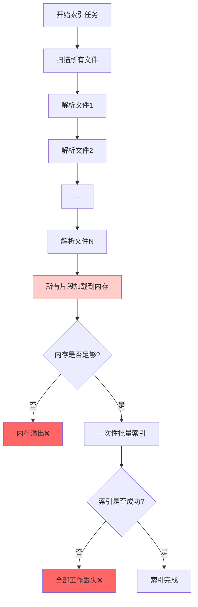
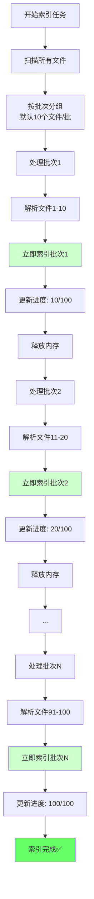
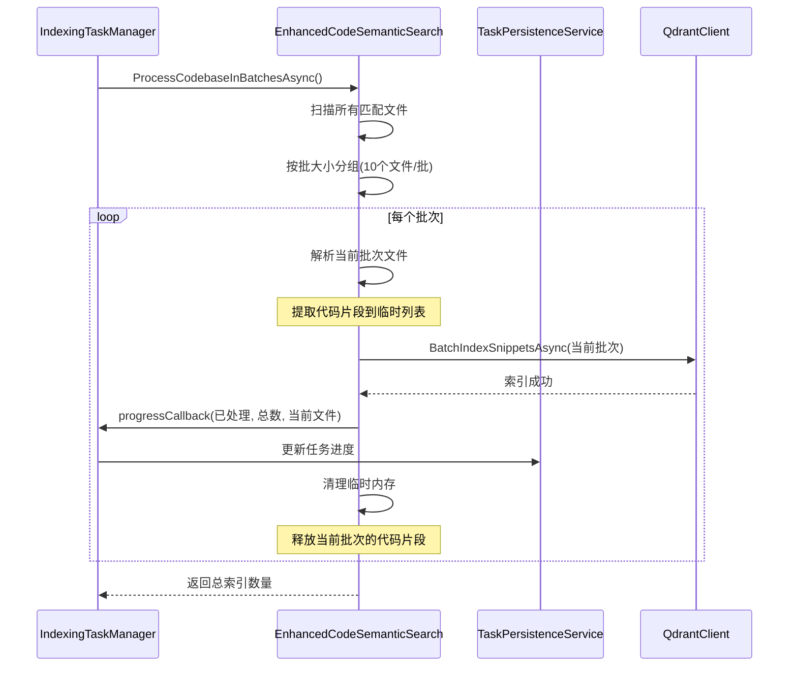
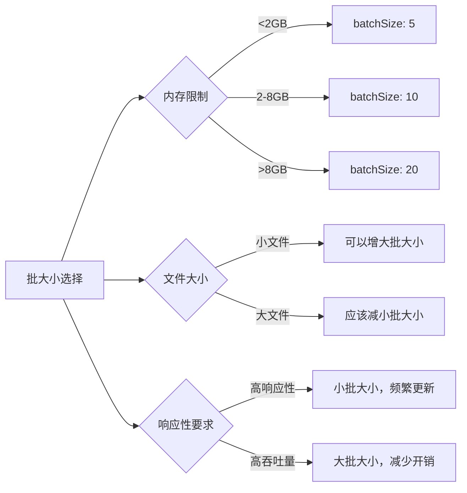
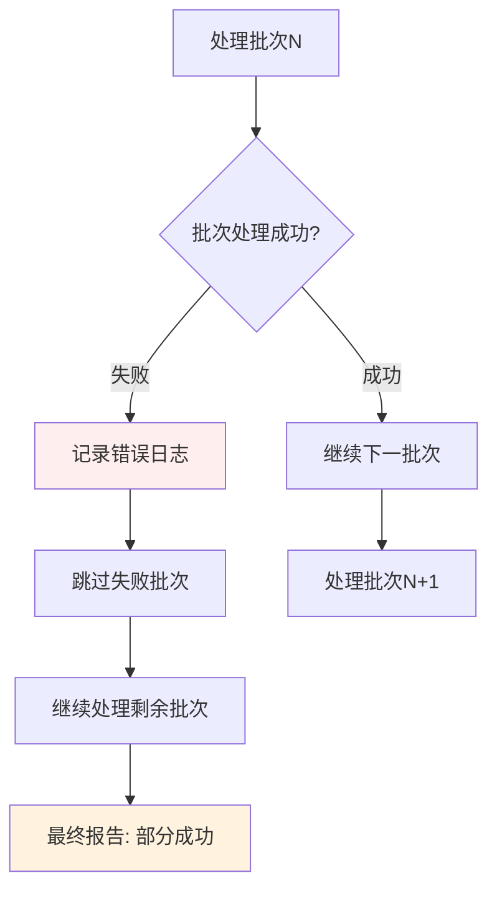

# 索引任务批处理流程图

## 改进前后对比

### 🔴 当前实现流程（存在问题）



**问题分析：**
- 🚫 **内存压力**：所有代码片段必须同时加载到内存
- 🚫 **进度盲区**：用户只能看到"正在建立索引..."
- 🚫 **全量风险**：最后阶段失败导致全部工作丢失
- 🚫 **等待时间**：必须等所有文件解析完才开始索引

### 🟢 改进后批处理流程（解决方案）



**改进优势：**
- ✅ **内存优化**：内存使用从 O(n) 降至 O(batch_size)
- ✅ **实时进度**：精确显示当前处理文件和进度百分比
- ✅ **错误隔离**：单批失败不影响其他批次
- ✅ **流式处理**：边解析边索引，提高处理效率

## 详细技术流程

### 核心批处理逻辑



### 进度回调机制


## 内存使用对比

### 传统方式内存占用

```
内存使用 = 所有文件的代码片段总量
例如：1000个文件 × 平均10个片段/文件 × 1KB/片段 = 10MB+
```

### 批处理方式内存占用

```
内存使用 = 单批文件的代码片段量
例如：10个文件 × 平均10个片段/文件 × 1KB/片段 = 100KB
内存优化比例 = 10MB / 100KB = 100倍改进
```

## 配置参数说明

### IndexingSettings 配置项

| 参数 | 默认值 | 说明 | 影响 |
|------|--------|------|------|
| `batchSize` | 10 | 每批处理的文件数量 | 内存使用和处理效率的平衡 |
| `enableRealTimeProgress` | true | 是否启用实时进度更新 | 用户体验和性能开销的平衡 |
| `enableBatchLogging` | true | 是否记录批处理详细日志 | 调试信息和日志量的平衡 |
| `maxConcurrentBatches` | 1 | 最大并发批次数 | 预留并发处理扩展 |

### 批大小选择指南



## 错误处理策略

### 批次级错误隔离



## 性能监控指标

### 关键指标

1. **内存使用峰值**
   - 改进前：与总文件数成正比
   - 改进后：固定为批大小相关

2. **进度更新频率**
   - 改进前：仅在开始和结束
   - 改进后：每批完成时更新

3. **错误恢复能力**
   - 改进前：全量失败
   - 改进后：批次级隔离

4. **用户体验指标**
   - 进度可见性：从无到有
   - 响应性：实时反馈
   - 可预期性：预估剩余时间

## 实施验证方案

### 测试场景

1. **小型代码库测试**（<100文件）
   - 验证批处理逻辑正确性
   - 对比处理时间差异

2. **中型代码库测试**（100-1000文件）
   - 验证内存优化效果
   - 测试进度反馈准确性

3. **大型代码库测试**（>1000文件）
   - 验证内存压力缓解
   - 测试错误恢复机制

### 成功标准

- [ ] 内存使用峰值降低 > 50%
- [ ] 进度反馈精度 > 95%
- [ ] 批次失败隔离 100% 有效
- [ ] 总体处理时间差异 < 10%
- [ ] 用户体验明显改善