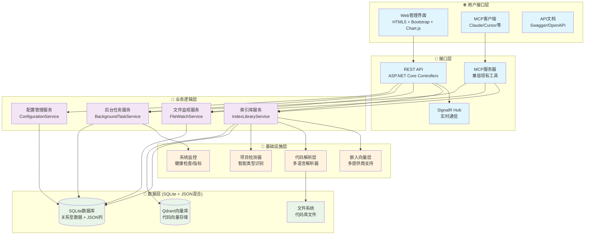
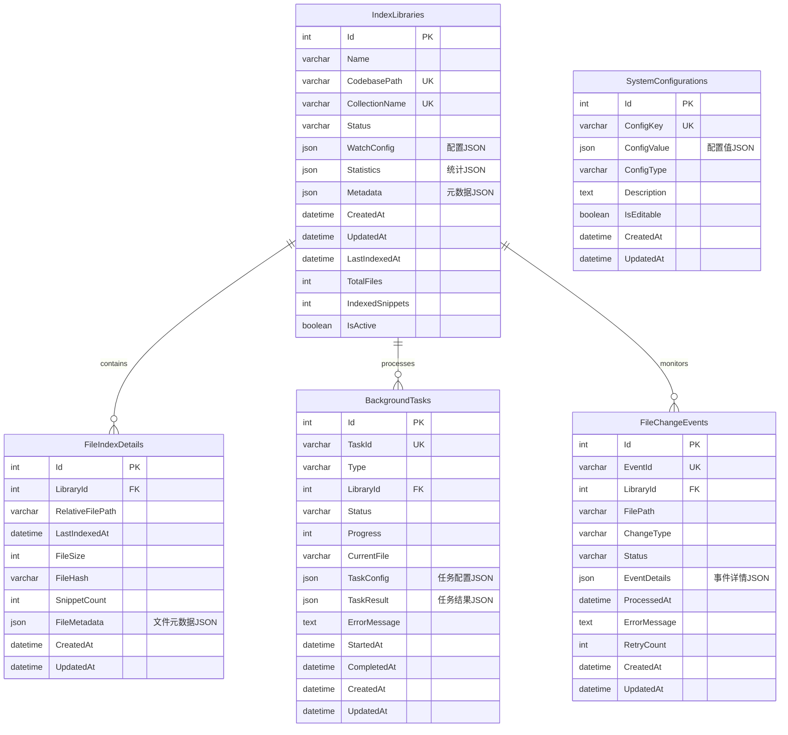
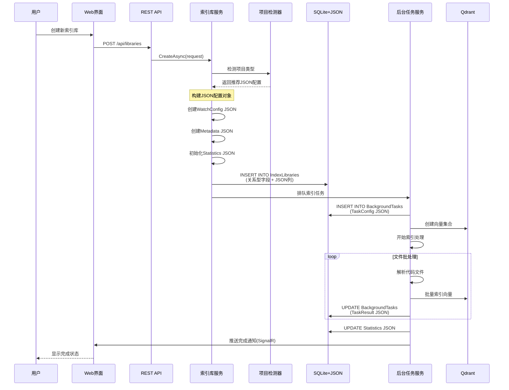
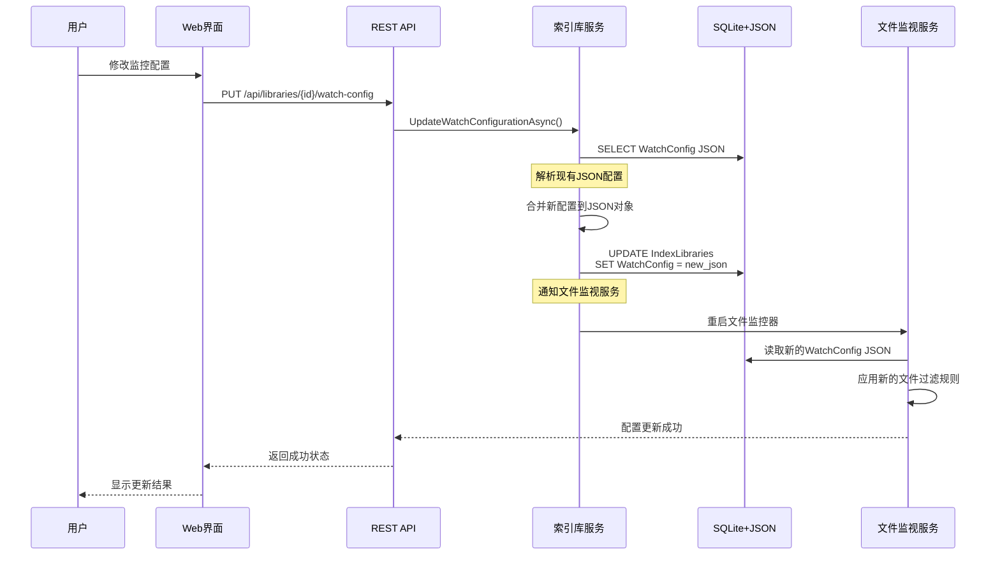
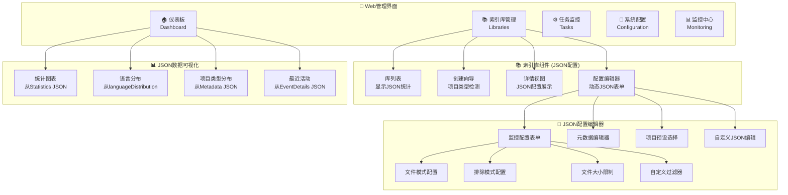
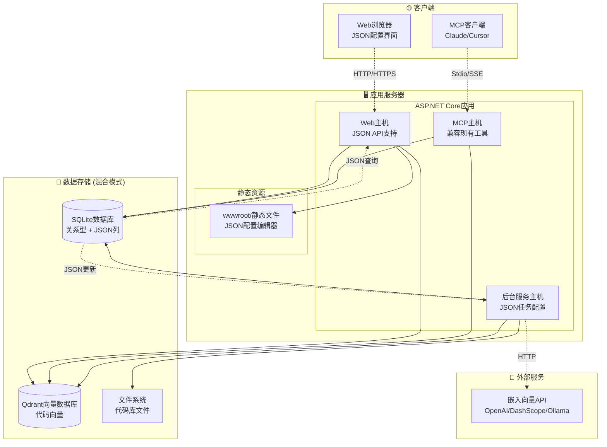
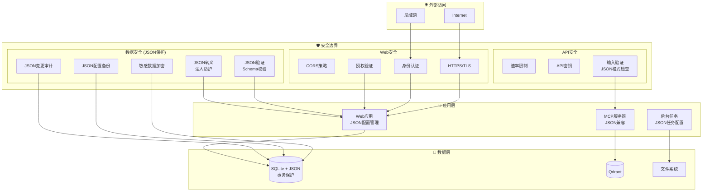

# CodebaseApp 升级架构图表设计 (SQLite + JSON方案)

## 🏗️ 整体系统架构图



## 📊 SQLite + JSON 混合数据库架构图



## 🔄 JSON数据结构设计图

```mermaid
graph TB
    subgraph "WatchConfig JSON 结构"
        WC[WatchConfig]
        WC --> WC_FP[filePatterns: string[]]
        WC --> WC_EP[excludePatterns: string[]]
        WC --> WC_IS[includeSubdirectories: boolean]
        WC --> WC_EN[isEnabled: boolean]
        WC --> WC_MFS[maxFileSize: number]
        WC --> WC_CF[customFilters: object[]]
    end
    
    subgraph "Statistics JSON 结构"
        ST[Statistics]
        ST --> ST_IS[indexedSnippets: number]
        ST --> ST_TF[totalFiles: number]
        ST --> ST_LID[lastIndexingDuration: number]
        ST --> ST_AFS[averageFileSize: number]
        ST --> ST_LD[languageDistribution: object]
        ST --> ST_IH[indexingHistory: object[]]
    end
    
    subgraph "Metadata JSON 结构"
        MD[Metadata]
        MD --> MD_PT[projectType: string]
        MD --> MD_FW[framework: string]
        MD --> MD_TM[team: string]
        MD --> MD_PR[priority: string]
        MD --> MD_TG[tags: string[]]
        MD --> MD_CS[customSettings: object]
    end
    
    subgraph "EventDetails JSON 结构"
        ED[EventDetails]
        ED --> ED_FS[fileSize: number]
        ED --> ED_DA[detectedAt: datetime]
        ED --> ED_TP[triggerPattern: string]
        ED --> ED_CM[changeMetadata: object]
    end
```

## 🔄 业务流程图 (SQLite + JSON)

### 索引库创建流程



### JSON配置更新流程



## 🌐 Web界面结构图 (JSON配置管理)



## 🚀 部署架构图 (SQLite + JSON)



## 📦 SQLite + JSON 数据访问模式

```mermaid
graph TB
    subgraph "Repository层 (混合模式)"
        REPO[Repository接口]
        REPO --> REL_OPS[关系型操作<br/>基础CRUD]
        REPO --> JSON_OPS[JSON操作<br/>配置管理]
    end
    
    subgraph "SQLite查询类型"
        REL_OPS --> REL_QUERY[关系查询<br/>SELECT * FROM Libraries<br/>WHERE Status = 'active']
        JSON_OPS --> JSON_QUERY[JSON查询<br/>WHERE JSON_EXTRACT(WatchConfig, '$.isEnabled') = true]
        JSON_OPS --> JSON_UPDATE[JSON更新<br/>UPDATE SET WatchConfig = JSON_SET(...)]
        JSON_OPS --> JSON_STATS[JSON统计<br/>JSON_ARRAY_LENGTH, SUM等]
    end
    
    subgraph "性能优化"
        JSON_QUERY --> JSON_INDEX[JSON索引<br/>CREATE INDEX ON JSON_EXTRACT(...)]
        REL_QUERY --> REL_INDEX[关系索引<br/>CREATE INDEX ON (column)]
        JSON_UPDATE --> JSON_VALIDATE[JSON验证<br/>确保数据完整性]
    end
    
    subgraph "缓存策略"
        JSON_OPS --> JSON_CACHE[JSON配置缓存<br/>IMemoryCache]
        REL_OPS --> REL_CACHE[关系数据缓存<br/>EF Core缓存]
    end
```

## 🔒 安全架构图 (JSON数据保护)



这个更新的架构图完全反映了SQLite + JSON混合方案的设计，突出了JSON配置的灵活性和SQLite关系型数据的稳定性优势。