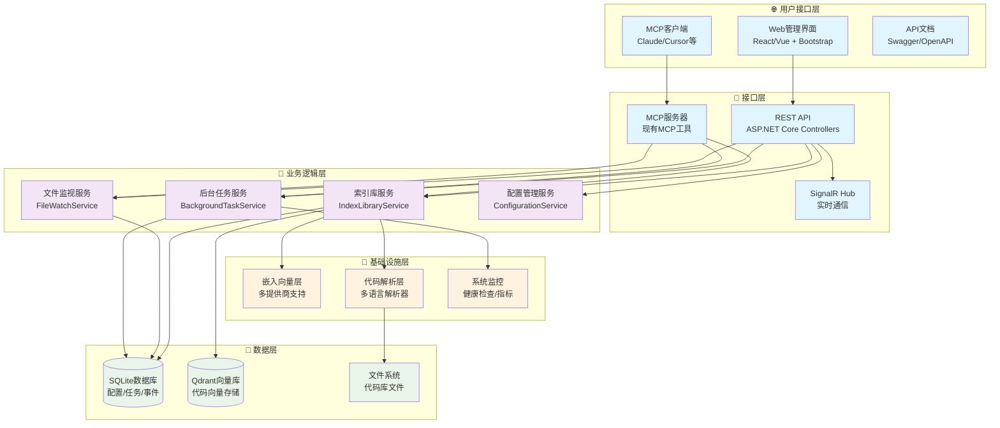
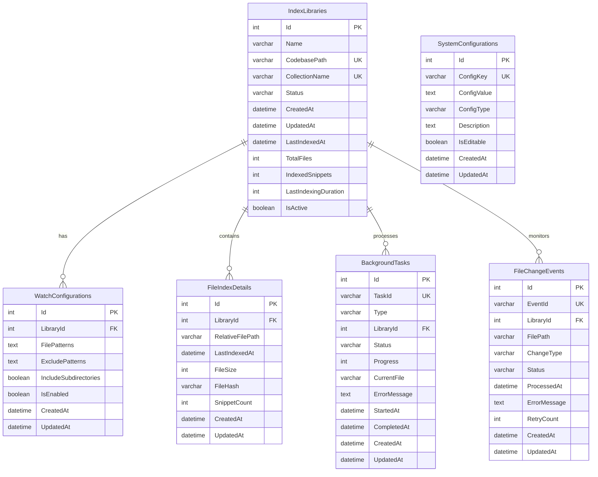
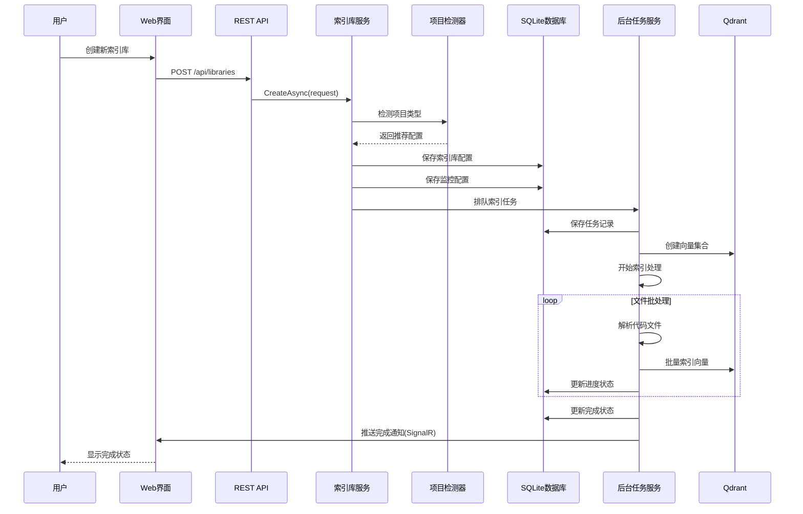
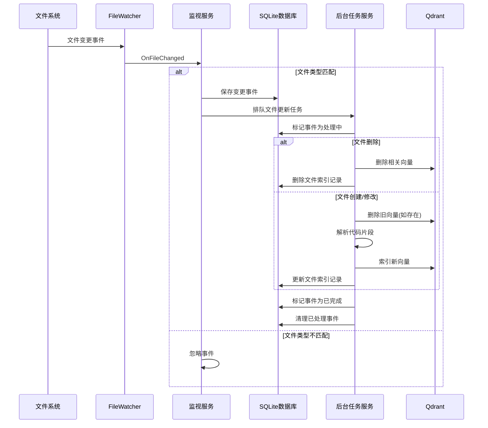
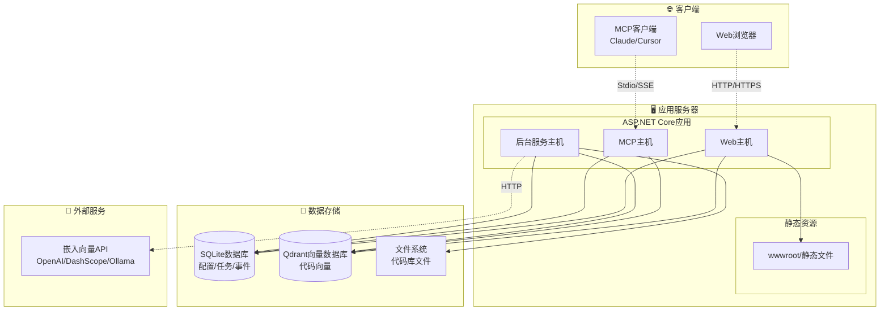
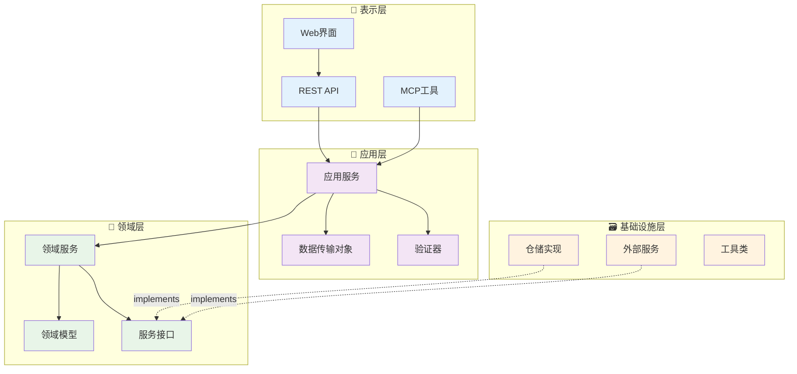

# CodebaseApp 升级架构图表设计

## 🏗️ 整体系统架构图



## 📊 数据库关系图



## 🔄 业务流程图

### 索引库创建流程



### 文件监控和更新流程



## 🌐 Web界面结构图

```mermaid
graph TB
    subgraph "📱 Web管理界面"
        DASH[🏠 仪表板<br/>Dashboard]
        LIB[📚 索引库管理<br/>Libraries]
        TASK[⚙️ 任务监控<br/>Tasks]
        CONF[🔧 系统配置<br/>Configuration]
        MON[📊 监控中心<br/>Monitoring]
    end
    
    subgraph "📊 仪表板组件"
        DASH --> STATS[统计卡片]
        DASH --> CHART[图表展示]
        DASH --> RECENT[最近活动]
        DASH --> ALERTS[系统警告]
    end
    
    subgraph "📚 索引库组件"
        LIB --> LIB_LIST[库列表]
        LIB --> LIB_CREATE[创建向导]
        LIB --> LIB_DETAIL[详情视图]
        LIB --> LIB_CONFIG[配置编辑]
    end
    
    subgraph "⚙️ 任务组件"
        TASK --> TASK_LIST[任务列表]
        TASK --> TASK_PROG[进度监控]
        TASK --> TASK_LOG[日志查看]
        TASK --> TASK_CTRL[任务控制]
    end
    
    subgraph "🔧 配置组件"
        CONF --> SYS_CONF[系统设置]
        CONF --> FILE_CONF[文件类型配置]
        CONF --> EMBED_CONF[嵌入向量配置]
        CONF --> WATCH_CONF[监控配置]
    end
    
    subgraph "📊 监控组件"
        MON --> REAL_TIME[实时状态]
        MON --> PERF_MON[性能监控]
        MON --> ERR_LOG[错误日志]
        MON --> HEALTH[健康检查]
    end
```



## 🚀 部署架构图



## 📦 模块依赖图



## 🔒 安全架构图

```mermaid
graph TB
    subgraph "🌐 外部访问"
        INTERNET[Internet]
        LOCAL[局域网]
    end
    
    subgraph "🛡️ 安全边界"
        subgraph "Web安全"
            CORS[CORS策略]
            HTTPS[HTTPS/TLS]
            AUTH[身份认证]
            AUTHZ[授权验证]
        end
        
        subgraph "数据安全"
            ENCRYPT[数据加密]
            BACKUP[备份策略]
            AUDIT[审计日志]
        end
        
        subgraph "API安全"
            RATE_LIMIT[速率限制]
            API_KEY[API密钥]
            VALIDATE[输入验证]
        end
    end
    
    subgraph "🏢 应用层"
        WEB_APP[Web应用]
        MCP_SERVER[MCP服务器]
        BG_TASKS[后台任务]
    end
    
    subgraph "💾 数据层"
        SQLITE[(SQLite)]
        QDRANT[(Qdrant)]
        FILES[文件系统]
    end
    
    %% 安全连接
    INTERNET --> HTTPS
    LOCAL --> AUTH
    
    HTTPS --> WEB_APP
    AUTH --> WEB_APP
    AUTHZ --> WEB_APP
    
    API_KEY --> MCP_SERVER
    RATE_LIMIT --> MCP_SERVER
    VALIDATE --> MCP_SERVER
    
    ENCRYPT --> SQLITE
    BACKUP --> SQLITE
    AUDIT --> SQLITE
    
    WEB_APP --> SQLITE
    MCP_SERVER --> QDRANT
    BG_TASKS --> FILES