# CodebaseApp 升级实施指南 (SQLite + JSON方案)

## 🎯 实施优先级和依赖关系

### 关键路径分析

```mermaid
gantt
    title CodebaseApp升级实施时间线 (SQLite + JSON)
    dateFormat  YYYY-MM-DD
    section 数据层
    SQLite+JSON设计     :a1, 2025-01-01, 3d
    JSON迁移工具        :a2, after a1, 1d
    section 领域服务
    索引库服务         :b1, after a2, 2d
    文件监视服务       :b2, after b1, 2d
    后台任务服务       :b3, after b2, 2d
    section 配置支持
    JSON文件类型配置   :c1, after b1, 2d
    项目类型检测       :c2, after c1, 1d
    section Web界面
    REST API          :d1, after b3, 2d
    JSON配置编辑器     :d2, after d1, 2d
    实时通信          :d3, after d2, 1d
    section 集成测试
    MCP工具升级       :e1, after c2, 1d
    测试和优化        :e2, after d3, 2d
```


## 📋 详细实施步骤

### 阶段一：SQLite + JSON 数据层重构 (2-3天)

#### 1.1 混合数据库设计实现

**核心实体模型：**

```csharp
// Models/Domain/IndexLibrary.cs
public class IndexLibrary
{
    public int Id { get; set; }
    public string Name { get; set; } = string.Empty;
    public string CodebasePath { get; set; } = string.Empty;
    public string CollectionName { get; set; } = string.Empty;
    public IndexLibraryStatus Status { get; set; } = IndexLibraryStatus.Pending;
    
    // JSON列 - 存储为字符串，运行时序列化/反序列化
    public string WatchConfig { get; set; } = "{}";
    public string Statistics { get; set; } = "{}";
    public string Metadata { get; set; } = "{}";
    
    public DateTime CreatedAt { get; set; } = DateTime.UtcNow;
    public DateTime UpdatedAt { get; set; } = DateTime.UtcNow;
    public DateTime? LastIndexedAt { get; set; }
    public int TotalFiles { get; set; }
    public int IndexedSnippets { get; set; }
    public bool IsActive { get; set; } = true;
    
    // 运行时属性 - 不映射到数据库
    [JsonIgnore]
    public WatchConfigurationDto WatchConfigObject 
    { 
        get => JsonSerializer.Deserialize<WatchConfigurationDto>(WatchConfig) ?? new();
        set => WatchConfig = JsonSerializer.Serialize(value);
    }
    
    [JsonIgnore]
    public StatisticsDto StatisticsObject
    {
        get => JsonSerializer.Deserialize<StatisticsDto>(Statistics) ?? new();
        set => Statistics = JsonSerializer.Serialize(value);
    }
    
    [JsonIgnore]
    public MetadataDto MetadataObject
    {
        get => JsonSerializer.Deserialize<MetadataDto>(Metadata) ?? new();
        set => Metadata = JsonSerializer.Serialize(value);
    }
}

// Models/Domain/WatchConfigurationDto.cs
public class WatchConfigurationDto
{
    public List<string> FilePatterns { get; set; } = new();
    public List<string> ExcludePatterns { get; set; } = new();
    public bool IncludeSubdirectories { get; set; } = true;
    public bool IsEnabled { get; set; } = true;
    public long MaxFileSize { get; set; } = 10 * 1024 * 1024;
    public List<CustomFilterDto> CustomFilters { get; set; } = new();
}

public class CustomFilterDto
{
    public string Name { get; set; } = string.Empty;
    public string Pattern { get; set; } = string.Empty;
    public bool Enabled { get; set; } = true;
}

// Models/Domain/StatisticsDto.cs
public class StatisticsDto
{
    public int IndexedSnippets { get; set; }
    public int TotalFiles { get; set; }
    public double LastIndexingDuration { get; set; }
    public long AverageFileSize { get; set; }
    public Dictionary<string, int> LanguageDistribution { get; set; } = new();
    public List<IndexingHistoryDto> IndexingHistory { get; set; } = new();
}

public class IndexingHistoryDto
{
    public DateTime Date { get; set; }
    public double Duration { get; set; }
    public int FilesProcessed { get; set; }
    public int SnippetsCreated { get; set; }
}

// Models/Domain/MetadataDto.cs
public class MetadataDto
{
    public string ProjectType { get; set; } = "unknown";
    public string Framework { get; set; } = string.Empty;
    public string Team { get; set; } = string.Empty;
    public string Priority { get; set; } = "normal";
    public List<string> Tags { get; set; } = new();
    public Dictionary<string, object> CustomSettings { get; set; } = new();
}
```

#### 1.2 SQLite + JSON 数据访问层

```csharp
// Services/Data/DatabaseContext.cs
public class DatabaseContext : IDisposable
{
    private readonly IDbConnection _connection;
    private readonly ILogger<DatabaseContext> _logger;
    private IDbTransaction? _transaction;

    public DatabaseContext(IConfiguration configuration, ILogger<DatabaseContext> logger)
    {
        _logger = logger;
        var connectionString = configuration.GetConnectionString("DefaultConnection") 
            ?? "Data Source=codebase-app.db";
        
        _connection = new SqliteConnection(connectionString);
        _connection.Open();
        
        // 确保SQLite版本支持JSON函数
        EnsureJsonSupport();
    }

    public IDbConnection Connection => _connection;

    private void EnsureJsonSupport()
    {
        try
        {
            var version = _connection.QuerySingle<string>("SELECT sqlite_version()");
            _logger.LogInformation("SQLite版本: {Version}", version);
            
            // 测试JSON支持
            var test = _connection.QuerySingle<string>("SELECT JSON('{}')");
            _logger.LogInformation("JSON函数支持: 正常");
        }
        catch (Exception ex)
        {
            _logger.LogError(ex, "SQLite JSON函数支持检查失败");
            throw new NotSupportedException("当前SQLite版本不支持JSON函数，请升级到3.45+");
        }
    }

    public async Task<IDbTransaction> BeginTransactionAsync()
    {
        _transaction = await _connection.BeginTransactionAsync();
        return _transaction;
    }

    public async Task CommitAsync()
    {
        if (_transaction != null)
        {
            await _transaction.CommitAsync();
            _transaction.Dispose();
            _transaction = null;
        }
    }

    public async Task RollbackAsync()
    {
        if (_transaction != null)
        {
            await _transaction.RollbackAsync();
            _transaction.Dispose();
            _transaction = null;
        }
    }

    public void Dispose()
    {
        _transaction?.Dispose();
        _connection?.Dispose();
    }
}

// Services/Data/JsonQueryHelper.cs
public static class JsonQueryHelper
{
    public static string ExtractPath(string jsonColumn, string path)
    {
        return $"JSON_EXTRACT({jsonColumn}, '$.{path}')";
    }
    
    public static string ArrayLength(string jsonColumn, string arrayPath = "")
    {
        var path = string.IsNullOrEmpty(arrayPath) ? "" : $".{arrayPath}";
        return $"JSON_ARRAY_LENGTH({jsonColumn}, '${path}')";
    }
    
    public static string JsonSet(string jsonColumn, string path, object value)
    {
        return $"JSON_SET({jsonColumn}, '$.{path}', {FormatValue(value)})";
    }
    
    public static string JsonInsert(string jsonColumn, string path, object value)
    {
        return $"JSON_INSERT({jsonColumn}, '$.{path}', {FormatValue(value)})";
    }
    
    public static string JsonRemove(string jsonColumn, string path)
    {
        return $"JSON_REMOVE({jsonColumn}, '$.{path}')";
    }
    
    private static string FormatValue(object value)
    {
        return value switch
        {
            string s => $"'{s}'",
            bool b => b.ToString().ToLower(),
            null => "null",
            _ when value.GetType().IsArray || value.GetType().IsGenericType => 
                $"'{JsonSerializer.Serialize(value)}'",
            _ => value.ToString()
        };
    }
    
    public static string ValidateJson(string jsonColumn)
    {
        return $"JSON_VALID({jsonColumn})";
    }
}

// Services/Data/Repositories/IndexLibraryRepository.cs
public class IndexLibraryRepository : IIndexLibraryRepository
{
    private readonly DatabaseContext _context;
    private readonly ILogger<IndexLibraryRepository> _logger;

    public IndexLibraryRepository(DatabaseContext context, ILogger<IndexLibraryRepository> logger)
    {
        _context = context;
        _logger = logger;
    }

    public async Task<IndexLibrary> CreateAsync(IndexLibrary library)
    {
        var sql = @"
            INSERT INTO IndexLibraries 
            (Name, CodebasePath, CollectionName, Status, WatchConfig, Statistics, Metadata, 
             CreatedAt, UpdatedAt, LastIndexedAt, TotalFiles, IndexedSnippets, IsActive)
            VALUES 
            (@Name, @CodebasePath, @CollectionName, @Status, @WatchConfig, @Statistics, @Metadata,
             @CreatedAt, @UpdatedAt, @LastIndexedAt, @TotalFiles, @IndexedSnippets, @IsActive);
            
            SELECT last_insert_rowid();";

        var id = await _context.Connection.QuerySingleAsync<int>(sql, library);
        library.Id = id;
        
        _logger.LogInformation("创建索引库: {Name} (ID: {Id})", library.Name, id);
        return library;
    }

    public async Task<IndexLibrary?> GetByPathAsync(string codebasePath)
    {
        var sql = @"
            SELECT * FROM IndexLibraries 
            WHERE CodebasePath = @CodebasePath AND IsActive = 1";
        
        return await _context.Connection.QueryFirstOrDefaultAsync<IndexLibrary>(sql, 
            new { CodebasePath = codebasePath });
    }

    public async Task<List<IndexLibrary>> GetEnabledLibrariesAsync()
    {
        var sql = $@"
            SELECT * FROM IndexLibraries 
            WHERE IsActive = 1 
            AND {JsonQueryHelper.ExtractPath("WatchConfig", "isEnabled")} = true
            ORDER BY UpdatedAt DESC";
            
        var libraries = await _context.Connection.QueryAsync<IndexLibrary>(sql);
        return libraries.ToList();
    }

    public async Task<List<IndexLibrary>> GetByProjectTypeAsync(string projectType)
    {
        var sql = $@"
            SELECT * FROM IndexLibraries 
            WHERE IsActive = 1 
            AND {JsonQueryHelper.ExtractPath("Metadata", "projectType")} = @ProjectType
            ORDER BY UpdatedAt DESC";
            
        var libraries = await _context.Connection.QueryAsync<IndexLibrary>(sql, 
            new { ProjectType = projectType });
        return libraries.ToList();
    }

    public async Task<bool> UpdateWatchConfigAsync(int libraryId, WatchConfigurationDto watchConfig)
    {
        var sql = @"
            UPDATE IndexLibraries 
            SET WatchConfig = @WatchConfig,
                UpdatedAt = CURRENT_TIMESTAMP
            WHERE Id = @LibraryId";
            
        var affected = await _context.Connection.ExecuteAsync(sql, new { 
            LibraryId = libraryId,
            WatchConfig = JsonSerializer.Serialize(watchConfig)
        });
        
        _logger.LogInformation("更新监控配置: LibraryId={LibraryId}, 影响行数={Affected}", 
            libraryId, affected);
        
        return affected > 0;
    }

    public async Task<bool> UpdateStatisticsAsync(int libraryId, StatisticsDto statistics)
    {
        var sql = @"
            UPDATE IndexLibraries 
            SET Statistics = @Statistics,
                TotalFiles = @TotalFiles,
                IndexedSnippets = @IndexedSnippets,
                UpdatedAt = CURRENT_TIMESTAMP
            WHERE Id = @LibraryId";
            
        var affected = await _context.Connection.ExecuteAsync(sql, new { 
            LibraryId = libraryId,
            Statistics = JsonSerializer.Serialize(statistics),
            TotalFiles = statistics.TotalFiles,
            IndexedSnippets = statistics.IndexedSnippets
        });
        
        return affected > 0;
    }

    public async Task<bool> AppendMetadataAsync(int libraryId, string key, object value)
    {
        var sql = $@"
            UPDATE IndexLibraries 
            SET Metadata = {JsonQueryHelper.JsonSet("Metadata", key, value)},
                UpdatedAt = CURRENT_TIMESTAMP
            WHERE Id = @LibraryId";
            
        var affected = await _context.Connection.ExecuteAsync(sql, new { LibraryId = libraryId });
        return affected > 0;
    }

    public async Task<Dictionary<string, int>> GetLanguageDistributionAsync()
    {
        var sql = $@"
            SELECT 
                key as Language,
                value as Count
            FROM IndexLibraries,
                 JSON_EACH({JsonQueryHelper.ExtractPath("Statistics", "languageDistribution")})
            WHERE IsActive = 1";
        
        var results = await _context.Connection.QueryAsync<(string Language, int Count)>(sql);
        
        return results.GroupBy(r => r.Language)
                     .ToDictionary(g => g.Key, g => g.Sum(x => x.Count));
    }

    public async Task<LibraryStatistics> GetStatisticsAsync()
    {
        var sql = $@"
            SELECT 
                COUNT(*) as TotalLibraries,
                SUM(TotalFiles) as TotalFiles,
                SUM(IndexedSnippets) as TotalSnippets,
                COUNT(CASE WHEN Status = 'completed' THEN 1 END) as CompletedLibraries,
                COUNT(CASE WHEN Status = 'failed' THEN 1 END) as FailedLibraries,
                COUNT(CASE WHEN {JsonQueryHelper.ExtractPath("WatchConfig", "isEnabled")} = true THEN 1 END) as MonitoredLibraries
            FROM IndexLibraries 
            WHERE IsActive = 1";
        
        return await _context.Connection.QuerySingleAsync<LibraryStatistics>(sql);
    }
}

public class LibraryStatistics
{
    public int TotalLibraries { get; set; }
    public int TotalFiles { get; set; }
    public int TotalSnippets { get; set; }
    public int CompletedLibraries { get; set; }
    public int FailedLibraries { get; set; }
    public int MonitoredLibraries { get; set; }
}
```

#### 1.3 JSON数据迁移服务

```csharp
// Services/Migration/JsonMigrationService.cs
public class JsonMigrationService : IJsonMigrationService
{
    private readonly DatabaseContext _context;
    private readonly IIndexLibraryRepository _libraryRepository;
    private readonly ILogger<JsonMigrationService> _logger;
    private const string LEGACY_CONFIG_FILE = "codebase-indexes.json";

    public async Task<MigrationResult> MigrateFromLegacyAsync()
    {
        var result = new MigrationResult();
        
        try
        {
            _logger.LogInformation("开始JSON数据迁移...");
            
            // 1. 备份现有配置
            await BackupLegacyConfigAsync();
            
            // 2. 读取现有JSON配置
            var legacyConfig = await ReadLegacyConfigAsync();
            if (legacyConfig == null)
            {
                result.Success = true;
                result.Message = "未发现需要迁移的配置文件";
                return result;
            }
            
            using var transaction = await _context.BeginTransactionAsync();
            
            try
            {
                // 3. 迁移索引库配置
                foreach (var mapping in legacyConfig.CodebaseMappings)
                {
                    var library = await MigrateIndexLibraryWithJsonAsync(mapping);
                    result.MigratedLibraries.Add(library);
                }
                
                // 4. 迁移系统配置
                await MigrateSystemConfigurationsAsync(legacyConfig.GlobalSettings);
                
                await _context.CommitAsync();
                
                result.Success = true;
                result.Message = $"成功迁移 {result.MigratedLibraries.Count} 个索引库到JSON格式";
                
                _logger.LogInformation("JSON数据迁移完成: {Count} 个索引库", result.MigratedLibraries.Count);
            }
            catch (Exception ex)
            {
                await _context.RollbackAsync();
                throw;
            }
        }
        catch (Exception ex)
        {
            _logger.LogError(ex, "JSON数据迁移失败");
            result.Success = false;
            result.Message = $"迁移失败: {ex.Message}";
        }
        
        return result;
    }

    private async Task<IndexLibrary> MigrateIndexLibraryWithJsonAsync(CodebaseMapping mapping)
    {
        // 转换监控配置为JSON
        var watchConfig = new WatchConfigurationDto
        {
            FilePatterns = mapping.WatcherConfig.FileExtensions,
            ExcludePatterns = mapping.WatcherConfig.ExcludeDirectories,
            IncludeSubdirectories = mapping.WatcherConfig.IncludeSubdirectories,
            IsEnabled = mapping.IsMonitoring,
            MaxFileSize = 10 * 1024 * 1024, // 默认10MB
            CustomFilters = new List<CustomFilterDto>()
        };
        
        // 转换统计信息为JSON
        var statistics = new StatisticsDto
        {
            IndexedSnippets = mapping.Statistics.IndexedSnippets,
            TotalFiles = mapping.Statistics.TotalFiles,
            LastIndexingDuration = ParseDuration(mapping.Statistics.LastIndexingDuration),
            AverageFileSize = 0, // 需要重新计算
            LanguageDistribution = new Dictionary<string, int> { ["csharp"] = mapping.Statistics.TotalFiles },
            IndexingHistory = new List<IndexingHistoryDto>()
        };
        
        // 如果有历史记录，添加一条
        if (mapping.LastIndexed.HasValue)
        {
            statistics.IndexingHistory.Add(new IndexingHistoryDto
            {
                Date = mapping.LastIndexed.Value,
                Duration = statistics.LastIndexingDuration,
                FilesProcessed = statistics.TotalFiles,
                SnippetsCreated = statistics.IndexedSnippets
            });
        }
        
        // 转换元数据为JSON
        var metadata = new MetadataDto
        {
            ProjectType = DetectProjectTypeFromPath(mapping.CodebasePath),
            Framework = "unknown",
            Team = "default",
            Priority = "normal",
            Tags = new List<string> { "migrated", "legacy" },
            CustomSettings = new Dictionary<string, object>
            {
                ["originalId"] = mapping.Id,
                ["friendlyName"] = mapping.FriendlyName,
                ["migrationDate"] = DateTime.UtcNow,
                ["originalCreatedAt"] = mapping.CreatedAt
            }
        };
        
        var library = new IndexLibrary
        {
            Name = mapping.FriendlyName,
            CodebasePath = mapping.CodebasePath,
            CollectionName = mapping.CollectionName,
            Status = MapLegacyStatus(mapping.IndexingStatus),
            WatchConfig = JsonSerializer.Serialize(watchConfig),
            Statistics = JsonSerializer.Serialize(statistics),
            Metadata = JsonSerializer.Serialize(metadata),
            CreatedAt = mapping.CreatedAt,
            LastIndexedAt = mapping.LastIndexed,
            TotalFiles = mapping.Statistics.TotalFiles,
            IndexedSnippets = mapping.Statistics.IndexedSnippets,
            IsActive = true
        };
        
        library = await _libraryRepository.CreateAsync(library);
        
        // 迁移文件索引详情
        await MigrateFileDetailsAsync(library.Id, mapping.FileIndexDetails);
        
        _logger.LogInformation("迁移索引库: {Name} -> JSON格式", library.Name);
        
        return library;
    }

    private string DetectProjectTypeFromPath(string codebasePath)
    {
        if (Directory.GetFiles(codebasePath, "*.csproj", SearchOption.AllDirectories).Any())
            return "csharp";
        
        if (File.Exists(Path.Combine(codebasePath, "package.json")))
            return "typescript";
            
        if (File.Exists(Path.Combine(codebasePath, "requirements.txt")))
            return "python";
            
        return "mixed";
    }

    private double ParseDuration(string durationString)
    {
        if (string.IsNullOrEmpty(durationString))
            return 0;
            
        if (durationString.EndsWith("s") && 
            double.TryParse(durationString[..^1], out var seconds))
        {
            return seconds;
        }
        
        return 0;
    }

    private IndexLibraryStatus MapLegacyStatus(string legacyStatus)
    {
        return legacyStatus.ToLower() switch
        {
            "completed" => IndexLibraryStatus.Completed,
            "failed" => IndexLibraryStatus.Failed,
            "indexing" => IndexLibraryStatus.Indexing,
            _ => IndexLibraryStatus.Pending
        };
    }
}

public class MigrationResult
{
    public bool Success { get; set; }
    public string Message { get; set; } = string.Empty;
    public List<IndexLibrary> MigratedLibraries { get; set; } = new();
}

public enum IndexLibraryStatus
{
    Pending,
    Indexing,
    Completed,
    Failed,
    Cancelled
}
```

### 阶段二：领域服务重构 (3-4天)

#### 2.1 JSON配置感知的索引库服务

```csharp
// Services/Domain/IndexLibraryService.cs
public class IndexLibraryService : IIndexLibraryService
{
    private readonly IIndexLibraryRepository _libraryRepository;
    private readonly IBackgroundTaskService _taskService;
    private readonly ProjectTypeDetector _projectDetector;
    private readonly ILogger<IndexLibraryService> _logger;

    public async Task<CreateIndexLibraryResult> CreateAsync(CreateIndexLibraryRequest request)
    {
        try
        {
            _logger.LogInformation("创建索引库: {Path}", request.CodebasePath);
            
            // 1. 验证路径
            if (!Directory.Exists(request.CodebasePath))
            {
                return CreateIndexLibraryResult.Failed("指定的路径不存在");
            }
            
            // 2. 检查是否已存在
            var existing = await _libraryRepository.GetByPathAsync(request.CodebasePath);
            if (existing != null)
            {
                return CreateIndexLibraryResult.Failed("该路径已存在索引库");
            }
            
            // 3. 自动检测项目类型和配置
            var projectType = ProjectType.Mixed;
            WatchConfigurationDto? recommendedConfig = null;
            
            if (request.AutoDetectType)
            {
                projectType = await _projectDetector.DetectProjectTypeAsync(request.CodebasePath);
                recommendedConfig = _projectDetector.GetRecommendedWatchConfiguration(projectType, request.CodebasePath);
                _logger.LogInformation("检测到项目类型: {Type}", projectType);
            }
            
            // 4. 构建JSON配置
            var watchConfig = new WatchConfigurationDto
            {
                FilePatterns = request.FilePatterns?.ToList() ?? 
                              recommendedConfig?.FilePatterns ?? 
                              new List<string> { "*.cs" },
                ExcludePatterns = request.ExcludePatterns?.ToList() ?? 
                                 recommendedConfig?.ExcludePatterns ?? 
                                 new List<string> { "bin", "obj", ".git" },
                IncludeSubdirectories = request.IncludeSubdirectories ?? true,
                IsEnabled = true,
                MaxFileSize = request.MaxFileSize ?? 10 * 1024 * 1024,
                CustomFilters = new List<CustomFilterDto>()
            };
            
            var statistics = new StatisticsDto
            {
                IndexedSnippets = 0,
                TotalFiles = 0,
                LastIndexingDuration = 0,
                AverageFileSize = 0,
                LanguageDistribution = new Dictionary<string, int>(),
                IndexingHistory = new List<IndexingHistoryDto>()
            };
            
            var metadata = new MetadataDto
            {
                ProjectType = projectType.ToString().ToLower(),
                Framework = recommendedConfig?.Framework ?? "unknown",
                Team = request.Team ?? "default",
                Priority = request.Priority ?? "normal",
                Tags = request.Tags?.ToList() ?? new List<string>(),
                CustomSettings = new Dictionary<string, object>
                {
                    ["autoDetected"] = request.AutoDetectType,
                    ["createdVia"] = "api",
                    ["embeddingModel"] = recommendedConfig?.EmbeddingModel ?? "text-embedding-3-small"
                }
            };
            
            // 5. 创建索引库
            var library = new IndexLibrary
            {
                Name = request.Name ?? Path.GetFileName(request.CodebasePath.TrimEnd(Path.DirectorySeparatorChar)),
                CodebasePath = Path.GetFullPath(request.CodebasePath),
                CollectionName = GenerateCollectionName(request.CodebasePath),
                Status = IndexLibraryStatus.Pending,
                WatchConfig = JsonSerializer.Serialize(watchConfig),
                Statistics = JsonSerializer.Serialize(statistics),
                Metadata = JsonSerializer.Serialize(metadata)
            };
            
            library = await _libraryRepository.CreateAsync(library);
            
            // 6. 排队索引任务
            var taskId = await _taskService.QueueIndexingTaskAsync(library.Id, TaskPriority.Normal);
            
            _logger.LogInformation("索引库创建成功: {LibraryId}, 任务ID: {TaskId}", library.Id, taskId);
            
            return CreateIndexLibraryResult.Success(library, taskId);
        }
        catch (Exception ex)
        {
            _logger.LogError(ex, "创建索引库失败: {Path}", request.CodebasePath);
            return CreateIndexLibraryResult.Failed($"创建失败: {ex.Message}");
        }
    }

    public async Task<bool> UpdateWatchConfigurationAsync(int libraryId, UpdateWatchConfigurationRequest request)
    {
        try
        {
            var library = await _libraryRepository.GetByIdAsync(libraryId);
            if (library == null)
            {
                return false;
            }
            
            // 解析现有JSON配置
            var currentConfig = library.WatchConfigObject;
            
            // 更新字段
            if (request.FilePatterns != null)
                currentConfig.FilePatterns = request.FilePatterns.ToList();
            
            if (request.ExcludePatterns != null)
                currentConfig.ExcludePatterns = request.ExcludePatterns.ToList();
            
            if (request.IncludeSubdirectories.HasValue)
                currentConfig.IncludeSubdirectories = request.IncludeSubdirectories.Value;
            
            if (request.IsEnabled.HasValue)
                currentConfig.IsEnabled = request.IsEnabled.Value;
            
            if (request.MaxFileSize.HasValue)
                currentConfig.MaxFileSize = request.MaxFileSize.Value;
            
            if (request.CustomFilters != null)
            {
                currentConfig.CustomFilters = request.CustomFilters.Select(cf => new CustomFilterDto
                {
                    Name = cf.Name,
                    Pattern = cf.Pattern,
                    Enabled = cf.Enabled
                }).ToList();
            }
            
            // 保存更新的JSON配置
            var success = await _libraryRepository.UpdateWatchConfigAsync(libraryId, currentConfig);
            
            if (success)
            {
                // 如果监控配置发生变化，重启文件监控
                if (currentConfig.IsEnabled)
                {
                    await _taskService.QueueWatcherRestartTaskAsync(libraryId);
                }
                
                _logger.LogInformation("监控配置更新成功: LibraryId={LibraryId}", libraryId);
            }
            
            return success;
        }
        catch (Exception ex)
        {
            _logger.LogError(ex, "更新监控配置失败: LibraryId={LibraryId}", libraryId);
            return false;
        }
    }

    public async Task<IndexStatisticsDto> GetStatisticsAsync(int libraryId)
    {
        var library = await _libraryRepository.GetByIdAsync(libraryId);
        if (library == null)
            return null;
        
        var stats = library.StatisticsObject;
        
        return new IndexStatisticsDto
        {
            LibraryId = libraryId,
            LibraryName = library.Name,
            Status = library.Status.ToString(),
            TotalFiles = library.TotalFiles,
            IndexedSnippets = library.IndexedSnippets,
            LastIndexingDuration = stats.LastIndexingDuration,
            AverageFileSize = stats.AverageFileSize,
            LanguageDistribution = stats.LanguageDistribution,
            IndexingHistory = stats.IndexingHistory,
            LastIndexedAt = library.LastIndexedAt,
            IsMonitored = library.WatchConfigObject.IsEnabled
        };
    }

    private string GenerateCollectionName(string codebasePath)
    {
        var pathHash = SHA256.HashData(Encoding.UTF8.GetBytes(codebasePath));
        var hashString = Convert.ToHexString(pathHash)[..8].ToLower();
        return $"code_index_{hashString}";
    }
}

// Models/DTOs/CreateIndexLibraryRequest.cs
public class CreateIndexLibraryRequest
{
    public string CodebasePath { get; set; } = string.Empty;
    public string? Name { get; set; }
    public string[]? FilePatterns { get; set; }
    public string[]? ExcludePatterns { get; set; }
    public bool? IncludeSubdirectories { get; set; }
    public long? MaxFileSize { get; set; }
    public bool AutoDetectType { get; set; } = true;
    public string? Team { get; set; }
    public string? Priority { get; set; }
    public string[]? Tags { get; set; }
}

public class UpdateWatchConfigurationRequest
{
    public string[]? FilePatterns { get; set; }
    public string[]? ExcludePatterns { get; set; }
    public bool? IncludeSubdirectories { get; set; }
    public bool? IsEnabled { get; set; }
    public long? MaxFileSize { get; set; }
    public CustomFilterRequest[]? CustomFilters { get; set; }
}

public class CustomFilterRequest
{
    public string Name { get; set; } = string.Empty;
    public string Pattern { get; set; } = string.Empty;
    public bool Enabled { get; set; } = true;
}
```

这个更新的实施指南完全基于SQLite + JSON的混合方案，充分利用了JSON的灵活性和SQLite的稳定性。所有的配置数据都使用JSON格式存储，便于动态扩展和管理。