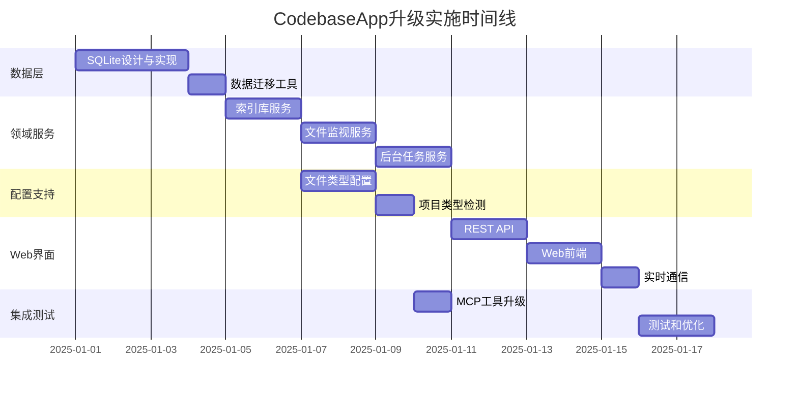

# CodebaseApp 升级实施指南

## 🎯 实施优先级和依赖关系

### 关键路径分析


## 📋 详细实施步骤

### 阶段一：数据存储层重构

#### 1.1 SQLite数据库设计

**核心实体关系：**

```csharp
// Models/Domain/IndexLibrary.cs
public class IndexLibrary
{
    public int Id { get; set; }
    public string Name { get; set; } = string.Empty;
    public string CodebasePath { get; set; } = string.Empty;
    public string CollectionName { get; set; } = string.Empty;
    public IndexLibraryStatus Status { get; set; } = IndexLibraryStatus.Pending;
    public DateTime CreatedAt { get; set; } = DateTime.UtcNow;
    public DateTime UpdatedAt { get; set; } = DateTime.UtcNow;
    public DateTime? LastIndexedAt { get; set; }
    public int TotalFiles { get; set; }
    public int IndexedSnippets { get; set; }
    public int LastIndexingDuration { get; set; }
    public bool IsActive { get; set; } = true;
    
    // 导航属性
    public WatchConfiguration? WatchConfiguration { get; set; }
    public List<FileIndexDetail> FileIndexDetails { get; set; } = new();
    public List<BackgroundTask> BackgroundTasks { get; set; } = new();
    public List<FileChangeEvent> FileChangeEvents { get; set; } = new();
}

// Models/Domain/WatchConfiguration.cs
public class WatchConfiguration
{
    public int Id { get; set; }
    public int LibraryId { get; set; }
    public List<string> FilePatterns { get; set; } = new();
    public List<string> ExcludePatterns { get; set; } = new();
    public bool IncludeSubdirectories { get; set; } = true;
    public bool IsEnabled { get; set; } = true;
    public DateTime CreatedAt { get; set; } = DateTime.UtcNow;
    public DateTime UpdatedAt { get; set; } = DateTime.UtcNow;
    
    // 导航属性
    public IndexLibrary Library { get; set; } = null!;
}
```

#### 1.2 数据访问层实现

**Repository Pattern：**

```csharp
// Services/Data/IRepository.cs
public interface IRepository<T> where T : class
{
    Task<T?> GetByIdAsync(int id);
    Task<List<T>> GetAllAsync();
    Task<T> CreateAsync(T entity);
    Task<T> UpdateAsync(T entity);
    Task<bool> DeleteAsync(int id);
}

// Services/Data/Repositories/IndexLibraryRepository.cs
public class IndexLibraryRepository : IIndexLibraryRepository
{
    private readonly DatabaseContext _context;
    private readonly ILogger<IndexLibraryRepository> _logger;

    public IndexLibraryRepository(DatabaseContext context, ILogger<IndexLibraryRepository> logger)
    {
        _context = context;
        _logger = logger;
    }

    public async Task<IndexLibrary?> GetByPathAsync(string codebasePath)
    {
        var sql = @"
            SELECT * FROM IndexLibraries 
            WHERE CodebasePath = @CodebasePath AND IsActive = 1";
        
        return await _context.Connection.QueryFirstOrDefaultAsync<IndexLibrary>(sql, new { CodebasePath = codebasePath });
    }

    public async Task<List<IndexLibrary>> GetActiveLibrariesAsync()
    {
        var sql = @"
            SELECT il.*, wc.* 
            FROM IndexLibraries il
            LEFT JOIN WatchConfigurations wc ON il.Id = wc.LibraryId
            WHERE il.IsActive = 1
            ORDER BY il.UpdatedAt DESC";
        
        var libraryDict = new Dictionary<int, IndexLibrary>();
        
        await _context.Connection.QueryAsync<IndexLibrary, WatchConfiguration, IndexLibrary>(
            sql,
            (library, watchConfig) =>
            {
                if (!libraryDict.TryGetValue(library.Id, out var existingLibrary))
                {
                    existingLibrary = library;
                    libraryDict.Add(library.Id, existingLibrary);
                }
                
                if (watchConfig != null)
                {
                    existingLibrary.WatchConfiguration = watchConfig;
                }
                
                return existingLibrary;
            },
            splitOn: "Id"
        );
        
        return libraryDict.Values.ToList();
    }
}
```

#### 1.3 数据库连接和事务管理

```csharp
// Services/Data/DatabaseContext.cs
public class DatabaseContext : IDisposable
{
    private readonly IDbConnection _connection;
    private readonly ILogger<DatabaseContext> _logger;
    private IDbTransaction? _transaction;

    public DatabaseContext(IConfiguration configuration, ILogger<DatabaseContext> logger)
    {
        _logger = logger;
        var connectionString = configuration.GetConnectionString("DefaultConnection") 
            ?? "Data Source=codebase-app.db";
        
        _connection = new SqliteConnection(connectionString);
        _connection.Open();
    }

    public IDbConnection Connection => _connection;

    public async Task<IDbTransaction> BeginTransactionAsync()
    {
        _transaction = await _connection.BeginTransactionAsync();
        return _transaction;
    }

    public async Task CommitAsync()
    {
        if (_transaction != null)
        {
            await _transaction.CommitAsync();
            _transaction.Dispose();
            _transaction = null;
        }
    }

    public async Task RollbackAsync()
    {
        if (_transaction != null)
        {
            await _transaction.RollbackAsync();
            _transaction.Dispose();
            _transaction = null;
        }
    }

    public void Dispose()
    {
        _transaction?.Dispose();
        _connection?.Dispose();
    }
}
```

#### 1.4 数据迁移实现

```csharp
// Services/Migration/DataMigrationService.cs
public class DataMigrationService : IDataMigrationService
{
    private readonly DatabaseContext _context;
    private readonly IIndexLibraryRepository _libraryRepository;
    private readonly ILogger<DataMigrationService> _logger;
    private const string LEGACY_CONFIG_FILE = "codebase-indexes.json";

    public async Task<MigrationResult> MigrateFromLegacyAsync()
    {
        var result = new MigrationResult();
        
        try
        {
            _logger.LogInformation("开始数据迁移...");
            
            // 1. 备份现有配置
            await BackupLegacyConfigAsync();
            
            // 2. 读取现有JSON配置
            var legacyConfig = await ReadLegacyConfigAsync();
            if (legacyConfig == null)
            {
                result.Success = true;
                result.Message = "未发现需要迁移的配置文件";
                return result;
            }
            
            using var transaction = await _context.BeginTransactionAsync();
            
            try
            {
                // 3. 迁移索引库配置
                foreach (var mapping in legacyConfig.CodebaseMappings)
                {
                    var library = await MigrateIndexLibraryAsync(mapping);
                    result.MigratedLibraries.Add(library);
                    
                    // 4. 迁移文件监控配置
                    await MigrateWatchConfigurationAsync(library.Id, mapping.WatcherConfig);
                    
                    // 5. 迁移文件索引详情
                    await MigrateFileIndexDetailsAsync(library.Id, mapping.FileIndexDetails);
                }
                
                // 6. 迁移系统配置
                await MigrateSystemConfigurationsAsync(legacyConfig.GlobalSettings);
                
                await _context.CommitAsync();
                
                result.Success = true;
                result.Message = $"成功迁移 {result.MigratedLibraries.Count} 个索引库";
                
                _logger.LogInformation("数据迁移完成: {Count} 个索引库", result.MigratedLibraries.Count);
            }
            catch (Exception ex)
            {
                await _context.RollbackAsync();
                throw;
            }
        }
        catch (Exception ex)
        {
            _logger.LogError(ex, "数据迁移失败");
            result.Success = false;
            result.Message = $"迁移失败: {ex.Message}";
        }
        
        return result;
    }

    private async Task<IndexLibrary> MigrateIndexLibraryAsync(CodebaseMapping mapping)
    {
        var library = new IndexLibrary
        {
            Name = mapping.FriendlyName,
            CodebasePath = mapping.CodebasePath,
            CollectionName = mapping.CollectionName,
            Status = MapLegacyStatus(mapping.IndexingStatus),
            CreatedAt = mapping.CreatedAt,
            LastIndexedAt = mapping.LastIndexed,
            TotalFiles = mapping.Statistics.TotalFiles,
            IndexedSnippets = mapping.Statistics.IndexedSnippets,
            LastIndexingDuration = ParseDuration(mapping.Statistics.LastIndexingDuration),
            IsActive = true
        };
        
        return await _libraryRepository.CreateAsync(library);
    }

    private IndexLibraryStatus MapLegacyStatus(string legacyStatus)
    {
        return legacyStatus.ToLower() switch
        {
            "completed" => IndexLibraryStatus.Completed,
            "failed" => IndexLibraryStatus.Failed,
            "indexing" => IndexLibraryStatus.Indexing,
            _ => IndexLibraryStatus.Pending
        };
    }
}
```

### 阶段二：领域服务重构

#### 2.1 索引库服务实现

```csharp
// Services/Domain/IndexLibraryService.cs
public class IndexLibraryService : IIndexLibraryService
{
    private readonly IIndexLibraryRepository _libraryRepository;
    private readonly IWatchConfigurationRepository _watchConfigRepository;
    private readonly IBackgroundTaskService _taskService;
    private readonly ProjectTypeDetector _projectDetector;
    private readonly ILogger<IndexLibraryService> _logger;

    public async Task<CreateIndexLibraryResult> CreateAsync(CreateIndexLibraryRequest request)
    {
        try
        {
            _logger.LogInformation("创建索引库: {Path}", request.CodebasePath);
            
            // 1. 验证路径
            if (!Directory.Exists(request.CodebasePath))
            {
                return CreateIndexLibraryResult.Failed("指定的路径不存在");
            }
            
            // 2. 检查是否已存在
            var existing = await _libraryRepository.GetByPathAsync(request.CodebasePath);
            if (existing != null)
            {
                return CreateIndexLibraryResult.Failed("该路径已存在索引库");
            }
            
            // 3. 自动检测项目类型和配置
            FileTypeConfiguration? fileConfig = null;
            if (request.AutoDetectType)
            {
                var projectType = await _projectDetector.DetectProjectTypeAsync(request.CodebasePath);
                fileConfig = _projectDetector.GetRecommendedConfiguration(projectType, request.CodebasePath);
                _logger.LogInformation("检测到项目类型: {Type}", projectType);
            }
            
            // 4. 创建索引库
            var library = new IndexLibrary
            {
                Name = request.Name ?? Path.GetFileName(request.CodebasePath.TrimEnd(Path.DirectorySeparatorChar)),
                CodebasePath = Path.GetFullPath(request.CodebasePath),
                CollectionName = GenerateCollectionName(request.CodebasePath),
                Status = IndexLibraryStatus.Pending
            };
            
            library = await _libraryRepository.CreateAsync(library);
            
            // 5. 创建监控配置
            var watchConfig = new WatchConfiguration
            {
                LibraryId = library.Id,
                FilePatterns = request.FilePatterns?.ToList() ?? fileConfig?.IncludePatterns ?? new List<string> { "*.cs" },
                ExcludePatterns = request.ExcludePatterns?.ToList() ?? fileConfig?.ExcludeDirectories ?? new List<string> { "bin", "obj", ".git" },
                IncludeSubdirectories = request.IncludeSubdirectories ?? true,
                IsEnabled = true
            };
            
            await _watchConfigRepository.CreateAsync(watchConfig);
            
            // 6. 排队索引任务
            var taskId = await _taskService.QueueIndexingTaskAsync(library.Id, TaskPriority.Normal);
            
            _logger.LogInformation("索引库创建成功: {LibraryId}, 任务ID: {TaskId}", library.Id, taskId);
            
            return CreateIndexLibraryResult.Success(library, taskId);
        }
        catch (Exception ex)
        {
            _logger.LogError(ex, "创建索引库失败: {Path}", request.CodebasePath);
            return CreateIndexLibraryResult.Failed($"创建失败: {ex.Message}");
        }
    }

    public async Task<bool> UpdateWatchConfigurationAsync(int libraryId, UpdateWatchConfigurationRequest request)
    {
        try
        {
            var library = await _libraryRepository.GetByIdAsync(libraryId);
            if (library == null)
            {
                return false;
            }
            
            var watchConfig = await _watchConfigRepository.GetByLibraryIdAsync(libraryId);
            if (watchConfig == null)
            {
                return false;
            }
            
            // 更新配置
            if (request.FilePatterns != null)
                watchConfig.FilePatterns = request.FilePatterns.ToList();
            
            if (request.ExcludePatterns != null)
                watchConfig.ExcludePatterns = request.ExcludePatterns.ToList();
            
            if (request.IncludeSubdirectories.HasValue)
                watchConfig.IncludeSubdirectories = request.IncludeSubdirectories.Value;
            
            if (request.IsEnabled.HasValue)
                watchConfig.IsEnabled = request.IsEnabled.Value;
            
            watchConfig.UpdatedAt = DateTime.UtcNow;
            
            await _watchConfigRepository.UpdateAsync(watchConfig);
            
            // 如果监控配置发生变化，重启文件监控
            if (watchConfig.IsEnabled)
            {
                await _taskService.QueueWatcherRestartTaskAsync(libraryId);
            }
            
            _logger.LogInformation("监控配置更新成功: LibraryId={LibraryId}", libraryId);
            return true;
        }
        catch (Exception ex)
        {
            _logger.LogError(ex, "更新监控配置失败: LibraryId={LibraryId}", libraryId);
            return false;
        }
    }

    private string GenerateCollectionName(string codebasePath)
    {
        var pathHash = SHA256.HashData(Encoding.UTF8.GetBytes(codebasePath));
        var hashString = Convert.ToHexString(pathHash)[..8].ToLower();
        return $"code_index_{hashString}";
    }
}
```

#### 2.2 后台任务服务实现

```csharp
// Services/Domain/BackgroundTaskService.cs
public class BackgroundTaskService : BackgroundService, IBackgroundTaskService
{
    private readonly IBackgroundTaskRepository _taskRepository;
    private readonly IIndexLibraryRepository _libraryRepository;
    private readonly EnhancedCodeSemanticSearch _searchService;
    private readonly IServiceProvider _serviceProvider;
    private readonly ILogger<BackgroundTaskService> _logger;
    private readonly SemaphoreSlim _concurrencyLimiter;
    private readonly Timer _taskProcessor;

    public BackgroundTaskService(
        IBackgroundTaskRepository taskRepository,
        IIndexLibraryRepository libraryRepository,
        EnhancedCodeSemanticSearch searchService,
        IServiceProvider serviceProvider,
        IConfiguration configuration,
        ILogger<BackgroundTaskService> logger)
    {
        _taskRepository = taskRepository;
        _libraryRepository = libraryRepository;
        _searchService = searchService;
        _serviceProvider = serviceProvider;
        _logger = logger;
        
        var maxConcurrency = configuration.GetValue<int>("BackgroundTasks:MaxConcurrency", 3);
        _concurrencyLimiter = new SemaphoreSlim(maxConcurrency, maxConcurrency);
        
        var processingInterval = configuration.GetValue<int>("BackgroundTasks:ProcessingInterval", 5000);
        _taskProcessor = new Timer(ProcessPendingTasks, null, TimeSpan.Zero, TimeSpan.FromMilliseconds(processingInterval));
    }

    public async Task<string> QueueIndexingTaskAsync(int libraryId, TaskPriority priority = TaskPriority.Normal)
    {
        var task = new BackgroundTask
        {
            TaskId = Guid.NewGuid().ToString(),
            Type = BackgroundTaskType.Indexing,
            LibraryId = libraryId,
            Status = BackgroundTaskStatus.Pending,
            Priority = priority
        };
        
        await _taskRepository.CreateAsync(task);
        
        _logger.LogInformation("索引任务已排队: TaskId={TaskId}, LibraryId={LibraryId}", task.TaskId, libraryId);
        
        return task.TaskId;
    }

    private async void ProcessPendingTasks(object? state)
    {
        try
        {
            var pendingTasks = await _taskRepository.GetPendingTasksAsync();
            if (!pendingTasks.Any())
                return;
            
            _logger.LogDebug("发现 {Count} 个待处理任务", pendingTasks.Count);
            
            // 按优先级排序
            var sortedTasks = pendingTasks
                .OrderBy(t => t.Priority)
                .ThenBy(t => t.CreatedAt)
                .ToList();
            
            var processingTasks = sortedTasks
                .Take(_concurrencyLimiter.CurrentCount)
                .ToList();
            
            foreach (var task in processingTasks)
            {
                _ = Task.Run(async () =>
                {
                    await _concurrencyLimiter.WaitAsync();
                    try
                    {
                        await ProcessTaskAsync(task);
                    }
                    finally
                    {
                        _concurrencyLimiter.Release();
                    }
                });
            }
        }
        catch (Exception ex)
        {
            _logger.LogError(ex, "处理待处理任务时发生错误");
        }
    }

    private async Task ProcessTaskAsync(BackgroundTask task)
    {
        try
        {
            _logger.LogInformation("开始处理任务: {TaskId} ({Type})", task.TaskId, task.Type);
            
            // 更新任务状态为处理中
            task.Status = BackgroundTaskStatus.Running;
            task.StartedAt = DateTime.UtcNow;
            await _taskRepository.UpdateAsync(task);
            
            // 根据任务类型执行不同的处理逻辑
            bool success = task.Type switch
            {
                BackgroundTaskType.Indexing => await ProcessIndexingTaskAsync(task),
                BackgroundTaskType.Rebuilding => await ProcessRebuildingTaskAsync(task),
                BackgroundTaskType.FileUpdate => await ProcessFileUpdateTaskAsync(task),
                BackgroundTaskType.WatcherRestart => await ProcessWatcherRestartTaskAsync(task),
                _ => throw new NotSupportedException($"不支持的任务类型: {task.Type}")
            };
            
            // 更新任务完成状态
            task.Status = success ? BackgroundTaskStatus.Completed : BackgroundTaskStatus.Failed;
            task.CompletedAt = DateTime.UtcNow;
            task.Progress = 100;
            
            if (success)
            {
                task.CurrentFile = "任务已完成";
            }
            
            await _taskRepository.UpdateAsync(task);
            
            // 成功完成的任务延迟清理
            if (success)
            {
                _ = Task.Delay(TimeSpan.FromHours(1)).ContinueWith(async _ =>
                {
                    await _taskRepository.DeleteAsync(task.Id);
                });
            }
            
            _logger.LogInformation("任务处理完成: {TaskId}, 状态: {Status}", task.TaskId, task.Status);
        }
        catch (Exception ex)
        {
            _logger.LogError(ex, "任务处理失败: {TaskId}", task.TaskId);
            
            task.Status = BackgroundTaskStatus.Failed;
            task.ErrorMessage = ex.Message;
            task.CompletedAt = DateTime.UtcNow;
            await _taskRepository.UpdateAsync(task);
        }
    }

    private async Task<bool> ProcessIndexingTaskAsync(BackgroundTask task)
    {
        if (!task.LibraryId.HasValue)
            return false;
        
        var library = await _libraryRepository.GetByIdAsync(task.LibraryId.Value);
        if (library == null)
            return false;
        
        try
        {
            // 更新索引库状态
            library.Status = IndexLibraryStatus.Indexing;
            await _libraryRepository.UpdateAsync(library);
            
            // 执行索引
            var result = await ExecuteIndexingAsync(library, task);
            
            // 更新完成状态
            library.Status = result ? IndexLibraryStatus.Completed : IndexLibraryStatus.Failed;
            library.LastIndexedAt = DateTime.UtcNow;
            library.UpdatedAt = DateTime.UtcNow;
            
            await _libraryRepository.UpdateAsync(library);
            
            return result;
        }
        catch (Exception ex)
        {
            _logger.LogError(ex, "索引任务执行失败: LibraryId={LibraryId}", library.Id);
            
            library.Status = IndexLibraryStatus.Failed;
            await _libraryRepository.UpdateAsync(library);
            
            return false;
        }
    }

    private async Task<bool> ExecuteIndexingAsync(IndexLibrary library, BackgroundTask task)
    {
        // 获取监控配置
        using var scope = _serviceProvider.CreateScope();
        var watchConfigRepository = scope.ServiceProvider.GetRequiredService<IWatchConfigurationRepository>();
        var watchConfig = await watchConfigRepository.GetByLibraryIdAsync(library.Id);
        
        if (watchConfig == null)
        {
            _logger.LogError("未找到监控配置: LibraryId={LibraryId}", library.Id);
            return false;
        }
        
        // 获取匹配的文件
        var filePatterns = watchConfig.FilePatterns.Any() ? watchConfig.FilePatterns : new List<string> { "*.cs" };
        var excludePatterns = watchConfig.ExcludePatterns;
        
        var allFiles = GetMatchingFiles(library.CodebasePath, filePatterns, excludePatterns, watchConfig.IncludeSubdirectories);
        var totalFiles = allFiles.Count;
        
        if (totalFiles == 0)
        {
            _logger.LogWarning("在代码库中未找到匹配的文件: {Path}", library.CodebasePath);
            return false;
        }
        
        _logger.LogInformation("开始索引 {TotalFiles} 个文件: {LibraryName}", totalFiles, library.Name);
        
        // 确保集合存在
        if (!await _searchService.EnsureCollectionAsync(library.CollectionName))
        {
            _logger.LogError("无法创建或访问集合: {CollectionName}", library.CollectionName);
            return false;
        }
        
        // 批量处理文件
        var processedFiles = 0;
        var indexedSnippets = 0;
        var batchSize = 10;
        
        for (int i = 0; i < allFiles.Count; i += batchSize)
        {
            var batch = allFiles.Skip(i).Take(batchSize).ToList();
            
            task.CurrentFile = $"处理批次 {i / batchSize + 1}/{(allFiles.Count + batchSize - 1) / batchSize}";
            task.Progress = (int)((double)processedFiles / totalFiles * 100);
            await _taskRepository.UpdateAsync(task);
            
            try
            {
                var batchSnippets = new List<CodeSnippet>();
                
                foreach (var filePath in batch)
                {
                    var snippets = _searchService.ExtractCodeSnippets(filePath);
                    batchSnippets.AddRange(snippets);
                    processedFiles++;
                }
                
                if (batchSnippets.Any())
                {
                    await _searchService.BatchIndexSnippetsAsync(batchSnippets, library.CollectionName);
                    indexedSnippets += batchSnippets.Count;
                }
            }
            catch (Exception ex)
            {
                _logger.LogError(ex, "处理文件批次失败: 批次 {BatchIndex}", i / batchSize + 1);
                // 继续处理其他批次
            }
        }
        
        // 更新统计信息
        library.TotalFiles = totalFiles;
        library.IndexedSnippets = indexedSnippets;
        
        _logger.LogInformation("索引完成: {LibraryName}, 文件数: {TotalFiles}, 代码片段数: {IndexedSnippets}", 
            library.Name, totalFiles, indexedSnippets);
        
        return true;
    }

    private List<string> GetMatchingFiles(string basePath, List<string> includePatterns, List<string> excludePatterns, bool includeSubdirectories)
    {
        var searchOption = includeSubdirectories ? SearchOption.AllDirectories : SearchOption.TopDirectoryOnly;
        var allFiles = new List<string>();
        
        foreach (var pattern in includePatterns)
        {
            var files = Directory.GetFiles(basePath, pattern, searchOption);
            allFiles.AddRange(files);
        }
        
        // 去重
        allFiles = allFiles.Distinct().ToList();
        
        // 应用排除模式
        if (excludePatterns.Any())
        {
            allFiles = allFiles.Where(file =>
            {
                var relativePath = Path.GetRelativePath(basePath, file);
                return !excludePatterns.Any(exclude =>
                    relativePath.Contains(exclude, StringComparison.OrdinalIgnoreCase));
            }).ToList();
        }
        
        return allFiles;
    }

    protected override async Task ExecuteAsync(CancellationToken stoppingToken)
    {
        _logger.LogInformation("后台任务服务已启动");
        
        try
        {
            await Task.Delay(Timeout.Infinite, stoppingToken);
        }
        catch (OperationCanceledException)
        {
            _logger.LogInformation("后台任务服务正在停止");
        }
    }

    public override void Dispose()
    {
        _taskProcessor?.Dispose();
        _concurrencyLimiter?.Dispose();
        base.Dispose();
    }
}
```

### 阶段三：Web管理界面

#### 3.1 REST API控制器

```csharp
// Controllers/IndexLibrariesController.cs
[ApiController]
[Route("api/[controller]")]
public class IndexLibrariesController : ControllerBase
{
    private readonly IIndexLibraryService _libraryService;
    private readonly ILogger<IndexLibrariesController> _logger;

    public IndexLibrariesController(IIndexLibraryService libraryService, ILogger<IndexLibrariesController> logger)
    {
        _libraryService = libraryService;
        _logger = logger;
    }

    /// <summary>
    /// 获取所有索引库
    /// </summary>
    [HttpGet]
    public async Task<ActionResult<ApiResponse<List<IndexLibraryDto>>>> GetAllAsync()
    {
        try
        {
            var libraries = await _libraryService.GetAllAsync();
            return ApiResponse<List<IndexLibraryDto>>.Success(libraries);
        }
        catch (Exception ex)
        {
            _logger.LogError(ex, "获取索引库列表失败");
            return ApiResponse<List<IndexLibraryDto>>.Error("获取索引库列表失败");
        }
    }

    /// <summary>
    /// 创建新的索引库
    /// </summary>
    [HttpPost]
    public async Task<ActionResult<ApiResponse<CreateIndexLibraryResponse>>> CreateAsync([FromBody] CreateIndexLibraryRequest request)
    {
        try
        {
            if (!ModelState.IsValid)
            {
                return ApiResponse<CreateIndexLibraryResponse>.Error("请求参数无效");
            }

            var result = await _libraryService.CreateAsync(request);
            
            if (result.Success)
            {
                return ApiResponse<CreateIndexLibraryResponse>.Success(result.Data!);
            }
            else
            {
                return ApiResponse<CreateIndexLibraryResponse>.Error(result.Message);
            }
        }
        catch (Exception ex)
        {
            _logger.LogError(ex, "创建索引库失败");
            return ApiResponse<CreateIndexLibraryResponse>.Error("创建索引库失败");
        }
    }

    /// <summary>
    /// 启动索引任务
    /// </summary>
    [HttpPost("{id}/start-indexing")]
    public async Task<ActionResult<ApiResponse<string>>> StartIndexingAsync(int id)
    {
        try
        {
            var taskId = await _libraryService.StartIndexingAsync(id);
            if (string.IsNullOrEmpty(taskId))
            {
                return ApiResponse<string>.Error("启动索引任务失败");
            }
            
            return ApiResponse<string>.Success(taskId, "索引任务已启动");
        }
        catch (Exception ex)
        {
            _logger.LogError(ex, "启动索引任务失败: LibraryId={LibraryId}", id);
            return ApiResponse<string>.Error("启动索引任务失败");
        }
    }

    /// <summary>
    /// 获取索引库统计信息
    /// </summary>
    [HttpGet("{id}/statistics")]
    public async Task<ActionResult<ApiResponse<IndexStatisticsDto>>> GetStatisticsAsync(int id)
    {
        try
        {
            var statistics = await _libraryService.GetStatisticsAsync(id);
            if (statistics == null)
            {
                return ApiResponse<IndexStatisticsDto>.Error("索引库不存在");
            }
            
            return ApiResponse<IndexStatisticsDto>.Success(statistics);
        }
        catch (Exception ex)
        {
            _logger.LogError(ex, "获取索引库统计信息失败: LibraryId={LibraryId}", id);
            return ApiResponse<IndexStatisticsDto>.Error("获取统计信息失败");
        }
    }

    /// <summary>
    /// 更新监控配置
    /// </summary>
    [HttpPut("{id}/watch-configuration")]
    public async Task<ActionResult<ApiResponse<bool>>> UpdateWatchConfigurationAsync(int id, [FromBody] UpdateWatchConfigurationRequest request)
    {
        try
        {
            var success = await _libraryService.UpdateWatchConfigurationAsync(id, request);
            
            if (success)
            {
                return ApiResponse<bool>.Success(true, "监控配置更新成功");
            }
            else
            {
                return ApiResponse<bool>.Error("更新监控配置失败");
            }
        }
        catch (Exception ex)
        {
            _logger.LogError(ex, "更新监控配置失败: LibraryId={LibraryId}", id);
            return ApiResponse<bool>.Error("更新监控配置失败");
        }
    }
}
```

#### 3.2 Web前端界面

**主页面结构 (wwwroot/index.html):**

```html
<!DOCTYPE html>
<html lang="zh-CN">
<head>
    <meta charset="UTF-8">
    <meta name="viewport" content="width=device-width, initial-scale=1.0">
    <title>CodebaseApp 管理中心</title>
    <link href="https://cdn.jsdelivr.net/npm/bootstrap@5.3.0/dist/css/bootstrap.min.css" rel="stylesheet">
    <link href="https://cdn.jsdelivr.net/npm/bootstrap-icons@1.10.0/font/bootstrap-icons.css" rel="stylesheet">
    <link href="/css/app.css" rel="stylesheet">
</head>
<body>
    <!-- 导航栏 -->
    <nav class="navbar navbar-expand-lg navbar-dark bg-primary">
        <div class="container-fluid">
            <a class="navbar-brand" href="#">
                <i class="bi bi-code-square me-2"></i>
                CodebaseApp
            </a>
            <div class="navbar-nav">
                <a class="nav-link active" href="#" data-page="dashboard">
                    <i class="bi bi-speedometer2 me-1"></i>仪表板
                </a>
                <a class="nav-link" href="#" data-page="libraries">
                    <i class="bi bi-collection me-1"></i>索引库
                </a>
                <a class="nav-link" href="#" data-page="tasks">
                    <i class="bi bi-list-task me-1"></i>任务
                </a>
                <a class="nav-link" href="#" data-page="configurations">
                    <i class="bi bi-gear me-1"></i>配置
                </a>
                <a class="nav-link" href="#" data-page="monitoring">
                    <i class="bi bi-graph-up me-1"></i>监控
                </a>
            </div>
        </div>
    </nav>

    <!-- 主内容区域 -->
    <div class="container-fluid mt-4">
        <div id="page-content">
            <!-- 动态加载的页面内容 -->
        </div>
    </div>

    <!-- 模态框容器 -->
    <div id="modal-container"></div>

    <!-- JavaScript -->
    <script src="https://cdn.jsdelivr.net/npm/bootstrap@5.3.0/dist/js/bootstrap.bundle.min.js"></script>
    <script src="https://cdn.jsdelivr.net/npm/chart.js"></script>
    <script src="/js/signalr/dist/browser/signalr.min.js"></script>
    <script src="/js/app.js"></script>
</body>
</html>
```

**仪表板页面 (wwwroot/pages/dashboard.html):**

```html
<div class="row">
    <div class="col-12">
        <h2 class="mb-4">
            <i class="bi bi-speedometer2 me-2"></i>
            系统仪表板
        </h2>
    </div>
</div>

<!-- 统计卡片 -->
<div class="row mb-4">
    <div class="col-md-3">
        <div class="card bg-primary text-white">
            <div class="card-body">
                <div class="d-flex justify-content-between">
                    <div>
                        <h4 id="total-libraries">-</h4>
                        <p class="mb-0">索引库总数</p>
                    </div>
                    <div class="align-self-center">
                        <i class="bi bi-collection fs-1"></i>
                    </div>
                </div>
            </div>
        </div>
    </div>
    
    <div class="col-md-3">
        <div class="card bg-success text-white">
            <div class="card-body">
                <div class="d-flex justify-content-between">
                    <div>
                        <h4 id="active-tasks">-</h4>
                        <p class="mb-0">活跃任务</p>
                    </div>
                    <div class="align-self-center">
                        <i class="bi bi-gear-fill fs-1"></i>
                    </div>
                </div>
            </div>
        </div>
    </div>
    
    <div class="col-md-3">
        <div class="card bg-info text-white">
            <div class="card-body">
                <div class="d-flex justify-content-between">
                    <div>
                        <h4 id="total-files">-</h4>
                        <p class="mb-0">总文件数</p>
                    </div>
                    <div class="align-self-center">
                        <i class="bi bi-file-earmark-text fs-1"></i>
                    </div>
                </div>
            </div>
        </div>
    </div>
    
    <div class="col-md-3">
        <div class="card bg-warning text-white">
            <div class="card-body">
                <div class="d-flex justify-content-between">
                    <div>
                        <h4 id="total-snippets">-</h4>
                        <p class="mb-0">代码片段数</p>
                    </div>
                    <div class="align-self-center">
                        <i class="bi bi-code-slash fs-1"></i>
                    </div>
                </div>
            </div>
        </div>
    </div>
</div>

<!-- 图表区域 -->
<div class="row mb-4">
    <div class="col-md-8">
        <div class="card">
            <div class="card-header">
                <h5 class="mb-0">
                    <i class="bi bi-graph-up me-2"></i>
                    索引活动趋势
                </h5>
            </div>
            <div class="card-body">
                <canvas id="indexing-trend-chart" height="300"></canvas>
            </div>
        </div>
    </div>
    
    <div class="col-md-4">
        <div class="card">
            <div class="card-header">
                <h5 class="mb-0">
                    <i class="bi bi-pie-chart me-2"></i>
                    索引库状态分布
                </h5>
            </div>
            <div class="card-body">
                <canvas id="status-distribution-chart" height="300"></canvas>
            </div>
        </div>
    </div>
</div>

<!-- 最近活动 -->
<div class="row">
    <div class="col-12">
        <div class="card">
            <div class="card-header">
                <h5 class="mb-0">
                    <i class="bi bi-clock-history me-2"></i>
                    最近活动
                </h5>
            </div>
            <div class="card-body">
                <div id="recent-activities">
                    <div class="text-center">
                        <div class="spinner-border" role="status">
                            <span class="visually-hidden">加载中...</span>
                        </div>
                    </div>
                </div>
            </div>
        </div>
    </div>
</div>
```

**JavaScript应用逻辑 (wwwroot/js/app.js):**

```javascript
class CodebaseApp {
    constructor() {
        this.apiBase = '/api';
        this.connection = null;
        this.currentPage = 'dashboard';
        
        this.init();
    }

    async init() {
        this.setupNavigation();
        this.setupSignalR();
        await this.loadPage('dashboard');
    }

    setupNavigation() {
        document.querySelectorAll('[data-page]').forEach(link => {
            link.addEventListener('click', async (e) => {
                e.preventDefault();
                const page = e.target.closest('[data-page]').dataset.page;
                await this.loadPage(page);
            });
        });
    }

    async setupSignalR() {
        this.connection = new signalR.HubConnectionBuilder()
            .withUrl("/hub/monitoring")
            .build();

        this.connection.on("TaskProgressUpdated", (taskId, progress, currentFile) => {
            this.updateTaskProgress(taskId, progress, currentFile);
        });

        this.connection.on("LibraryStatusChanged", (libraryId, status) => {
            this.updateLibraryStatus(libraryId, status);
        });

        this.connection.on("SystemNotification", (message, type) => {
            this.showNotification(message, type);
        });

        try {
            await this.connection.start();
            console.log("SignalR连接已建立");
        } catch (err) {
            console.error("SignalR连接失败:", err);
        }
    }

    async loadPage(pageName) {
        try {
            // 更新导航状态
            document.querySelectorAll('.nav-link').forEach(link => {
                link.classList.remove('active');
            });
            document.querySelector(`[data-page="${pageName}"]`).classList.add('active');

            // 加载页面内容
            const response = await fetch(`/pages/${pageName}.html`);
            const html = await response.text();
            document.getElementById('page-content').innerHTML = html;

            // 执行页面特定的初始化
            await this.initializePage(pageName);
            
            this.currentPage = pageName;
        } catch (error) {
            console.error('加载页面失败:', error);
            this.showNotification('页面加载失败', 'error');
        }
    }

    async initializePage(pageName) {
        switch (pageName) {
            case 'dashboard':
                await this.initializeDashboard();
                break;
            case 'libraries':
                await this.initializeLibraries();
                break;
            case 'tasks':
                await this.initializeTasks();
                break;
            case 'configurations':
                await this.initializeConfigurations();
                break;
            case 'monitoring':
                await this.initializeMonitoring();
                break;
        }
    }

    async initializeDashboard() {
        try {
            // 加载统计数据
            const stats = await this.apiRequest('/dashboard/statistics');
            
            document.getElementById('total-libraries').textContent = stats.totalLibraries;
            document.getElementById('active-tasks').textContent = stats.activeTasks;
            document.getElementById('total-files').textContent = stats.totalFiles.toLocaleString();
            document.getElementById('total-snippets').textContent = stats.totalSnippets.toLocaleString();

            // 初始化图表
            await this.initializeCharts(stats);
            
            // 加载最近活动
            await this.loadRecentActivities();
        } catch (error) {
            console.error('初始化仪表板失败:', error);
        }
    }

    async initializeCharts(stats) {
        // 索引活动趋势图
        const trendCtx = document.getElementById('indexing-trend-chart').getContext('2d');
        new Chart(trendCtx, {
            type: 'line',
            data: {
                labels: stats.trendData.labels,
                datasets: [{
                    label: '索引文件数',
                    data: stats.trendData.indexedFiles,
                    borderColor: 'rgb(75, 192, 192)',
                    backgroundColor: 'rgba(75, 192, 192, 0.2)',
                    tension: 0.1
                }]
            },
            options: {
                responsive: true,
                maintainAspectRatio: false,
                scales: {
                    y: {
                        beginAtZero: true
                    }
                }
            }
        });

        // 状态分布饼图
        const statusCtx = document.getElementById('status-distribution-chart').getContext('2d');
        new Chart(statusCtx, {
            type: 'doughnut',
            data: {
                labels: ['已完成', '进行中', '失败', '待处理'],
                datasets: [{
                    data: [
                        stats.statusDistribution.completed,
                        stats.statusDistribution.running,
                        stats.statusDistribution.failed,
                        stats.statusDistribution.pending
                    ],
                    backgroundColor: [
                        '#28a745',
                        '#007bff', 
                        '#dc3545',
                        '#ffc107'
                    ]
                }]
            },
            options: {
                responsive: true,
                maintainAspectRatio: false
            }
        });
    }

    async loadRecentActivities() {
        try {
            const activities = await this.apiRequest('/dashboard/recent-activities');
            const container = document.getElementById('recent-activities');
            
            if (activities.length === 0) {
                container.innerHTML = '<p class="text-muted text-center">暂无最近活动</p>';
                return;
            }

            const html = activities.map(activity => `
                <div class="activity-item d-flex align-items-center mb-3">
                    <div class="activity-icon me-3">
                        <i class="bi ${this.getActivityIcon(activity.type)} text-${this.getActivityColor(activity.type)}"></i>
                    </div>
                    <div class="activity-content flex-grow-1">
                        <div class="activity-title">${activity.title}</div>
                        <div class="activity-time text-muted small">${this.formatTime(activity.timestamp)}</div>
                    </div>
                    <div class="activity-status">
                        <span class="badge bg-${this.getActivityColor(activity.type)}">${activity.status}</span>
                    </div>
                </div>
            `).join('');

            container.innerHTML = html;
        } catch (error) {
            console.error('加载最近活动失败:', error);
        }
    }

    async apiRequest(endpoint, options = {}) {
        const url = `${this.apiBase}${endpoint}`;
        const defaultOptions = {
            headers: {
                'Content-Type': 'application/json',
            },
        };

        const response = await fetch(url, { ...defaultOptions, ...options });
        
        if (!response.ok) {
            throw new Error(`API请求失败: ${response.status}`);
        }

        const result = await response.json();
        
        if (!result.success) {
            throw new Error(result.message || 'API请求返回错误');
        }

        return result.data;
    }

    updateTaskProgress(taskId, progress, currentFile) {
        const progressBar = document.querySelector(`[data-task-id="${taskId}"] .progress-bar`);
        if (progressBar) {
            progressBar.style.width = `${progress}%`;
            progressBar.textContent = `${progress}%`;
        }

        const currentFileSpan = document.querySelector(`[data-task-id="${taskId}"] .current-file`);
        if (currentFileSpan) {
            currentFileSpan.textContent = currentFile;
        }
    }

    updateLibraryStatus(libraryId, status) {
        const statusBadge = document.querySelector(`[data-library-id="${libraryId}"] .status-badge`);
        if (statusBadge) {
            statusBadge.className = `badge status-badge bg-${this.getStatusColor(status)}`;
            statusBadge.textContent = this.getStatusText(status);
        }
    }

    showNotification(message, type) {
        // 创建通知元素
        const notification = document.createElement('div');
        notification.className = `alert alert-${type} alert-dismissible fade show notification`;
        notification.innerHTML = `
            ${message}
            <button type="button" class="btn-close" data-bs-dismiss="alert"></button>
        `;

        // 添加到页面
        document.body.appendChild(notification);

        // 自动消失
        setTimeout(() => {
            notification.remove();
        }, 5000);
    }

    getActivityIcon(type) {
        const icons = {
            'indexing': 'gear-fill',
            'completed': 'check-circle-fill',
            'failed': 'exclamation-circle-fill',
            'created': 'plus-circle-fill'
        };
        return icons[type] || 'info-circle-fill';
    }

    getActivityColor(type) {
        const colors = {
            'indexing': 'primary',
            'completed': 'success',
            'failed': 'danger',
            'created': 'info'
        };
        return colors[type] || 'secondary';
    }

    getStatusColor(status) {
        const colors = {
            'completed': 'success',
            'running': 'primary',
            'failed': 'danger',
            'pending': 'warning'
        };
        return colors[status] || 'secondary';
    }

    getStatusText(status) {
        const texts = {
            'completed': '已完成',
            'running': '进行中',
            'failed': '失败',
            'pending': '待处理'
        };
        return texts[status] || status;
    }

    formatTime(timestamp) {
        const date = new Date(timestamp);
        const now = new Date();
        const diff = now - date;

        if (diff < 60000) {
            return '刚刚';
        } else if (diff < 3600000) {
            return `${Math.floor(diff / 60000)}分钟前`;
        } else if (diff < 86400000) {
            return `${Math.floor(diff / 3600000)}小时前`;
        } else {
            return date.toLocaleDateString();
        }
    }
}

// 初始化应用
document.addEventListener('DOMContentLoaded', () => {
    window.codebaseApp = new CodebaseApp();
});
```

## 🧪 测试策略

### 单元测试示例

```csharp
// Tests/Services/Domain/IndexLibraryServiceTests.cs
public class IndexLibraryServiceTests
{
    private readonly Mock<IIndexLibraryRepository> _mockRepository;
    private readonly Mock<IWatchConfigurationRepository> _mockWatchConfigRepository;
    private readonly Mock<IBackgroundTaskService> _mockTaskService;
    private readonly Mock<ProjectTypeDetector> _mockProjectDetector;
    private readonly Mock<ILogger<IndexLibraryService>> _mockLogger;
    private readonly IndexLibraryService _service;

    public IndexLibraryServiceTests()
    {
        _mockRepository = new Mock<IIndexLibraryRepository>();
        _mockWatchConfigRepository = new Mock<IWatchConfigurationRepository>();
        _mockTaskService = new Mock<IBackgroundTaskService>();
        _mockProjectDetector = new Mock<ProjectTypeDetector>();
        _mockLogger = new Mock<ILogger<IndexLibraryService>>();
        
        _service = new IndexLibraryService(
            _mockRepository.Object,
            _mockWatchConfigRepository.Object,
            _mockTaskService.Object,
            _mockProjectDetector.Object,
            _mockLogger.Object
        );
    }

    [Fact]
    public async Task CreateAsync_ValidRequest_ShouldCreateLibraryAndReturnSuccess()
    {
        // Arrange
        var request = new CreateIndexLibraryRequest
        {
            Name = "Test Library",
            CodebasePath = @"C:\TestProject",
            AutoDetectType = true
        };

        _mockRepository.Setup(x => x.GetByPathAsync(It.IsAny<string>()))
            .ReturnsAsync((IndexLibrary?)null);

        _mockProjectDetector.Setup(x => x.DetectProjectTypeAsync(It.IsAny<string>()))
            .ReturnsAsync(ProjectType.CSharp);

        _mockProjectDetector.Setup(x => x.GetRecommendedConfiguration(It.IsAny<ProjectType>(), It.IsAny<string>()))
            .Returns(ProjectTypePresets.CSharpProject);

        var createdLibrary = new IndexLibrary { Id = 1, Name = request.Name };
        _mockRepository.Setup(x => x.CreateAsync(It.IsAny<IndexLibrary>()))
            .ReturnsAsync(createdLibrary);

        _mockTaskService.Setup(x => x.QueueIndexingTaskAsync(It.IsAny<int>(), It.IsAny<TaskPriority>()))
            .ReturnsAsync("task-123");

        // Act
        var result = await _service.CreateAsync(request);

        // Assert
        Assert.True(result.Success);
        Assert.NotNull(result.Data);
        Assert.Equal("task-123", result.Data.TaskId);
        
        _mockRepository.Verify(x => x.CreateAsync(It.IsAny<IndexLibrary>()), Times.Once);
        _mockWatchConfigRepository.Verify(x => x.CreateAsync(It.IsAny<WatchConfiguration>()), Times.Once);
        _mockTaskService.Verify(x => x.QueueIndexingTaskAsync(1, TaskPriority.Normal), Times.Once);
    }

    [Fact]
    public async Task CreateAsync_PathAlreadyExists_ShouldReturnFailure()
    {
        // Arrange
        var request = new CreateIndexLibraryRequest
        {
            CodebasePath = @"C:\ExistingProject"
        };

        var existingLibrary = new IndexLibrary { Id = 1, CodebasePath = request.CodebasePath };
        _mockRepository.Setup(x => x.GetByPathAsync(request.CodebasePath))
            .ReturnsAsync(existingLibrary);

        // Act
        var result = await _service.CreateAsync(request);

        // Assert
        Assert.False(result.Success);
        Assert.Contains("已存在索引库", result.Message);
        
        _mockRepository.Verify(x => x.CreateAsync(It.IsAny<IndexLibrary>()), Times.Never);
    }
}
```

## 🚀 部署配置

### Docker支持

```dockerfile
# Dockerfile
FROM mcr.microsoft.com/dotnet/aspnet:8.0 AS base
WORKDIR /app
EXPOSE 80
EXPOSE 443

FROM mcr.microsoft.com/dotnet/sdk:8.0 AS build
WORKDIR /src
COPY ["CodebaseMcpServer/CodebaseMcpServer.csproj", "CodebaseMcpServer/"]
RUN dotnet restore "CodebaseMcpServer/CodebaseMcpServer.csproj"
COPY . .
WORKDIR "/src/CodebaseMcpServer"
RUN dotnet build "CodebaseMcpServer.csproj" -c Release -o /app/build

FROM build AS publish
RUN dotnet publish "CodebaseMcpServer.csproj" -c Release -o /app/publish

FROM base AS final
WORKDIR /app
COPY --from=publish /app/publish .

# 创建数据目录
RUN mkdir -p /app/data

ENTRYPOINT ["dotnet", "CodebaseMcpServer.dll"]
```

### Docker Compose配置

```yaml
# docker-compose.yml
version: '3.8'

services:
  codebase-app:
    build: .
    ports:
      - "8080:80"
      - "8443:443"
    volumes:
      - ./data:/app/data
      - ./logs:/app/logs
      - ./codebases:/app/codebases:ro
    environment:
      - ASPNETCORE_ENVIRONMENT=Production
      - ConnectionStrings__DefaultConnection=Data Source=/app/data/codebase-app.db
      - CodeSearch__QdrantConfig__Host=qdrant
      - CodeSearch__QdrantConfig__Port=6334
    depends_on:
      - qdrant
    networks:
      - codebase-network

  qdrant:
    image: qdrant/qdrant:latest
    ports:
      - "6333:6333"
      - "6334:6334"
    volumes:
      - qdrant_storage:/qdrant/storage
    networks:
      - codebase-network

volumes:
  qdrant_storage:

networks:
  codebase-network:
    driver: bridge
```

这个实施指南涵盖了升级的核心技术实现细节。您觉得这个升级方案如何？是否需要我详细说明某个特定部分或者调整某些设计决策？