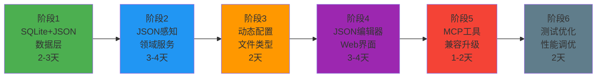

# CodebaseApp 全新升级方案总结 (SQLite + JSON方案)

## 🎯 升级核心价值

### 解决的关键问题
1. **配置灵活性不足** → SQLite JSON列支持的动态配置和扩展
2. **架构耦合度高** → 清晰的领域分离和服务解耦
3. **数据存储局限** → SQLite关系型 + JSON混合存储，事务性+灵活性
4. **管理界面缺失** → 完整的Web管理看板和JSON配置编辑器

### 技术架构升级
```
现有架构：                         升级后架构：
┌─────────────┐                   ┌─────────────┐
│ MCP Server  │                   │ Web + MCP   │
├─────────────┤                   ├─────────────┤
│ 单一服务层   │ ────升级───→        │ 领域服务层   │
├─────────────┤                   ├─────────────┤
│ JSON文件    │                   │SQLite+JSON │
└─────────────┘                   └─────────────┘
```

## 📊 SQLite + JSON 方案优势分析

### 核心技术优势

| 特性 | 纯关系型SQLite | SQLite + JSON混合 | 优势对比 |
|------|---------------|------------------|---------|
| **数据一致性** | ⭐⭐⭐⭐⭐ | ⭐⭐⭐⭐⭐ | 事务保证一致 |
| **配置灵活性** | ⭐⭐ | ⭐⭐⭐⭐⭐ | JSON动态扩展 |
| **查询能力** | ⭐⭐⭐⭐⭐ | ⭐⭐⭐⭐⭐ | SQL + JSON函数 |
| **学习成本** | ⭐⭐⭐⭐⭐ | ⭐⭐⭐⭐ | 基本无变化 |
| **工具支持** | ⭐⭐⭐⭐⭐ | ⭐⭐⭐⭐⭐ | 丰富生态 |
| **扩展性** | ⭐⭐⭐ | ⭐⭐⭐⭐⭐ | JSON无限扩展 |

### 数据模型设计亮点

#### 混合存储策略：
```sql
-- 关系型字段：高频查询、索引优化
CREATE TABLE IndexLibraries (
    Id INTEGER PRIMARY KEY,
    Name VARCHAR(100) NOT NULL,        -- 基础信息
    CodebasePath VARCHAR(500) UNIQUE,  -- 核心标识
    Status VARCHAR(20),                -- 状态查询
    
    -- JSON字段：灵活配置、动态扩展
    WatchConfig JSON,     -- 监控配置
    Statistics JSON,      -- 统计信息  
    Metadata JSON,        -- 项目元数据
    
    -- 性能字段：避免JSON解析
    TotalFiles INTEGER,
    IndexedSnippets INTEGER,
    UpdatedAt DATETIME
);
```

#### JSON配置结构示例：
```json
{
  "watchConfig": {
    "filePatterns": ["*.cs", "*.ts", "*.py"],
    "excludePatterns": ["bin", "obj", "node_modules"],
    "customFilters": [
      {
        "name": "exclude-tests",
        "pattern": "**/*test*",
        "enabled": true
      }
    ],
    "maxFileSize": 10485760,
    "isEnabled": true
  },
  "metadata": {
    "projectType": "webapi",
    "framework": "net8.0",
    "team": "backend",
    "tags": ["microservice", "auth"],
    "customSettings": {
      "embeddingModel": "text-embedding-3-small",
      "enableAdvancedParsing": true
    }
  }
}
```

## 🏗️ 分阶段实施策略

### 推荐实施顺序



### 关键里程碑验证

#### 🎯 阶段1完成标准：
- ✅ SQLite数据库创建成功，JSON函数测试通过
- ✅ 所有Repository接口实现完成，支持JSON操作
- ✅ 数据迁移工具测试成功，无数据丢失
- ✅ JSON查询性能满足要求（<10ms）

#### 🎯 阶段2完成标准：
- ✅ 所有领域服务重构完成，支持JSON配置
- ✅ 文件监控服务基于JSON配置正常工作
- ✅ 后台任务服务支持JSON任务配置
- ✅ 现有功能完全兼容，无回归问题

## 💡 技术实施要点

### JSON数据操作最佳实践

#### 1. JSON查询优化
```csharp
// 高效的JSON查询
public async Task<List<IndexLibrary>> GetEnabledLibrariesAsync()
{
    var sql = $@"
        SELECT * FROM IndexLibraries 
        WHERE IsActive = 1 
        AND {JsonQueryHelper.ExtractPath("WatchConfig", "isEnabled")} = true
        ORDER BY UpdatedAt DESC";
        
    return await _connection.QueryAsync<IndexLibrary>(sql);
}

// JSON索引支持
CREATE INDEX idx_watch_enabled 
ON IndexLibraries(JSON_EXTRACT(WatchConfig, '$.isEnabled'));
```

#### 2. JSON数据验证
```csharp
public class WatchConfigurationValidator
{
    public ValidationResult Validate(WatchConfigurationDto config)
    {
        var errors = new List<string>();
        
        if (!config.FilePatterns.Any())
            errors.Add("至少需要一个文件模式");
            
        if (config.MaxFileSize <= 0)
            errors.Add("文件大小限制必须大于0");
            
        // JSON Schema验证
        var jsonSchema = GetWatchConfigSchema();
        var json = JsonSerializer.Serialize(config);
        
        if (!jsonSchema.IsValid(json))
            errors.Add("JSON配置格式不正确");
            
        return new ValidationResult(errors);
    }
}
```

#### 3. JSON配置版本控制
```csharp
public class JsonConfigVersionManager
{
    public async Task<bool> UpgradeConfigVersionAsync(int libraryId, string fromVersion, string toVersion)
    {
        var library = await _repository.GetByIdAsync(libraryId);
        if (library == null) return false;
        
        // 版本升级策略
        var config = library.WatchConfigObject;
        
        switch ((fromVersion, toVersion))
        {
            case ("1.0", "1.1"):
                // 添加新字段，保持向后兼容
                if (config.CustomFilters == null)
                    config.CustomFilters = new List<CustomFilterDto>();
                break;
                
            case ("1.1", "2.0"):
                // 重大版本升级
                config = MigrateToV2(config);
                break;
        }
        
        return await _repository.UpdateWatchConfigAsync(libraryId, config);
    }
}
```

### Web界面JSON编辑器

#### 动态表单生成：
```javascript
class JsonConfigEditor {
    constructor(containerId, schema) {
        this.container = document.getElementById(containerId);
        this.schema = schema;
        this.data = {};
    }
    
    render(initialData = {}) {
        this.data = { ...initialData };
        this.container.innerHTML = this.generateForm(this.schema);
        this.bindEvents();
    }
    
    generateForm(schema) {
        // 根据JSON Schema生成动态表单
        return Object.entries(schema.properties)
            .map(([key, prop]) => this.generateField(key, prop))
            .join('');
    }
    
    generateField(key, property) {
        switch (property.type) {
            case 'array':
                return this.generateArrayField(key, property);
            case 'object':
                return this.generateObjectField(key, property);
            case 'boolean':
                return this.generateBooleanField(key, property);
            default:
                return this.generateStringField(key, property);
        }
    }
    
    generateArrayField(key, property) {
        return `
            <div class="form-group">
                <label>${property.title || key}</label>
                <div class="array-container" data-key="${key}">
                    <button type="button" class="btn btn-sm btn-primary add-item">
                        <i class="bi bi-plus"></i> 添加项目
                    </button>
                </div>
            </div>`;
    }
    
    validate() {
        // JSON Schema验证
        const validator = new JSONSchemaValidator();
        return validator.validate(this.data, this.schema);
    }
    
    getData() {
        return this.data;
    }
}

// 使用示例
const watchConfigEditor = new JsonConfigEditor('watch-config-form', {
    type: 'object',
    properties: {
        filePatterns: {
            type: 'array',
            title: '文件模式',
            items: { type: 'string' },
            default: ['*.cs']
        },
        excludePatterns: {
            type: 'array',
            title: '排除模式',
            items: { type: 'string' },
            default: ['bin', 'obj']
        },
        isEnabled: {
            type: 'boolean',
            title: '启用监控',
            default: true
        }
    }
});
```

## 📊 性能优化策略

### JSON查询性能优化

#### 1. 索引策略
```sql
-- 常用JSON查询的索引
CREATE INDEX idx_project_type 
ON IndexLibraries(JSON_EXTRACT(Metadata, '$.projectType'));

CREATE INDEX idx_team 
ON IndexLibraries(JSON_EXTRACT(Metadata, '$.team'));

CREATE INDEX idx_language_count
ON IndexLibraries(JSON_EXTRACT(Statistics, '$.languageDistribution.csharp'));
```

#### 2. 查询优化
```csharp
// 批量JSON操作，减少序列化开销
public async Task<List<ProjectSummaryDto>> GetProjectSummariesAsync()
{
    var sql = @"
        SELECT 
            Id,
            Name,
            JSON_EXTRACT(Metadata, '$.projectType') as ProjectType,
            JSON_EXTRACT(Metadata, '$.team') as Team,
            JSON_EXTRACT(Statistics, '$.indexedSnippets') as SnippetCount,
            JSON_EXTRACT(WatchConfig, '$.isEnabled') as IsMonitored
        FROM IndexLibraries 
        WHERE IsActive = 1
        ORDER BY UpdatedAt DESC";
    
    return await _connection.QueryAsync<ProjectSummaryDto>(sql);
}
```

#### 3. 缓存策略
```csharp
public class CachedJsonConfigService
{
    private readonly IMemoryCache _cache;
    private readonly IIndexLibraryRepository _repository;
    
    public async Task<WatchConfigurationDto> GetWatchConfigAsync(int libraryId)
    {
        var cacheKey = $"watch_config_{libraryId}";
        
        if (_cache.TryGetValue(cacheKey, out WatchConfigurationDto cached))
        {
            return cached;
        }
        
        var library = await _repository.GetByIdAsync(libraryId);
        var config = library?.WatchConfigObject;
        
        if (config != null)
        {
            _cache.Set(cacheKey, config, TimeSpan.FromMinutes(15));
        }
        
        return config;
    }
}
```

## 🎯 成功标准和验收

### 功能验收标准
1. **JSON配置管理**: 100%通过Web界面动态配置文件类型
2. **数据迁移**: 现有配置100%无损迁移到JSON格式
3. **性能基准**: JSON查询响应时间<50ms，批量操作<500ms
4. **MCP兼容**: 现有MCP客户端无需修改即可正常工作
5. **Web界面**: JSON配置编辑器功能完整，用户体验良好

### 技术质量标准
1. **JSON Schema**: 所有JSON配置有完整的Schema定义和验证
2. **查询优化**: 常用JSON查询都有对应的索引支持
3. **错误处理**: JSON解析错误有明确的错误信息和恢复机制
4. **版本兼容**: JSON配置支持版本升级和向后兼容
5. **安全性**: JSON输入验证和SQL注入防护完善

### 性能基准测试
1. **JSON查询性能**: 1000次查询平均响应时间<10ms
2. **配置更新性能**: JSON配置更新响应时间<100ms
3. **批量操作性能**: 100个库的统计查询<1秒
4. **内存使用**: JSON对象缓存内存占用<100MB
5. **并发性能**: 10个并发JSON操作无阻塞

## 🚀 推荐开始步骤

### 立即可执行的准备工作

#### 1. 环境验证（30分钟）
```bash
# 检查SQLite版本和JSON支持
sqlite3 --version
sqlite3 ":memory:" "SELECT JSON('{\"test\": true}')"

# 验证.NET环境
dotnet --version
dotnet add package Microsoft.Data.Sqlite --version 8.0.0
dotnet add package Dapper --version 2.1.35
```

#### 2. 数据库设计确认（1小时）
- 审查SQLite + JSON表结构设计
- 确认JSON Schema标准
- 验证索引策略

#### 3. 迁移策略确认（30分钟）
- 备份现有数据策略
- 数据迁移步骤验证
- 回滚方案确认

### 开发准备清单
- [ ] **开发环境**: .NET 8 SDK, SQLite Browser, VS Code/Visual Studio
- [ ] **数据库工具**: DB Browser for SQLite, SQLite命令行工具
- [ ] **测试数据**: 准备测试用的代码库目录
- [ ] **备份方案**: 现有配置文件备份脚本
- [ ] **监控工具**: 性能监控和日志工具

## 💭 最终建议

### 为什么选择SQLite + JSON混合方案

1. **最小学习成本** - 继续使用SQLite，团队无需学习新技术
2. **最佳平衡** - 关系型的稳定性 + JSON的灵活性
3. **平滑升级** - 可以渐进式将配置迁移到JSON，风险可控
4. **强大生态** - SQLite有丰富的工具和社区支持
5. **未来证明** - JSON列支持无限扩展，满足未来需求

### 关键成功因素

1. **JSON Schema标准化** - 制定完整的配置Schema，确保数据质量
2. **渐进式迁移** - 分步迁移，每步验证，降低风险
3. **性能监控** - 建立JSON查询性能基线，持续优化
4. **用户体验** - JSON配置编辑器要直观易用
5. **向后兼容** - 确保现有功能和工具无缝兼容

### 推荐的实施路径

**第一周（快速验证）**：
- 完成SQLite + JSON数据层设计和实现
- 实现基础的数据迁移工具
- 验证JSON查询性能和功能

**第二周（核心功能）**：
- 重构领域服务，支持JSON配置
- 实现动态文件类型配置
- 基础Web界面和JSON编辑器

**第三周（完善和优化）**：
- 完整Web管理界面
- MCP工具升级和兼容性测试
- 性能优化和测试

这个SQLite + JSON混合方案将使CodebaseApp既保持技术栈的稳定性，又获得现代化配置管理的灵活性，是最适合的升级路径！

---

**准备好开始实施了吗？建议现在切换到Code模式，开始第一阶段的具体编码工作！** 🚀