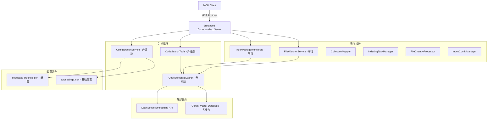

# 🎯 代码索引和MCP服务升级计划 v2.0

## 📋 需求分析

**核心升级功能：**
1. **新增"创建索引库"MCP工具** - 支持多代码库索引管理
2. **调整现有代码搜索功能** - 支持多集合查询
3. **内置文件监控服务** - 实时更新代码索引

**技术决策更新：**
- 使用目录路径哈希值生成唯一集合名称
- 文件监控作为MCP服务器内置后台服务
- **配置存储使用独立的JSON文件：`codebase-indexes.json`**

## 🏗️ 系统架构升级



## 📁 项目结构升级

```
CodebaseMcpServer/
├── Program.cs                          # 升级：添加后台服务注册
├── CodebaseMcpServer.csproj           # 升级：添加文件监控依赖
├── appsettings.json                    # 保持现有基础配置
├── codebase-indexes.json              # 新增：索引库配置文件
├── Tools/
│   ├── CodeSearchTools.cs             # 升级：支持多集合搜索
│   └── IndexManagementTools.cs        # 新增：索引管理工具
├── Services/
│   ├── FileWatcherService.cs          # 新增：文件监控服务
│   ├── IndexingTaskManager.cs         # 新增：索引任务管理
│   ├── CollectionMapperService.cs     # 新增：集合映射服务
│   ├── IndexConfigManager.cs          # 新增：索引配置管理
│   └── CodeSemanticSearch.cs          # 升级：支持多集合
├── Models/
│   ├── IndexConfiguration.cs          # 新增：索引配置模型
│   ├── CodebaseMapping.cs             # 新增：代码库映射模型
│   ├── IndexingTask.cs                # 新增：索引任务模型
│   └── FileWatcherConfig.cs           # 新增：文件监控配置
└── Extensions/
    └── PathExtensions.cs               # 新增：路径处理扩展
```

## 🔧 核心功能设计

### 1. 新增MCP工具：CreateIndexLibrary

```csharp
[McpServerTool, Description("为指定的代码库目录创建索引库，支持多代码库管理")]
public static async Task<string> CreateIndexLibrary(
    [Description("要创建索引的代码库目录的完整绝对路径")] string codebasePath,
    [Description("可选的索引库友好名称，如果不提供则使用目录名")] string? friendlyName = null)
```

**功能流程：**
1. 验证目录路径有效性
2. 生成目录路径哈希值作为集合名称（格式：`code_index_{hash8位}`）
3. 检查是否已存在索引任务，避免重复创建
4. 保存目录与集合映射关系到 `codebase-indexes.json`
5. 创建后台索引任务
6. 索引完成后启动文件监控

### 2. 升级现有工具：SemanticCodeSearch

```csharp
[McpServerTool, Description("在指定代码库中进行语义代码搜索")]
public static async Task<string> SemanticCodeSearch(
    [Description("自然语言搜索查询")] string query,
    [Description("要搜索的代码库路径，从本地配置获取对应集合名称")] string codebasePath,
    [Description("返回结果数量限制，默认为10个结果")] int limit = 10)
```

**升级要点：**
- 根据`codebasePath`从`codebase-indexes.json`获取对应的集合名称
- 如果集合不存在，提示用户先创建索引库
- 支持搜索结果按相似度排序

### 3. 新增后台服务：FileWatcherService

```csharp
public class FileWatcherService : BackgroundService
{
    // 监控已配置的所有代码库目录
    // 检测.cs文件的增加、修改、删除事件
    // 批量处理文件变更，避免频繁更新
    // 输出详细的监控和更新日志
}
```

## ⚙️ 配置文件设计

### appsettings.json （保持现有基础配置）

```json
{
  "CodeSearch": {
    "DashScopeApiKey": "sk-a239bd73d5b947ed955d03d437ca1e70",
    "QdrantConfig": {
      "Host": "localhost",
      "Port": 6334
    },
    "SearchConfig": {
      "DefaultLimit": 10,
      "MaxTokenLength": 8192,
      "BatchSize": 10
    }
  },
  "FileWatcher": {
    "EnableAutoMonitoring": true,
    "BatchProcessingDelay": 5000,
    "SupportedExtensions": [".cs"],
    "ExcludedDirectories": ["bin", "obj", ".git", "node_modules"],
    "LogFileChanges": true
  },
  "Logging": {
    "LogLevel": {
      "Default": "Information",
      "Microsoft": "Warning"
    }
  }
}
```

### codebase-indexes.json （新增的索引库配置文件）

```json
{
  "version": "1.0",
  "lastUpdated": "2025-06-14T16:30:00Z",
  "codebaseMappings": [
    {
      "id": "abc12345-def6-7890-ghij-klmnopqrstuv",
      "codebasePath": "d:/VSProject/MyApp",
      "normalizedPath": "d:\\vsproject\\myapp",
      "collectionName": "code_index_abc12345",
      "friendlyName": "MyApp主项目",
      "createdAt": "2025-06-14T16:30:00Z",
      "lastIndexed": "2025-06-14T16:35:00Z",
      "indexingStatus": "completed",
      "isMonitoring": true,
      "statistics": {
        "totalFiles": 45,
        "indexedSnippets": 312,
        "lastIndexingDuration": "2.3s",
        "lastUpdateTime": "2025-06-14T17:20:15Z"
      },
      "watcherConfig": {
        "enabled": true,
        "includeSubdirectories": true,
        "fileExtensions": [".cs"],
        "excludeDirectories": ["bin", "obj", ".git"]
      }
    }
  ],
  "globalSettings": {
    "maxConcurrentIndexing": 3,
    "indexingQueueSize": 100,
    "autoCleanupDays": 30
  }
}
```

## 🛠️ 技术实现要点

### 1. 路径哈希生成算法

```csharp
public static class PathHashGenerator
{
    public static string GenerateCollectionName(string path)
    {
        var normalizedPath = Path.GetFullPath(path).ToLowerInvariant();
        using var sha256 = SHA256.Create();
        var hash = sha256.ComputeHash(Encoding.UTF8.GetBytes(normalizedPath));
        var hashString = Convert.ToHexString(hash)[..8].ToLowerInvariant();
        return $"code_index_{hashString}";
    }
    
    public static string GenerateUniqueId()
    {
        return Guid.NewGuid().ToString();
    }
}
```

### 2. 索引配置管理器

```csharp
public class IndexConfigManager
{
    private const string CONFIG_FILE = "codebase-indexes.json";
    private readonly string _configPath;
    private IndexConfiguration _config;
    private readonly SemaphoreSlim _fileLock = new(1, 1);
    
    public IndexConfigManager()
    {
        _configPath = Path.Combine(AppDomain.CurrentDomain.BaseDirectory, CONFIG_FILE);
        LoadConfiguration();
    }
    
    public async Task<bool> AddCodebaseMapping(CodebaseMapping mapping)
    {
        await _fileLock.WaitAsync();
        try
        {
            // 检查是否已存在
            if (_config.CodebaseMappings.Any(m => 
                m.NormalizedPath.Equals(mapping.NormalizedPath, StringComparison.OrdinalIgnoreCase)))
            {
                return false; // 已存在
            }
            
            _config.CodebaseMappings.Add(mapping);
            _config.LastUpdated = DateTime.UtcNow;
            await SaveConfiguration();
            return true;
        }
        finally
        {
            _fileLock.Release();
        }
    }
    
    public CodebaseMapping? GetMappingByPath(string path)
    {
        var normalizedPath = Path.GetFullPath(path).ToLowerInvariant();
        return _config.CodebaseMappings.FirstOrDefault(m => 
            m.NormalizedPath.Equals(normalizedPath, StringComparison.OrdinalIgnoreCase));
    }
}
```

### 3. 索引任务管理

```csharp
public class IndexingTaskManager
{
    private readonly ConcurrentDictionary<string, IndexingTask> _runningTasks = new();
    private readonly ILogger<IndexingTaskManager> _logger;
    private readonly IndexConfigManager _configManager;
    
    public async Task<IndexingResult> StartIndexingAsync(string codebasePath, string? friendlyName = null)
    {
        var normalizedPath = Path.GetFullPath(codebasePath).ToLowerInvariant();
        
        // 检查是否已在执行
        if (_runningTasks.ContainsKey(normalizedPath))
        {
            return new IndexingResult 
            { 
                Success = false, 
                Message = "该代码库正在索引中，请等待完成",
                TaskId = _runningTasks[normalizedPath].Id
            };
        }
        
        // 创建索引任务
        var task = new IndexingTask
        {
            Id = Guid.NewGuid().ToString(),
            CodebasePath = codebasePath,
            Status = IndexingStatus.Running,
            StartTime = DateTime.UtcNow
        };
        
        _runningTasks.TryAdd(normalizedPath, task);
        
        // 异步执行索引
        _ = Task.Run(async () => await ExecuteIndexingTask(task, friendlyName));
        
        return new IndexingResult 
        { 
            Success = true, 
            Message = "索引任务已启动",
            TaskId = task.Id
        };
    }
    
    private async Task ExecuteIndexingTask(IndexingTask task, string? friendlyName)
    {
        try
        {
            _logger.LogInformation("开始索引代码库: {Path}", task.CodebasePath);
            
            // 生成集合名称
            var collectionName = PathHashGenerator.GenerateCollectionName(task.CodebasePath);
            
            // 创建代码库映射
            var mapping = new CodebaseMapping
            {
                Id = PathHashGenerator.GenerateUniqueId(),
                CodebasePath = task.CodebasePath,
                NormalizedPath = Path.GetFullPath(task.CodebasePath).ToLowerInvariant(),
                CollectionName = collectionName,
                FriendlyName = friendlyName ?? Path.GetFileName(task.CodebasePath),
                CreatedAt = DateTime.UtcNow,
                IndexingStatus = "indexing"
            };
            
            // 保存映射到配置
            await _configManager.AddCodebaseMapping(mapping);
            
            // 执行索引
            var searchService = new CodeSemanticSearch(
                apiKey: "sk-a239bd73d5b947ed955d03d437ca1e70",
                collectionName: collectionName);
                
            var indexedCount = await searchService.ProcessCodebase(task.CodebasePath);
            
            // 更新任务状态
            task.Status = IndexingStatus.Completed;
            task.EndTime = DateTime.UtcNow;
            task.IndexedCount = indexedCount;
            
            // 更新配置中的状态
            mapping.IndexingStatus = "completed";
            mapping.LastIndexed = DateTime.UtcNow;
            mapping.Statistics.IndexedSnippets = indexedCount;
            mapping.Statistics.LastIndexingDuration = $"{(task.EndTime - task.StartTime)?.TotalSeconds:F1}s";
            
            await _configManager.UpdateMapping(mapping);
            
            _logger.LogInformation("代码库索引完成: {Path}, 索引片段数: {Count}", 
                task.CodebasePath, indexedCount);
        }
        catch (Exception ex)
        {
            task.Status = IndexingStatus.Failed;
            task.ErrorMessage = ex.Message;
            _logger.LogError(ex, "代码库索引失败: {Path}", task.CodebasePath);
        }
        finally
        {
            _runningTasks.TryRemove(task.CodebasePath.ToLowerInvariant(), out _);
        }
    }
}
```

### 4. 文件监控批处理

```csharp
public class FileWatcherService : BackgroundService
{
    private readonly Dictionary<string, FileSystemWatcher> _watchers = new();
    private readonly Dictionary<string, List<FileChangeEvent>> _pendingChanges = new();
    private readonly Timer _batchProcessor;
    private readonly ILogger<FileWatcherService> _logger;
    private readonly IndexConfigManager _configManager;
    
    protected override async Task ExecuteAsync(CancellationToken stoppingToken)
    {
        _logger.LogInformation("文件监控服务启动");
        
        // 初始化已配置的监控
        await InitializeWatchers();
        
        // 启动批处理定时器
        _batchProcessor = new Timer(ProcessPendingChanges, null, 
            TimeSpan.Zero, TimeSpan.FromSeconds(5));
            
        // 等待取消信号
        await Task.Delay(Timeout.Infinite, stoppingToken);
    }
    
    private async Task InitializeWatchers()
    {
        var config = await _configManager.GetConfiguration();
        
        foreach (var mapping in config.CodebaseMappings.Where(m => m.IsMonitoring))
        {
            CreateWatcher(mapping);
        }
    }
    
    private void CreateWatcher(CodebaseMapping mapping)
    {
        try
        {
            var watcher = new FileSystemWatcher(mapping.CodebasePath)
            {
                Filter = "*.cs",
                IncludeSubdirectories = true,
                EnableRaisingEvents = true
            };
            
            watcher.Created += (s, e) => OnFileChanged(mapping, e, FileChangeType.Created);
            watcher.Changed += (s, e) => OnFileChanged(mapping, e, FileChangeType.Modified);
            watcher.Deleted += (s, e) => OnFileChanged(mapping, e, FileChangeType.Deleted);
            watcher.Renamed += (s, e) => OnFileRenamed(mapping, e);
            
            _watchers[mapping.NormalizedPath] = watcher;
            
            _logger.LogInformation("开始监控代码库: {Path} -> {CollectionName}", 
                mapping.CodebasePath, mapping.CollectionName);
        }
        catch (Exception ex)
        {
            _logger.LogError(ex, "创建文件监控失败: {Path}", mapping.CodebasePath);
        }
    }
    
    private void OnFileChanged(CodebaseMapping mapping, FileSystemEventArgs e, FileChangeType changeType)
    {
        // 排除不需要的目录
        if (IsExcludedPath(e.FullPath))
            return;
            
        lock (_pendingChanges)
        {
            if (!_pendingChanges.ContainsKey(mapping.CollectionName))
                _pendingChanges[mapping.CollectionName] = new List<FileChangeEvent>();
                
            _pendingChanges[mapping.CollectionName].Add(new FileChangeEvent
            {
                FilePath = e.FullPath,
                ChangeType = changeType,
                Timestamp = DateTime.UtcNow,
                CollectionName = mapping.CollectionName
            });
        }
        
        _logger.LogDebug("检测到文件变更: {Type} {Path}", changeType, e.FullPath);
    }
    
    private void ProcessPendingChanges(object? state)
    {
        Dictionary<string, List<FileChangeEvent>> changesToProcess;
        
        lock (_pendingChanges)
        {
            if (_pendingChanges.Count == 0)
                return;
                
            changesToProcess = new Dictionary<string, List<FileChangeEvent>>(_pendingChanges);
            _pendingChanges.Clear();
        }
        
        foreach (var kvp in changesToProcess)
        {
            var collectionName = kvp.Key;
            var changes = kvp.Value;
            
            _logger.LogInformation("批处理文件变更: 集合 {Collection}, 变更数 {Count}", 
                collectionName, changes.Count);
                
            _ = Task.Run(async () => await ProcessCollectionChanges(collectionName, changes));
        }
    }
    
    private async Task ProcessCollectionChanges(string collectionName, List<FileChangeEvent> changes)
    {
        try
        {
            var searchService = new CodeSemanticSearch(
                apiKey: "sk-a239bd73d5b947ed955d03d437ca1e70",
                collectionName: collectionName);
                
            foreach (var change in changes)
            {
                switch (change.ChangeType)
                {
                    case FileChangeType.Created:
                    case FileChangeType.Modified:
                        if (File.Exists(change.FilePath))
                        {
                            var snippets = searchService.ExtractCSharpSnippets(change.FilePath);
                            if (snippets.Any())
                            {
                                await searchService.BatchIndexSnippets(snippets);
                                _logger.LogInformation("更新文件索引: {Path}, 片段数: {Count}", 
                                    change.FilePath, snippets.Count);
                            }
                        }
                        break;
                        
                    case FileChangeType.Deleted:
                        // TODO: 实现删除文件的索引清理
                        _logger.LogInformation("文件已删除，需要清理索引: {Path}", change.FilePath);
                        break;
                }
            }
        }
        catch (Exception ex)
        {
            _logger.LogError(ex, "处理文件变更失败: 集合 {Collection}", collectionName);
        }
    }
}
```

## 📊 工具响应格式示例

### CreateIndexLibrary 工具响应：

```json
{
  "content": [
    {
      "type": "text", 
      "text": "✅ 索引库创建成功！\n\n📁 代码库路径: d:/VSProject/MyApp\n🏷️ 集合名称: code_index_abc12345\n🆔 任务ID: 550e8400-e29b-41d4-a716-446655440000\n📊 索引统计:\n  - 扫描文件: 45个\n  - 提取代码片段: 312个\n  - 索引耗时: 2.3秒\n\n🔍 现在可以使用 SemanticCodeSearch 工具搜索此代码库\n👁️ 文件监控已启动，代码变更将自动更新索引\n📄 配置已保存到: codebase-indexes.json"
    }
  ]
}
```

### 升级后的 SemanticCodeSearch 响应：

```json
{
  "content": [
    {
      "type": "text",
      "text": "🔍 在代码库 'MyApp主项目' 中搜索: '身份认证逻辑'\n📍 集合: code_index_abc12345\n📄 配置来源: codebase-indexes.json\n\n找到 3 个相关代码片段:\n\n--- 结果 1 (相似度: 0.8521) ---\n文件: UserController.cs\n命名空间: MyApp.Controllers\n类: UserController\n成员: Login (方法)\n位置: 第 25-45 行\n```csharp\n[HttpPost]\npublic async Task<IActionResult> Login(LoginModel model)\n{\n    var isValid = await _authService.ValidateUserAsync(model.Username, model.Password);\n    if (!isValid)\n        return Unauthorized();\n    \n    var token = _tokenService.GenerateToken(model.Username);\n    return Ok(new { Token = token });\n}\n```\n\n..."
    }
  ]
}
```

## 🚀 实施阶段规划

### 阶段一：核心架构升级（第1-3天）
1. ✅ 创建 `codebase-indexes.json` 配置文件结构
2. ✅ 实现 `IndexConfigManager` 配置管理器
3. ✅ 升级 `CodeSemanticSearch` 支持多集合
4. ✅ 实现路径哈希算法和工具类

### 阶段二：MCP工具实现（第4-6天）
1. ✅ 实现 `CreateIndexLibrary` 工具
2. ✅ 升级 `SemanticCodeSearch` 工具
3. ✅ 创建 `IndexingTaskManager` 任务管理器
4. ✅ 集成配置文件读写功能

### 阶段三：文件监控服务（第7-9天）
1. ✅ 实现 `FileWatcherService` 后台服务
2. ✅ 创建文件变更批处理逻辑
3. ✅ 集成索引更新机制
4. ✅ 添加详细日志输出

### 阶段四：测试和优化（第10天）
1. ✅ 端到端功能测试
2. ✅ 性能优化和错误处理
3. ✅ 文档更新
4. ✅ 部署验证

## 🎁 附加功能

1. **索引状态查询工具**: 查看所有已创建的索引库状态
2. **索引重建工具**: 重新索引指定代码库
3. **监控统计报告**: 显示文件变更和索引更新统计
4. **配置导入导出**: 支持索引配置的备份和恢复

## 🔄 配置文件管理优势

使用独立的 `codebase-indexes.json` 配置文件的优势：

1. **独立性**: 索引配置与应用程序配置分离，便于备份和迁移
2. **灵活性**: 可以轻松添加、删除、修改索引库配置
3. **可移植性**: 配置文件可以在不同环境间复制
4. **版本控制**: 支持配置文件的版本管理和升级
5. **安全性**: 不包含敏感信息，可以安全地共享

这个升级计划充分考虑了您的需求调整，提供了完整的多代码库索引管理、实时文件监控和优化的搜索体验。整个方案基于现有架构进行渐进式升级，确保向后兼容性和系统稳定性。