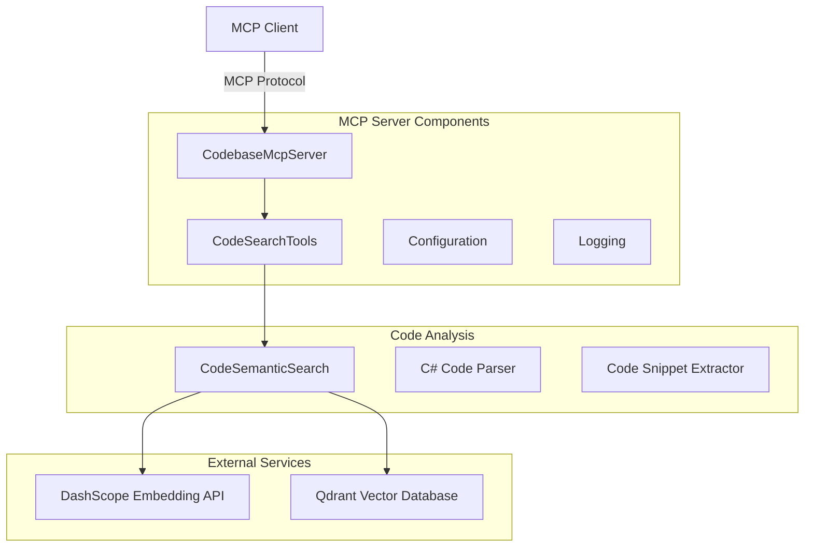

# 📋 Codebase MCP 服务器实现计划

## 🎯 项目概述

基于现有的 `CodeSemanticSearch.cs` 语义搜索功能，创建一个轻量级的 MCP (Model Context Protocol) 控制台应用程序，提供通过自然语义搜索代码的工具。

## 🏗️ 系统架构



## 📁 项目结构

```
CodebaseMcpServer/
├── Program.cs                    # MCP服务器主程序
├── CodebaseMcpServer.csproj     # 项目文件
├── appsettings.json             # 配置文件
├── Tools/
│   └── CodeSearchTools.cs       # MCP工具实现
├── Services/
│   ├── CodeSemanticSearch.cs    # 从现有项目复制并优化
│   └── ICodeSearchService.cs    # 服务接口
└── Models/
    ├── CodeSnippet.cs           # 代码片段模型
    ├── SearchResult.cs          # 搜索结果模型
    └── SearchRequest.cs         # 搜索请求模型
```

## 🔧 核心功能设计

### MCP 工具定义

**SemanticCodeSearch 工具**
- **功能**: 根据自然语言描述搜索相关代码片段
- **输入参数**:
  - `query` (string): 自然语言搜索查询
  - `codebasePath` (string, optional): 要搜索的代码库路径，默认使用配置文件中的路径
  - `limit` (int, optional): 返回结果数量限制，默认10
- **输出**: 格式化的搜索结果，包含文件路径、类名、方法名、代码片段等

### 配置管理

```jsonc
{
  "CodeSearch": {
    "DashScopeApiKey": "your-api-key-here",
    "QdrantConfig": {
      "Host": "localhost",
      "Port": 6334,
      "CollectionName": "codebase_embeddings"
    },
    "DefaultCodebasePath": "D:\\VSProject\\CoodeBaseDemo\\Codebase",
    "SearchConfig": {
      "DefaultLimit": 10,
      "MaxTokenLength": 8192,
      "BatchSize": 10
    }
  },
  "Logging": {
    "LogLevel": {
      "Default": "Information",
      "Microsoft": "Warning"
    }
  }
}
```

### 服务层架构

**ICodeSearchService 接口**
```csharp
public interface ICodeSearchService
{
    Task<List<SearchResult>> SearchAsync(string query, string? codebasePath = null, int limit = 10);
    Task<bool> IsCodebaseIndexedAsync(string codebasePath);
}
```

## 🛠️ 技术实现要点

### 1. MCP 服务器集成
- 使用 `Microsoft.Extensions.Hosting` 创建控制台主机
- 配置 `WithStdioServerTransport()` 用于标准输入输出通信
- 实现 `[McpServerToolType]` 工具类

### 2. 依赖注入配置
```csharp
builder.Services.AddSingleton<ICodeSearchService, CodeSemanticSearch>();
builder.Services.Configure<CodeSearchOptions>(builder.Configuration.GetSection("CodeSearch"));
```

### 3. 错误处理策略
- API 调用失败时的重试机制
- 向量数据库连接异常处理
- 代码解析错误的优雅降级

### 4. 性能优化
- 批量处理代码片段索引
- 智能文本截断保持代码结构完整性
- 缓存常用搜索结果

## 📊 MCP 工具响应格式

```json
{
  "content": [
    {
      "type": "text",
      "text": "找到 3 个相关代码片段:\n\n--- 结果 1 (得分: 0.8521) ---\n文件: D:\\Project\\Auth\\UserService.cs\n命名空间: MyApp.Services\n类: UserService\n方法: ValidateUser (方法)\n位置: 第 25-45 行\n代码:\npublic async Task<bool> ValidateUser(string username, string password)\n{\n    // 身份认证逻辑实现\n    var user = await _userRepository.GetByUsernameAsync(username);\n    if (user == null) return false;\n    \n    return _passwordHasher.VerifyPassword(password, user.PasswordHash);\n}\n\n..."
    }
  ]
}
```

## 🚀 部署和使用

### 1. 编译和发布
```bash
dotnet publish -c Release --self-contained -r win-x64
```

### 2. MCP 客户端配置
```json
{
  "mcpServers": {
    "codebase-search": {
      "command": "D:\\Path\\To\\CodebaseMcpServer.exe",
      "args": []
    }
  }
}
```

### 3. 使用示例
```
# 通过MCP客户端调用
工具名称: SemanticCodeSearch
参数:
- query: "身份认证逻辑"
- codebasePath: "D:\\MyProject\\Source" (可选)
- limit: 5 (可选)
```

## 🔄 扩展计划

1. **多语言支持**: 扩展到 JavaScript、Python 等其他编程语言
2. **代码结构分析**: 添加依赖关系分析、调用链追踪
3. **智能推荐**: 基于上下文推荐相关代码片段
4. **增量索引**: 支持文件变更的增量索引更新

---

这个计划充分利用了现有的 `CodeSemanticSearch.cs` 实现，同时遵循 MCP 协议标准，创建一个高效、易用的代码搜索工具。

## 实现优先级

1. **阶段一**: 创建基础 MCP 服务器结构和 SemanticCodeSearch 工具
2. **阶段二**: 集成现有的 CodeSemanticSearch 功能
3. **阶段三**: 优化错误处理和性能
4. **阶段四**: 添加配置管理和日志记录