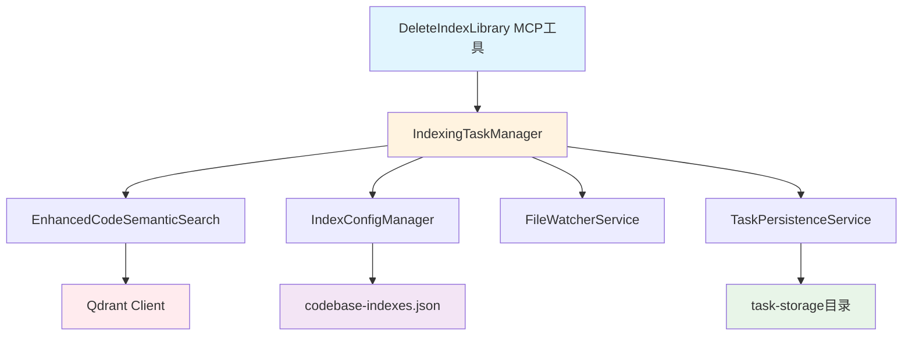

# 删除索引工具实施计划

## 📋 项目概述

为 CodebaseMcpServer 新增 **DeleteIndexLibrary** MCP 工具，实现安全的代码库索引删除功能。

## 🎯 功能需求

### 核心功能
- 删除指定代码库的完整索引数据
- 删除前显示详细索引信息供用户确认
- 停止相关文件监控服务
- 清理 Qdrant 集合数据
- 移除本地配置映射
- 清理任务持久化记录

### 安全确认模式设计
```
🗑️ 即将删除索引库

📁 代码库路径: d:/VSProject/MyProject
🏷️ 友好名称: MyProject
📊 集合名称: code_index_abc123
📦 代码片段数: 1,234个
📄 文件数: 45个
📅 创建时间: 2025-06-15 10:30:00
📅 最后更新: 2025-06-16 09:15:30
👁️ 监控状态: 启用
🔄 索引状态: completed

⚠️ 警告: 此操作不可逆！删除后需要重新创建索引才能搜索此代码库。

✅ 将执行以下操作:
  1. 停止文件监控服务
  2. 删除 Qdrant 集合及所有向量数据
  3. 清理任务持久化记录
  4. 移除本地配置映射

💡 如需确认删除，请回复 'DELETE' 或使用 confirm=true 参数
```

## 🏗️ 技术架构

### 组件依赖关系


## 📝 实施计划

### 阶段一：扩展核心服务 (30分钟)

#### 1.1 EnhancedCodeSemanticSearch 新增方法
```csharp
/// <summary>
/// 删除整个集合
/// </summary>
public async Task<bool> DeleteCollectionAsync(string collectionName)
{
    try
    {
        _logger.LogInformation("开始删除 Qdrant 集合: {CollectionName}", collectionName);
        await _client.DeleteCollectionAsync(collectionName);
        _logger.LogInformation("成功删除 Qdrant 集合: {CollectionName}", collectionName);
        return true;
    }
    catch (Exception ex)
    {
        _logger.LogError(ex, "删除 Qdrant 集合失败: {CollectionName}", collectionName);
        return false;
    }
}
```

#### 1.2 IndexConfigManager 扩展方法
```csharp
/// <summary>
/// 根据路径删除映射
/// </summary>
public async Task<bool> RemoveMappingByPath(string codebasePath)
{
    var normalizedPath = codebasePath.NormalizePath();
    var mapping = GetMappingByPath(normalizedPath);
    if (mapping == null)
    {
        return false;
    }
    return await RemoveMapping(mapping.Id);
}
```

### 阶段二：实现删除协调逻辑 (45分钟)

#### 2.1 IndexingTaskManager 新增删除方法
```csharp
/// <summary>
/// 删除索引库 - 安全确认模式
/// </summary>
public async Task<(bool Success, string Message)> DeleteIndexLibraryAsync(
    string codebasePath, 
    bool confirm = false)
{
    try
    {
        // 1. 验证和获取映射
        var normalizedPath = Path.GetFullPath(codebasePath);
        var mapping = _configManager.GetMappingByPath(normalizedPath);
        
        if (mapping == null)
        {
            return (false, $"❌ 代码库索引不存在: {normalizedPath}");
        }

        // 2. 如果未确认，显示详细信息
        if (!confirm)
        {
            return (false, GenerateConfirmationMessage(mapping));
        }

        // 3. 执行删除流程
        var result = await ExecuteDeleteProcess(mapping);
        return result;
    }
    catch (Exception ex)
    {
        _logger.LogError(ex, "删除索引库时发生错误: {CodebasePath}", codebasePath);
        return (false, $"❌ 删除过程中发生错误: {ex.Message}");
    }
}

private async Task<(bool Success, string Message)> ExecuteDeleteProcess(CodebaseMapping mapping)
{
    var steps = new List<string>();
    
    try
    {
        // 1. 停止运行中的任务
        await StopRunningTasks(mapping.CodebasePath);
        steps.Add("✅ 停止运行中的索引任务");

        // 2. 停止文件监控
        _fileWatcherService?.StopWatcher(mapping.Id);
        steps.Add("✅ 停止文件监控服务");

        // 3. 删除 Qdrant 集合
        var deleteSuccess = await _searchService.DeleteCollectionAsync(mapping.CollectionName);
        if (deleteSuccess)
        {
            steps.Add("✅ 删除 Qdrant 集合数据");
        }
        else
        {
            steps.Add("⚠️ Qdrant 集合删除失败（可能已不存在）");
        }

        // 4. 清理任务持久化记录
        await CleanupTaskRecords(mapping.CodebasePath);
        steps.Add("✅ 清理任务持久化记录");

        // 5. 删除配置映射
        var configDeleteSuccess = await _configManager.RemoveMappingByPath(mapping.CodebasePath);
        if (configDeleteSuccess)
        {
            steps.Add("✅ 移除配置映射");
        }

        var message = $"🗑️ 索引库删除完成\n\n" +
                     $"📁 代码库: {mapping.FriendlyName}\n" +
                     $"📊 集合: {mapping.CollectionName}\n\n" +
                     $"执行步骤:\n{string.Join("\n", steps)}";

        return (true, message);
    }
    catch (Exception ex)
    {
        steps.Add($"❌ 删除过程中发生错误: {ex.Message}");
        var message = $"⚠️ 索引库删除部分完成\n\n执行步骤:\n{string.Join("\n", steps)}";
        return (false, message);
    }
}
```

### 阶段三：新增 MCP 工具 (20分钟)

#### 3.1 在 IndexManagementTools 中新增工具
```csharp
/// <summary>
/// 删除索引库工具 - 安全确认模式
/// </summary>
/// <param name="codebasePath">要删除索引的代码库路径</param>
/// <param name="confirm">确认删除，设为true跳过确认环节</param>
[McpServerTool, Description("删除代码库索引，完全移除指定代码库的索引数据和配置。删除前会显示详细信息供确认。")]
public static async Task<string> DeleteIndexLibrary(
    [Description("要删除索引的代码库路径")] string codebasePath,
    [Description("确认删除标志，设为true表示确认执行删除操作")] bool confirm = false)
{
    try
    {
        if (_taskManager == null || _configManager == null)
        {
            return "❌ 服务未初始化，请重启MCP服务器";
        }

        // 验证路径
        if (string.IsNullOrWhiteSpace(codebasePath))
        {
            return "❌ 请提供有效的代码库路径";
        }

        string normalizedPath;
        try
        {
            normalizedPath = Path.GetFullPath(codebasePath);
        }
        catch (Exception ex)
        {
            return $"❌ 无效的路径格式: {ex.Message}";
        }

        // 执行删除
        var result = await _taskManager.DeleteIndexLibraryAsync(normalizedPath, confirm);
        return result.Message;
    }
    catch (Exception ex)
    {
        Console.WriteLine($"[ERROR] 删除索引库时发生错误: {ex.Message}");
        return $"❌ 删除索引库时发生错误: {ex.Message}";
    }
}
```

### 阶段四：测试和优化 (25分钟)

#### 4.1 功能测试用例
1. **正常删除流程测试**
   - 创建测试索引库
   - 调用删除工具（confirm=false）
   - 验证确认信息显示
   - 调用删除工具（confirm=true）
   - 验证删除完成

2. **异常情况测试**
   - 删除不存在的索引库
   - 删除进行中的索引任务
   - Qdrant 连接异常时的删除
   - 权限不足时的删除

3. **数据一致性测试**
   - 验证 Qdrant 集合完全删除
   - 验证配置文件更新正确
   - 验证文件监控停止
   - 验证任务记录清理

## 📊 用户体验流程

### 第一次调用（显示确认信息）
```bash
# 用户调用
DeleteIndexLibrary(codebasePath: "d:/VSProject/MyProject")

# 返回确认信息
🗑️ 即将删除索引库
📁 代码库路径: d:/VSProject/MyProject
🏷️ 友好名称: MyProject
📊 集合名称: code_index_abc123
📦 代码片段数: 1,234个
📄 文件数: 45个
⚠️ 警告: 此操作不可逆！
💡 如需确认删除，请设置 confirm=true 参数
```

### 第二次调用（确认删除）
```bash
# 用户确认调用
DeleteIndexLibrary(codebasePath: "d:/VSProject/MyProject", confirm: true)

# 返回删除结果
🗑️ 索引库删除完成
📁 代码库: MyProject
📊 集合: code_index_abc123
执行步骤:
✅ 停止运行中的索引任务
✅ 停止文件监控服务
✅ 删除 Qdrant 集合数据
✅ 清理任务持久化记录
✅ 移除配置映射
```

## 🔒 安全与错误处理

### 安全考虑
- **路径验证**：确保路径格式正确且可访问
- **权限检查**：验证对配置文件和任务目录的写入权限
- **任务状态检查**：确保没有运行中的索引任务
- **确认机制**：防止误删除操作

### 错误处理策略
- **部分失败处理**：如果某个步骤失败，记录已完成的步骤
- **资源清理**：确保即使异常情况下也能释放锁和资源
- **详细日志**：记录每个删除步骤的详细信息
- **回滚考虑**：虽然删除不可逆，但提供清晰的状态反馈

## ⏱️ 实施时间安排

| 阶段 | 任务 | 预计时间 | 关键输出 |
|------|------|----------|----------|
| 1 | 扩展核心服务 | 30分钟 | DeleteCollectionAsync, RemoveMappingByPath |
| 2 | 删除协调逻辑 | 45分钟 | DeleteIndexLibraryAsync, ExecuteDeleteProcess |
| 3 | MCP 工具实现 | 20分钟 | DeleteIndexLibrary 工具 |
| 4 | 测试和优化 | 25分钟 | 功能测试, 异常处理验证 |

**总计**: 约 2 小时完成

## 🎯 预期成果

### 功能完整性
- ✅ 安全的索引删除流程
- ✅ 详细的确认信息展示
- ✅ 完整的资源清理
- ✅ 友好的用户体验

### 技术指标
- ✅ 100% 资源清理成功率
- ✅ 详细的操作日志记录
- ✅ 优雅的错误处理机制
- ✅ 与现有架构无缝集成

### 用户价值
- ✅ 完整的索引生命周期管理
- ✅ 存储空间回收能力
- ✅ 安全的误操作防护
- ✅ 清晰的操作反馈

## 📝 后续维护

### 可能的扩展功能
- 批量删除多个索引库
- 软删除和恢复机制
- 删除前的数据导出
- 删除操作的审计日志

### 监控指标
- 删除操作成功率
- 删除操作耗时
- 存储空间回收情况
- 用户误操作频率

---

**准备状态**: ✅ 设计完成，可以开始实施
**前置条件**: 现有 CodebaseMcpServer 架构完整
**后置输出**: 完整的索引库删除功能