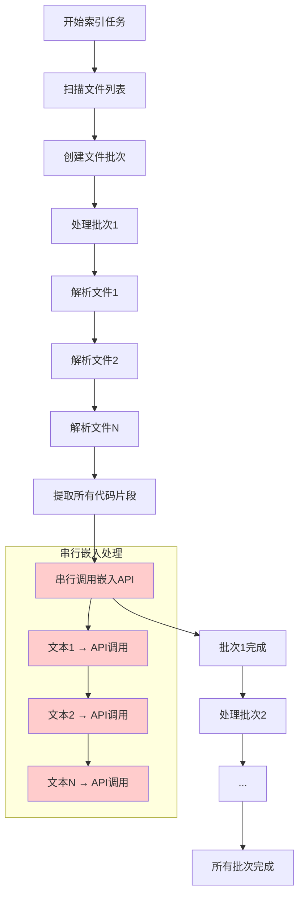
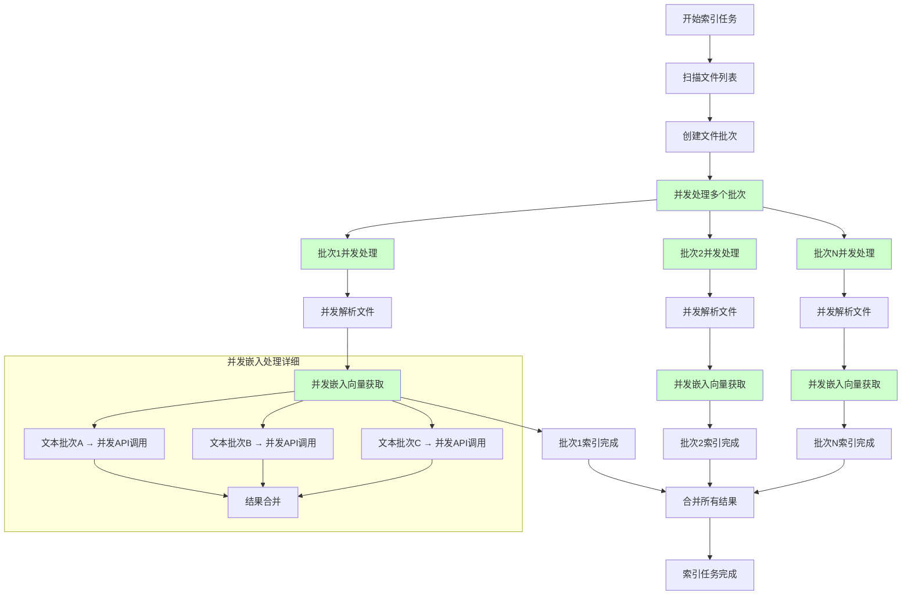
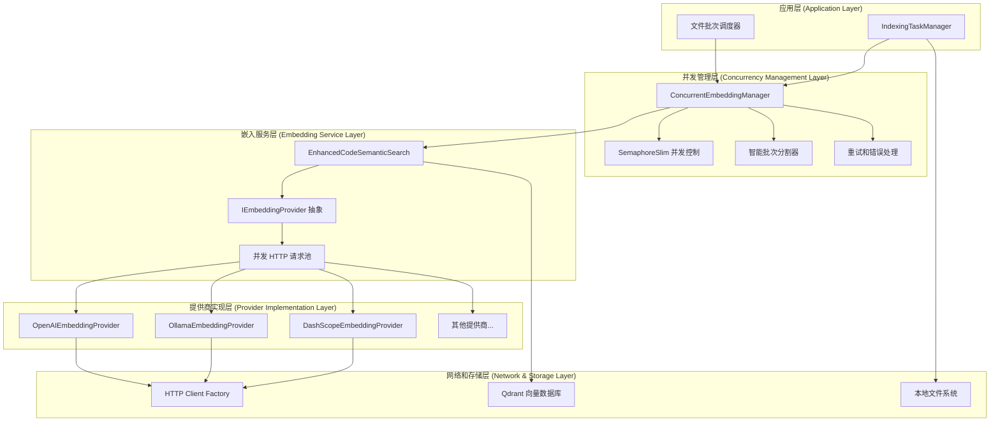
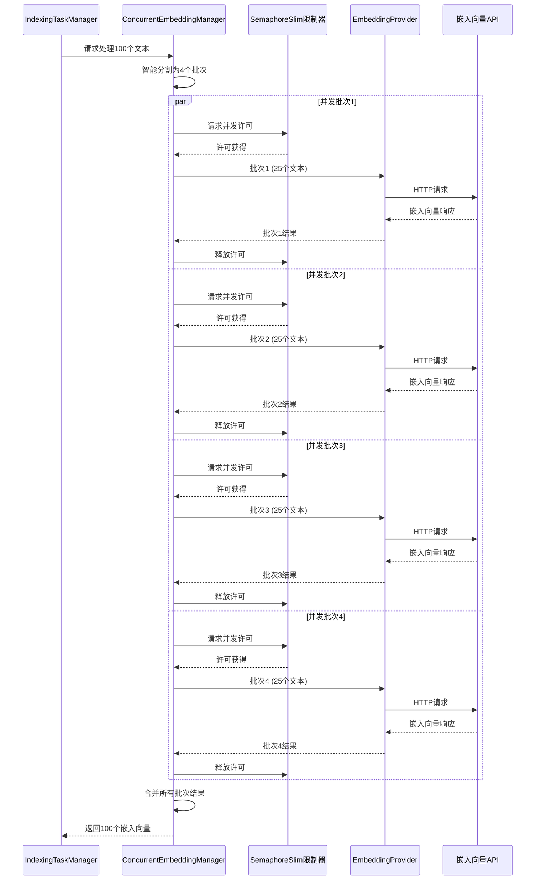
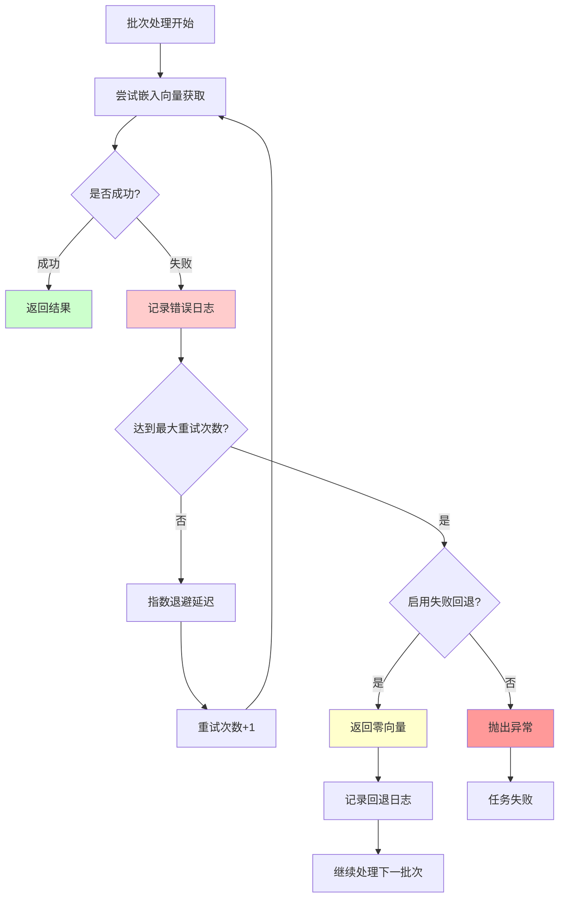
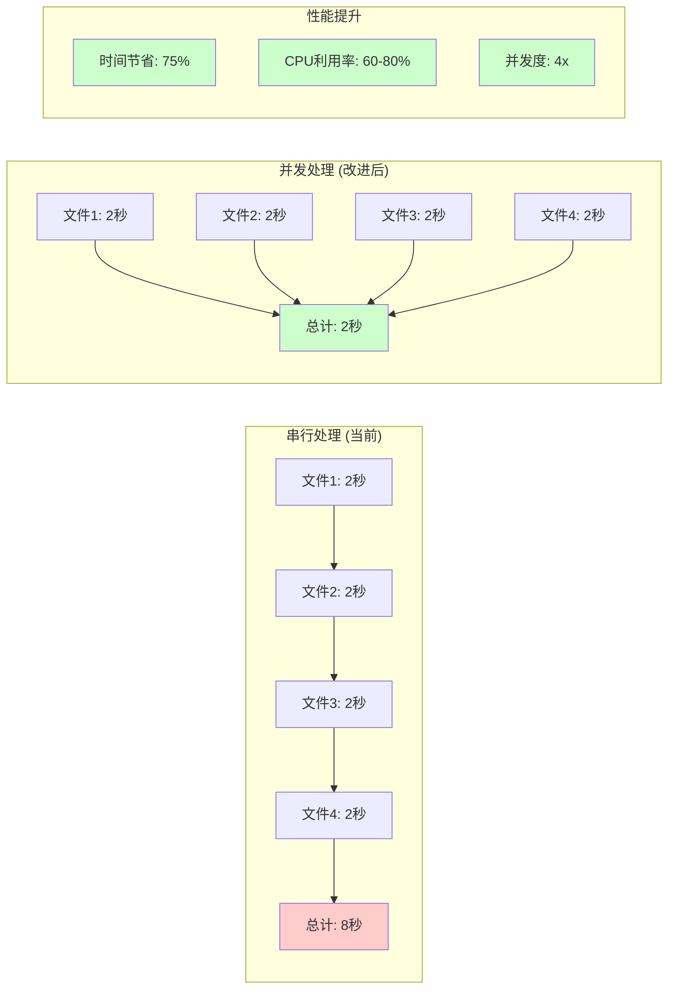
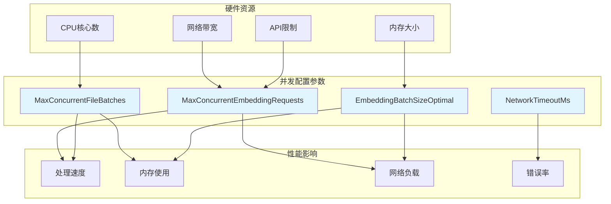

# IndexingTaskManager 嵌入模型并发调用流程图

## 1. 当前串行处理流程



## 2. 改进后并发处理流程



## 3. 并发架构层次图



## 4. 并发嵌入向量处理时序图



## 5. 错误处理和重试机制流程



## 6. 性能对比分析图



## 7. 配置参数影响分析



## 8. 内存使用优化对比

```mermaid
graph TD
    subgraph "改进前内存使用"
        A1[加载所有文件] --> A2[解析所有代码片段]
        A2 --> A3[内存中保存所有片段]
        A3 --> A4[批量获取嵌入向量]
        A4 --> A5[峰值内存: O(n)]
    end
    
    subgraph "改进后内存使用"
        B1[分批加载文件] --> B2[分批解析代码片段]
        B2 --> B3[及时释放已处理片段]
        B3 --> B4[并发获取嵌入向量]
        B4 --> B5[峰值内存: O(batch_size)]
    end
    
    subgraph "内存效益"
        C1[内存使用减少: 70-80%]
        C2[GC压力降低]
        C3[大型项目支持改善]
    end
    
    A5 --> C1
    B5 --> C1
    
    style A5 fill:#ffcccc
    style B5 fill:#ccffcc
    style C1 fill:#ccffcc
    style C2 fill:#ccffcc
    style C3 fill:#ccffcc
```

## 9. 实际使用场景流程

### 场景1：大型代码库初始索引

```mermaid
graph TD
    A[用户启动索引: 5000个文件] --> B[系统自动检测并发配置]
    B --> C[创建20个文件批次]
    C --> D[并发处理4个批次]
    D --> E[每个批次并发处理文件]
    E --> F[智能分割嵌入向量请求]
    F --> G[并发调用API获取向量]
    G --> H[实时更新进度显示]
    H --> I[批次完成后立即释放内存]
    I --> J[所有批次完成]
    J --> K[索引时间: 30分钟 (原60分钟)]
    
    style K fill:#ccffcc
```

### 场景2：增量重建优化

```mermaid
graph TD
    A[检测到100个文件变更] --> B[并发分析文件状态]
    B --> C[识别出30个需要重新索引]
    C --> D[并发处理文件更新]
    D --> E[每个文件并发获取嵌入向量]
    E --> F[并发更新Qdrant索引]
    F --> G[并发更新元数据]
    G --> H[增量重建完成: 3分钟 (原10分钟)]
    
    style H fill:#ccffcc
```

这个流程图全面展示了嵌入模型并发调用的改进方案，包括架构设计、性能对比、错误处理和实际应用场景，为实施提供了清晰的技术指导。