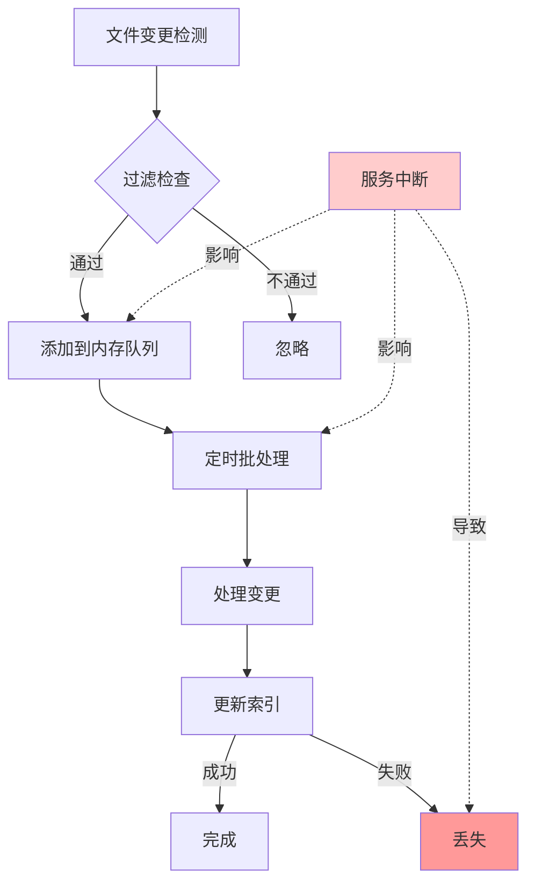
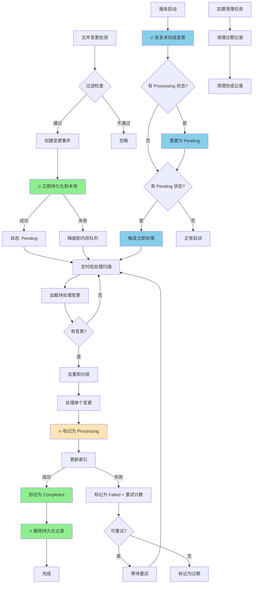
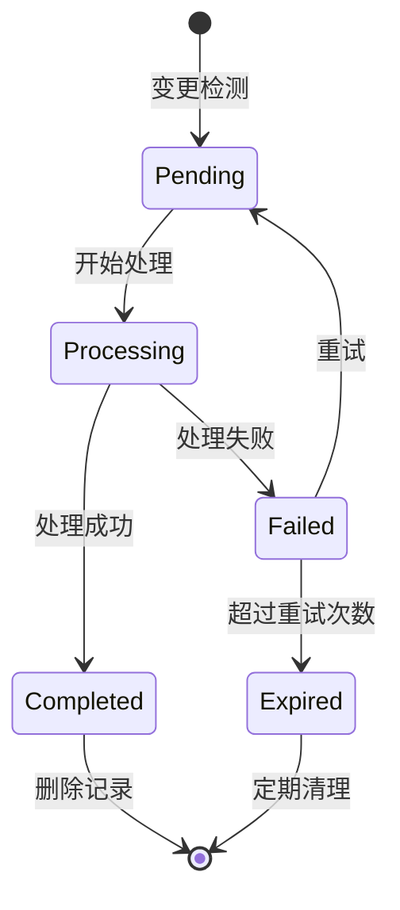
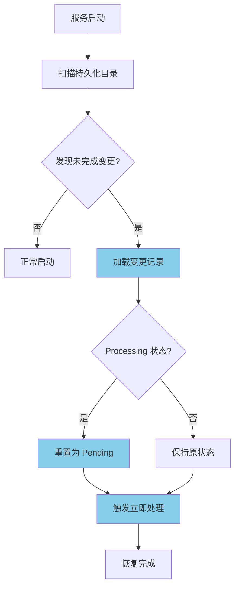
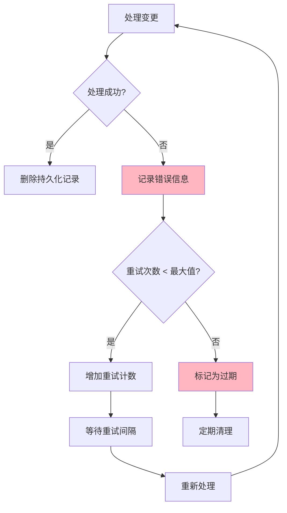
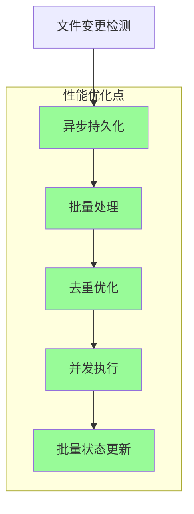
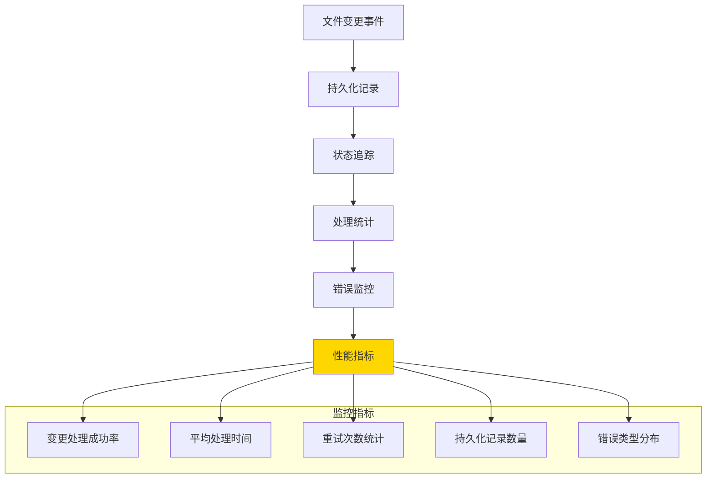

# 文件变更处理流程图

## 改进前的流程

## 改进后的流程

## 关键改进点

### 1. 持久化优先 (🔥 核心改进)

### 2. 状态生命周期管理

### 3. 服务重启恢复机制

## 错误处理和重试机制

## 并发安全处理

## 性能优化策略

## 故障恢复能力对比

### 改进前

### 改进后  

## 监控和可观测性

---

## 流程说明

### 主要改进
1. **持久化优先**：变更检测后立即保存到本地，确保不丢失
2. **状态管理**：完整的变更处理生命周期跟踪
3. **断点续传**：服务重启后自动恢复未完成处理
4. **错误恢复**：完善的重试和错误处理机制
5. **性能优化**：异步处理、批量操作、并发安全

### 关键特性
- ✅ **零丢失保证**：所有变更都有持久化备份
- ✅ **自动恢复**：服务重启无缝恢复处理
- ✅ **状态可见**：完整的处理状态追踪
- ✅ **错误自愈**：自动重试和故障恢复
- ✅ **运维友好**：丰富的监控和诊断信息

*此流程图配合 FileChange-Persistence-Upgrade-Plan.md 使用，提供可视化的改进方案说明。*