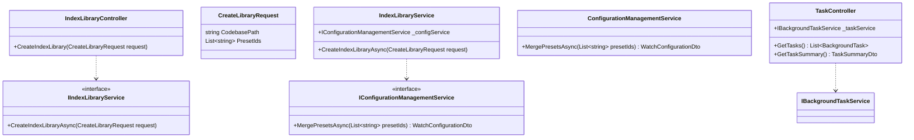

# Management Console Upgrade Plan (v3)

This document outlines the plan to upgrade the CodebaseApp Management Console based on user requirements.

## 1. Core Requirements

1.  **Tab State Persistence**: The active tab should be maintained after a page refresh. This will be implemented using URL hash (`#`) for navigation, which also allows for direct linking to specific tabs.
2.  **Task Monitoring Module**: A new "Task Monitoring" tab will be added to display real-time status of background jobs (e.g., indexing, rebuilding).
    *   **Summary Panel**: Cards showing key statistics (Total, Running, Completed, Failed).
    *   **Task List**: A detailed list of all tasks with their status, progress, and other details.
3.  **Multi-Preset Selection**: The "Create Index Library" form will be enhanced to allow selecting multiple configuration presets.
4.  **Custom Preset Creation**: A form will be implemented to allow users to create and save their own custom configuration presets.

## 2. Phased Implementation Plan

### Phase 1: Backend API & Service Layer Enhancements

This phase focuses on preparing the necessary backend logic and endpoints.

#### A. Task Monitoring API

*   **Create `TaskController.cs`**: A new controller to handle all task-related requests.
    *   **Dependencies**: `IBackgroundTaskService`.
*   **Define API Endpoints**:
    *   `GET /api/tasks`: Returns a list of all `BackgroundTask` objects.
    *   `GET /api/tasks/summary`: Returns a summary DTO with task statistics.
    *   `POST /api/tasks/{taskId}/cancel`: (Optional but recommended) Endpoint to cancel a running task.

#### B. Multi-Preset Merging Logic

*   **Update `CreateLibraryRequest` Model**: The request model for creating an index library will be updated to accept a list of preset IDs.
    *   Change `public string? PresetId` to `public List<string>? PresetIds`.
*   **Implement `MergePresetsAsync` Service**:
    *   **Location**: `IConfigurationManagementService`.
    *   **Signature**: `Task<WatchConfigurationDto> MergePresetsAsync(List<string> presetIds)`
    *   **Merging Strategy**:
        *   **Lists (`FilePatterns`, `ExcludePatterns`)**: Union of all lists from selected presets, with duplicates removed.
        *   **Simple Values (`MaxFileSize`, etc.)**: "Last one wins" policy. The value from the last preset in the list will be used.
        *   **Metadata**: "Last one wins" policy for key-value pairs.
*   **Update `IndexLibraryService`**: The `CreateIndexLibraryAsync` method will be updated to:
    1.  Accept the new request model with `PresetIds`.
    2.  If `PresetIds` is provided, call `MergePresetsAsync` to get the final configuration.
    3.  Apply the merged configuration to the new library.

**Backend Architecture Diagram:**



### Phase 2: Frontend UI & Logic Implementation

This phase involves modifying `CodebaseMcpServer/wwwroot/index.html`.

#### A. URL-Based Navigation

*   **`showTab(tabName)`**: This function will now only update the URL hash: `window.location.hash = tabName;`.
*   **`handleNavigation()`**: A new function will be created to:
    1.  Read the tab name from `window.location.hash` (defaulting to `dashboard`).
    2.  Update the UI to show the correct tab content and highlight the active tab button.
    3.  Call the appropriate data loading function (`loadDashboard()`, `loadTasks()`, etc.).
*   **Event Listeners**:
    *   Call `handleNavigation()` on `DOMContentLoaded`.
    *   Call `handleNavigation()` on the `hashchange` event.

**Frontend Navigation Flowchart:**

```mermaid
flowchart TD
    subgraph Page Load / URL Change
        A[Page Load or URL Change] --> B[handleNavigation()];
    end

    subgraph Navigation Logic
        B --> C{Read window.location.hash};
        C --> D{Parse Tab Name};
        D --> E[Update UI];
        E --> F{Load Data for Tab};
    end

    subgraph User Action
        K[User Clicks Tab] --> L[onclick: showTab('tabName')];
        L --> M[JS: window.location.hash = 'tabName'];
        M --> A;
    end
```

#### B. New "Task Monitoring" Tab

*   **HTML**: Add a new tab button and a new tab content `div` (`#tasks`).
*   **Content**: The `div` will contain placeholders for the stats grid and the task list.
*   **JavaScript (`loadTasks()`)**:
    *   Fetch data from `/api/tasks/summary` and `/api/tasks`.
    *   Dynamically render the statistics cards.
    *   Dynamically render the task list, including a progress bar for each task.

#### C. Update "Create Index Library" Form

*   **HTML**: Replace the `<select>` element for presets with a `<div>` that will contain multiple checkboxes.
*   **JavaScript**:
    *   When the "Create" tab is shown, fetch all presets from `/api/Configuration/presets` and populate the `div` with checkboxes.
    *   Modify `createLibrary()` to collect all selected preset IDs into an array and send it in the `presetIds` field of the POST request body.

#### D. Implement "Create Custom Preset" Form

*   **HTML**: Create a hidden modal or form section for creating a new preset.
*   **JavaScript**:
    *   The `showCreatePresetForm()` function will now display this form.
    *   A new `saveCustomPreset()` function will collect form data, construct the `ConfigurationPreset` object, and `POST` it to `/api/Configuration/presets`.
    *   On success, it will hide the form and refresh the preset list by calling `loadPresets()`.

This plan provides a clear roadmap for implementing all requested features.