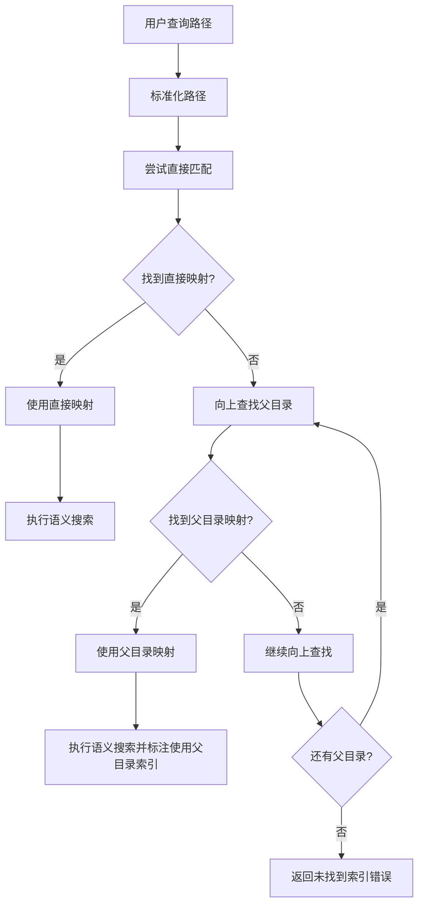

# SemanticCodeSearch 父目录索引回退功能实施计划

## 项目概述

### 背景
当前 `SemanticCodeSearch` 工具在查询指定路径时，如果该路径没有对应的索引库，会直接返回"代码库未建立索引"的错误。这种行为在用户查询子目录时体验不佳，特别是当父目录已经建立了索引的情况下。

### 目标
改进 `SemanticCodeSearch` 功能，使其能够智能地向上查找父目录的索引库，当查询路径本身没有索引时，自动使用最近的父目录索引进行搜索。

### 核心需求
- 保持现有直接路径匹配的优先级
- 当直接匹配失败时，向上遍历目录树查找父目录索引
- 向用户明确提示使用了父目录索引
- 确保向后兼容性和性能稳定性

## 技术架构分析

### 当前实现分析

**问题定位**：
- `IndexConfigManager.GetMappingByPath()` 仅支持精确路径匹配
- `CodeSearchTools.SemanticCodeSearch()` 第72行直接返回错误，没有回退机制
- 缺少路径层次结构的智能查找逻辑

**相关组件**：
1. **IndexConfigManager**：索引配置管理，需要扩展父目录查找功能
2. **CodeSearchTools**：MCP工具实现，需要修改查找逻辑
3. **PathExtensions**：路径处理工具，可能需要添加辅助方法

### 改进架构设计



## 详细实施方案

### 阶段一：扩展 IndexConfigManager（30分钟）

#### 1.1 新增方法实现

在 `IndexConfigManager.cs` 中添加新方法：

```csharp
/// <summary>
/// 查找路径对应的映射，支持父目录回退查找
/// </summary>
/// <param name="path">查询路径</param>
/// <returns>找到的映射信息，如果是父目录映射会在日志中标注</returns>
public CodebaseMapping? GetMappingByPathWithParentFallback(string path)
{
    var normalizedPath = path.NormalizePath();
    
    // 首先尝试直接匹配
    var directMapping = GetMappingByPath(normalizedPath);
    if (directMapping != null)
    {
        _logger.LogDebug("找到直接路径映射: {QueryPath} -> {CollectionName}", 
            normalizedPath, directMapping.CollectionName);
        return directMapping;
    }
    
    _logger.LogDebug("未找到直接路径映射，开始向上查找父目录: {QueryPath}", normalizedPath);
    
    // 如果没有直接匹配，向上查找父目录
    var currentPath = normalizedPath;
    int searchDepth = 0;
    const int maxSearchDepth = 10; // 防止无限循环
    
    while (!string.IsNullOrEmpty(currentPath) && searchDepth < maxSearchDepth)
    {
        var parentPath = Path.GetDirectoryName(currentPath);
        if (string.IsNullOrEmpty(parentPath) || parentPath == currentPath)
        {
            _logger.LogDebug("已到达根目录，停止查找");
            break;
        }
        
        searchDepth++;
        var normalizedParentPath = parentPath.NormalizePath();
        
        _logger.LogDebug("检查父目录 {Depth}: {ParentPath}", searchDepth, normalizedParentPath);
        
        var parentMapping = GetMappingByPath(normalizedParentPath);
        if (parentMapping != null)
        {
            _logger.LogInformation("找到父目录映射: 查询路径 {QueryPath} -> 父索引库 {ParentPath} (集合: {CollectionName})", 
                normalizedPath, parentMapping.CodebasePath, parentMapping.CollectionName);
            return parentMapping;
        }
        
        currentPath = parentPath;
    }
    
    if (searchDepth >= maxSearchDepth)
    {
        _logger.LogWarning("父目录查找达到最大深度限制 {MaxDepth}，停止查找", maxSearchDepth);
    }
    
    _logger.LogDebug("未找到任何父目录映射: {QueryPath}", normalizedPath);
    return null;
}

/// <summary>
/// 检查指定路径是否为某个已索引路径的子目录
/// </summary>
/// <param name="queryPath">查询路径</param>
/// <param name="indexedPath">已索引路径</param>
/// <returns>如果是子目录返回true</returns>
public bool IsSubDirectoryOfIndexed(string queryPath, string indexedPath)
{
    var normalizedQuery = queryPath.NormalizePath();
    var normalizedIndexed = indexedPath.NormalizePath();
    
    // 确保索引路径以路径分隔符结尾，避免误匹配
    if (!normalizedIndexed.EndsWith(Path.DirectorySeparatorChar.ToString()))
    {
        normalizedIndexed += Path.DirectorySeparatorChar;
    }
    
    return normalizedQuery.StartsWith(normalizedIndexed, StringComparison.OrdinalIgnoreCase);
}
```

#### 1.2 单元测试用例

为新方法创建测试用例：

```csharp
[Test]
public void GetMappingByPathWithParentFallback_DirectMatch_ReturnsDirectMapping()
{
    // 测试直接匹配优先级
}

[Test]
public void GetMappingByPathWithParentFallback_ParentMatch_ReturnsParentMapping()
{
    // 测试父目录匹配功能
}

[Test]
public void GetMappingByPathWithParentFallback_NoMatch_ReturnsNull()
{
    // 测试无匹配情况
}
```

### 阶段二：修改 CodeSearchTools（20分钟）

#### 2.1 更新主搜索逻辑

修改 `CodeSearchTools.cs` 中的 `SemanticCodeSearch` 方法：

```csharp
// 在第70-85行之间替换现有逻辑
// 从配置中获取对应的集合名称（支持父目录回退）
var mapping = _configManager.GetMappingByPathWithParentFallback(normalizedPath);
if (mapping == null)
{
    return $"📋 代码库未建立索引\n" +
           $"📁 路径: {normalizedPath}\n" +
           $"\n" +
           $"❓ 是否为此代码库创建索引库？\n" +
           $"✅ 创建后可立即进行语义搜索\n" +
           $"🔍 请使用 CreateIndexLibrary 工具创建索引，参数：\n" +
           $"   - codebasePath: {normalizedPath}\n" +
           $"   - friendlyName: {Path.GetFileName(normalizedPath)} (可选)\n" +
           $"\n" +
           $"💡 创建完成后，重新执行此搜索即可获得结果\n" +
           $"📝 注意：已检查父目录，未找到可用的索引库";
}

// 检查是否使用了父目录索引
bool isUsingParentIndex = !mapping.NormalizedPath.Equals(normalizedPath, StringComparison.OrdinalIgnoreCase);
```

#### 2.2 增强搜索结果显示

更新结果格式化逻辑：

```csharp
// 在第116-120行附近修改结果标题
var resultBuilder = new StringBuilder();

if (isUsingParentIndex)
{
    resultBuilder.AppendLine($"🎯 查询: '{query}' | 📁 {mapping.FriendlyName} (父目录索引) | ✅ {results.Count}个结果");
    resultBuilder.AppendLine($"💡 使用父目录索引: {mapping.CodebasePath}");
    resultBuilder.AppendLine($"📍 查询路径: {normalizedPath}");
}
else
{
    resultBuilder.AppendLine($"🎯 查询: '{query}' | 📁 {mapping.FriendlyName} | ✅ {results.Count}个结果");
}
resultBuilder.AppendLine();
```

#### 2.3 优化日志记录

添加详细的操作日志：

```csharp
if (isUsingParentIndex)
{
    Console.WriteLine($"[INFO] 使用父目录索引: 查询路径 '{normalizedPath}' -> 索引库 '{mapping.CodebasePath}'");
}
```

### 阶段三：路径处理工具增强（10分钟）

#### 3.1 在 PathExtensions 中添加辅助方法

```csharp
/// <summary>
/// 检查路径是否为另一个路径的子目录
/// </summary>
/// <param name="childPath">子路径</param>
/// <param name="parentPath">父路径</param>
/// <returns>如果是子目录返回true</returns>
public static bool IsSubDirectoryOf(this string childPath, string parentPath)
{
    var normalizedChild = childPath.NormalizePath();
    var normalizedParent = parentPath.NormalizePath();
    
    // 确保父路径以路径分隔符结尾
    if (!normalizedParent.EndsWith(Path.DirectorySeparatorChar.ToString()))
    {
        normalizedParent += Path.DirectorySeparatorChar;
    }
    
    return normalizedChild.StartsWith(normalizedParent, StringComparison.OrdinalIgnoreCase);
}

/// <summary>
/// 获取两个路径之间的层级差距
/// </summary>
/// <param name="childPath">子路径</param>
/// <param name="parentPath">父路径</param>
/// <returns>层级数，如果不是子目录返回-1</returns>
public static int GetDirectoryDepth(this string childPath, string parentPath)
{
    if (!childPath.IsSubDirectoryOf(parentPath))
        return -1;
        
    var normalizedChild = childPath.NormalizePath();
    var normalizedParent = parentPath.NormalizePath();
    
    if (!normalizedParent.EndsWith(Path.DirectorySeparatorChar.ToString()))
    {
        normalizedParent += Path.DirectorySeparatorChar;
    }
    
    var relativePath = normalizedChild.Substring(normalizedParent.Length);
    return relativePath.Split(Path.DirectorySeparatorChar, StringSplitOptions.RemoveEmptyEntries).Length;
}
```

### 阶段四：测试验证（15分钟）

#### 4.1 测试场景设计

**测试场景1：直接路径匹配**
- 查询路径：`d:/VSProject/CoodeBaseApp`
- 预期：使用直接匹配的索引库

**测试场景2：子目录查询**
- 查询路径：`d:/VSProject/CoodeBaseApp/Services`
- 预期：使用父目录 `d:/VSProject/CoodeBaseApp` 的索引库

**测试场景3：深层子目录查询**
- 查询路径：`d:/VSProject/CoodeBaseApp/Services/Embedding/Providers`
- 预期：使用父目录 `d:/VSProject/CoodeBaseApp` 的索引库

**测试场景4：无匹配目录**
- 查询路径：`d:/Other/Project`
- 预期：返回未找到索引的错误信息

#### 4.2 验证检查点

1. **功能验证**：
   - [ ] 直接路径匹配优先级正确
   - [ ] 父目录查找逻辑正常工作
   - [ ] 搜索结果正确显示使用了父目录索引
   - [ ] 无匹配时错误信息准确

2. **性能验证**：
   - [ ] 查找时间在可接受范围内（< 100ms）
   - [ ] 最大搜索深度限制生效
   - [ ] 内存使用无明显增加

3. **用户体验验证**：
   - [ ] 父目录索引使用提示清晰
   - [ ] 日志信息详细且有用
   - [ ] 错误信息友好

## 配置和部署

### 配置参数

可在 `IndexConfigManager` 中添加配置项：

```json
{
  "GlobalSettings": {
    "maxParentSearchDepth": 10,
    "enableParentIndexFallback": true,
    "logParentIndexUsage": true
  }
}
```

### 向后兼容性

- 保持现有 `GetMappingByPath` 方法不变
- 新增方法为可选功能，不影响现有代码
- 所有现有测试应继续通过

## 风险评估与缓解

### 潜在风险

1. **性能风险**：向上遍历目录可能增加查找时间
   - **缓解措施**：设置最大搜索深度限制、添加性能监控

2. **匹配准确性风险**：可能匹配到不期望的父目录索引
   - **缓解措施**：详细的日志记录、明确的用户提示

3. **复杂性风险**：增加代码复杂度
   - **缓解措施**：充分的单元测试、清晰的文档

### 回滚策略

如果出现问题，可以：
1. 在 `CodeSearchTools` 中恢复使用原始的 `GetMappingByPath` 方法
2. 通过配置参数禁用父目录回退功能
3. 移除新增的方法（如果影响系统稳定性）

## 预期效果

### 用户体验改进

- **智能化程度提升**：自动处理子目录查询，减少用户困惑
- **使用便利性增强**：无需为每个子目录单独创建索引
- **透明度提升**：明确告知用户使用了父目录索引

### 系统能力增强

- **搜索覆盖面扩大**：有效利用现有索引库
- **用户错误减少**：降低"未建立索引"错误的出现频率
- **运维复杂度降低**：减少需要维护的索引库数量

## 总结

这个改进方案将显著提升 `SemanticCodeSearch` 工具的智能化水平和用户体验，通过引入父目录索引回退机制，使工具能够更灵活地处理各种查询场景。实施过程分为四个阶段，总预计时间约75分钟，风险可控，收益明显。

实施完成后，建议进行全面测试并收集用户反馈，为后续的进一步优化提供依据。