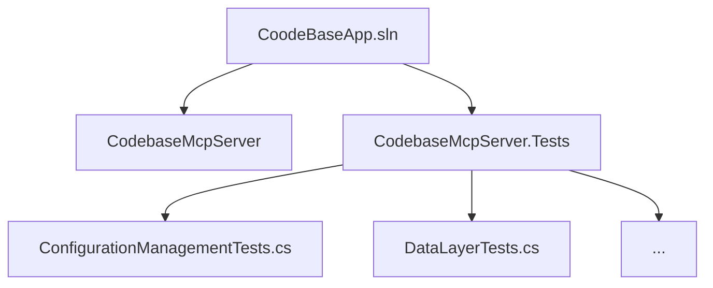

# CodebaseMcpServer 单元测试项目建设方案

## 目标
- 建立标准的 xUnit 单元测试项目 `CodebaseMcpServer.Tests`
- 迁移现有 `CodebaseMcpServer/Test/` 下所有测试代码
- 支持通过 `dotnet test` 执行全部或指定类/方法的测试

## 目录结构（Mermaid）



## 步骤

1. **创建测试项目**
   ```sh
   dotnet new xunit -n CodebaseMcpServer.Tests
   ```
2. **添加项目引用**
   ```sh
   dotnet add CodebaseMcpServer.Tests/CodebaseMcpServer.Tests.csproj reference CodebaseMcpServer/CodebaseMcpServer.csproj
   ```
3. **迁移测试代码**
   - 将 `CodebaseMcpServer/Test/` 下所有测试类移动到 `CodebaseMcpServer.Tests/`，并按 xUnit 规范重命名（如 `xxxTests.cs`）。
   - 确保命名空间统一为 `CodebaseMcpServer.Tests`。
4. **更新解决方案**
   ```sh
   dotnet sln add CodebaseMcpServer.Tests/CodebaseMcpServer.Tests.csproj
   ```
5. **测试方法规范**
   - 测试类：`xxxTests`
   - 测试方法：`MethodName_Scenario_ExpectedResult`
   - 使用 `[Fact]` 或 `[Theory]` 标记
6. **执行测试**
   - 全部测试：`dotnet test`
   - 指定类/方法：
     ```sh
     dotnet test --filter FullyQualifiedName~CodebaseMcpServer.Tests.类名.方法名
     ```

## 注意事项
- 迁移后删除原 `Test/` 目录，避免冗余。
- 后续所有测试代码均在 `CodebaseMcpServer.Tests` 项目维护。